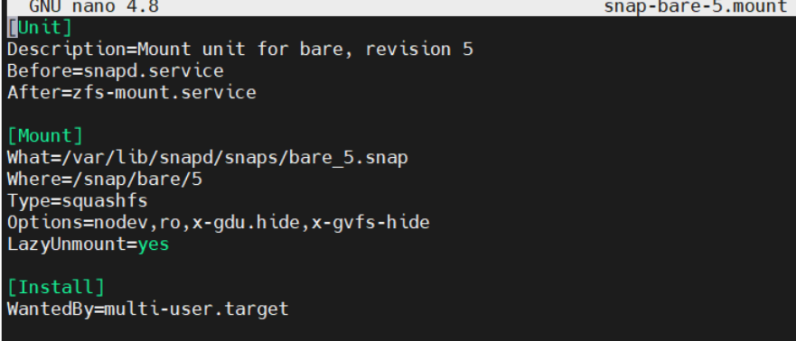
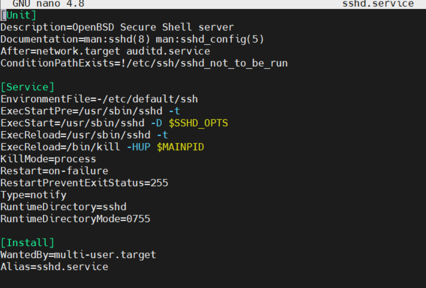
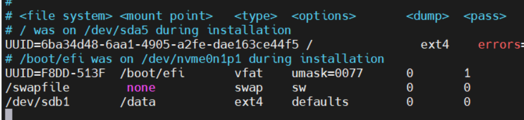
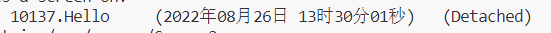
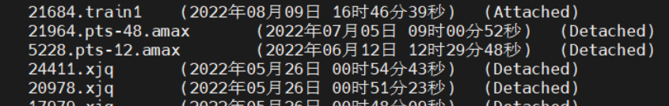

# linux系统安装

## 基础环境安装

按照安装顺序进入桌面

安装更新 弹窗（系统提示，可不更新）

## 显卡驱动及cuda安装

### 安装显卡驱动

1. 可通过 软件和更新-附加驱动 选择驱动 自动安装（建议）

2. 自行安装：

   查看可安装驱动版本:

   ```
   ubuntu-drivers devices
   ```

   选择某版本安装：

   ```
   sudo apt install nvidia-driver-*
   ```

3. 上面两种方式都需要网络环境，还可以选择用安装包安装

   此方法比较麻烦，可去网络自行查看，不做介绍

安装完成后检查

```
nvidia-smi
```

可能出现

```
NVIDIA -SMI has failed because it couldn 't communicate with the NVIDIA  driver. Make sure th at the l ate st NVIDIA driver is installed and  running
```

解决方法

```
sudo apt-get install dkms
利用命令
ls /usr/src 
可查看下面有一个nvidia-450.102.04/ 文件夹
sudo dkms install -m nvidia -v 450.102.04 #后边的版本号是nvidia-后边的
```

### 安装cuda11.3   

可去官网下载对应的包 地址：https://developer.nvidia.com/cuda-toolkit-archive

建议使用runfile文件安装 一开始没反应是在加载 等一会

```
sudo sh cuda_11.3.1_465.19.01_linux.run  
```

安装时注意不要安装驱动，因为已经安装更新的了

安装完检查 nvcc -V

这时你会发现没有找到，不要安装，是因为环境变量没有配置

打开自己user的.bashrc文件 可以用nano，或者vi，vim（可能没下）

```
nano ~/.bashrc
```

添加环境变量

```
export PATH=/usr/local/cuda/bin:$PATH
export LD_LIBRARY_PATH=/usr/local/cuda/lib64:$LD_LIBRARY_PATH
```

ctrl+o写入    ctrl+x离开

重新打开终端 更新环境变量

再次检查 发现已经找到cuda

```
nvcc -V 
```

### 安装cudnn 

地址：https://developer.nvidia.com/rdp/cudnn-archive

根据cuda版本选择 建议选择tar包下载  

```
# 解压 
tar -xvf  cudnn-linux-x86_64-8.4.0.27_cuda11.6-archive.tar.xz
# 复制文件
sudo cp cudnn-*-archive/include/cudnn*.h /usr/local/cuda/include 
sudo cp -P cudnn-*-archive/lib/libcudnn* /usr/local/cuda/lib64 
# 添加权限
sudo chmod a+r /usr/local/cuda/include/cudnn*.h /usr/local/cuda/lib64/libcudnn*
```

## 开启ssh和ftp

### ssh

```
sudo apt-get install openssh-server
sudo systemctl start ssh
sudo systemctl enable ssh
```

### ftp

```
sudo apt-get install vsftpd
sudo systemctl start vsftpd
sudo systemctl enable vsftpd
```

### 固定ip地址

在设置里选静态ip，输入ip，掩码，网关

## 系统美化 

### 安装 GNOME Tweaks 工具和 gnome 扩展

GNOME Tweaks 工具是必须的，我们需要它来更改主题和图标，GNOME Tweaks 工具可以在Ubuntu的软件商店找到，也可以通过以下命令安装：

```
sudo apt-get install gnome-tweak-tool
```

为了更加的可自定义性，还需要去安装一下扩展：

```
sudo apt-get install gnome-shell-extensions
```

这里还要执行以下命令：浏览器插件 方便启用

```
sudo apt-get install chrome-gnome-shell 
```

### 进入GNOME官方插件中心安装插件

https://extensions.gnome.org/  

**User Themes** 主题 

主题商店：https://www.gnome-look.org/browse/

**Dash to Dock** 自定义dock

**Fildem global menu** 全局菜单 

还需安装一个程序见github页 https://github.com/gonzaarcr/Fildem

新建文件 添加设置 开机启动

# linux深度学习常用命令

## conda

### 创建环境

```
conda create -n env_name python=x.x
```

### 复制环境

```
conda create -n BBB --clone AAA
```

### 删除环境

```
conda remove -n env_name --all
```

### 激活环境

```
source/conda activate env_name
```

### 退出环境

```
conda deactivate
```

### 列出所有虚拟环境

```
conda env list
或
conda info -e/env
```

### 迁移环境

```
# 进入环境
conda activate bcy
# 导出 environment.yml 文件：
conda env export > environment.yml
# 注意：如果当前路径已经有了 environment.yml 文件，conda 会重写这个文件

# 重现环境：不需要创建环境会自己创建
# 注：从网上安装的可以重新下载，从文件安装的不会
conda env create -f environment.yml
```

### 修改conda源

```
查看所有配置
conda config --show
添加源
conda config --add channels https://mirrors.tuna.tsinghua.edu.cn/anaconda/pkgs/free/
conda config --add channels https://mirrors.tuna.tsinghua.edu.cn/anaconda/pkgs/main/
中科大的源
conda config --add channels https://mirrors.ustc.edu.cn/anaconda/pkgs/free/ 
阿里云的源
conda config --add channels http://mirrors.aliyun.com/pypi/simple/
删除源
conda config --remove channels http://mirrors.aliyun.com/pypi/simple/
设置展示源
conda config --set show_channel_urls yes
```

## pip

### 安装

```
pip install SomePackage
# 安装指定版本
pip install SomePackage==1.0
# 更新包
pip install --upgrade SomePackage
```

### 删除

```
pip remove SomePackage
```

### 修改pip源

```
当次指定
pip install -i https://pypi.tuna.tsinghua.edu.cn/simple pandas

配置修改
pip config set global.index-url https://pypi.tuna.tsinghua.edu.cn/simple
阿里云 http://mirrors.aliyun.com/pypi/simple/
中国科技大学 https://pypi.mirrors.ustc.edu.cn/simple/
豆瓣(douban) http://pypi.douban.com/simple/
清华大学 https://pypi.tuna.tsinghua.edu.cn/simple/

或
在当前用户目录下创建.pip文件夹: 
mkdir ~/.pip
在该目录下创建pip.conf文件填写
vim ~/.pip/pip.conf
[global]
trusted-host=[主机名]
index-url=[镜像源的url]
```

### 查看安装的包

```
pip list
```

### 查看指定包的详细信息

```
pip show Package
```

### 查看系统支持 cp （python）版本

```
import pip;
print(pip._internal.pep425tags.get_supported());

python -m pip debug --verbose
```

## 系统包安装

### 更新

```
sudo apt update
sudo apt upgrade
```

### 修改apt源

```
1.备份系统默认源
sudo cp /etc/apt/sources.list /etc/apt/sources.list.bak
2.打开软件源文件
sudo vim /etc/apt/sources.list

deb https://mirrors.tuna.tsinghua.edu.cn/ubuntu/ xenial main restricted universe multiverse
# deb-src https://mirrors.tuna.tsinghua.edu.cn/ubuntu/ xenial main restricted universe multiverse
deb https://mirrors.tuna.tsinghua.edu.cn/ubuntu/ xenial-updates main restricted universe multiverse
# deb-src https://mirrors.tuna.tsinghua.edu.cn/ubuntu/ xenial-updates main restricted universe multiverse
deb https://mirrors.tuna.tsinghua.edu.cn/ubuntu/ xenial-backports main restricted universe multiverse
# deb-src https://mirrors.tuna.tsinghua.edu.cn/ubuntu/ xenial-backports main restricted universe multiverse
deb https://mirrors.tuna.tsinghua.edu.cn/ubuntu/ xenial-security main restricted universe multiverse
# deb-src https://mirrors.tuna.tsinghua.edu.cn/ubuntu/ xenial-security main restricted universe multiverse
```

## 查看显卡占用

```
nvidia-smi
每1秒刷新一次
watch -n 1 -d nvidia-smi
```

## ubuntu系统内核及显卡驱动更新

### 查看已安装内核

```
1.
dpkg --get-selections | grep linux-image
2.
cat /boot/grub/grub.cfg |grep menuentry
```

### 查看当前内核

```
uname -a
```

### 禁止内核更新

#### 1.禁止自动升级

修改配置文件/etc/apt/apt.conf.d/10periodic
\#０是关闭，1是开启，将所有值改为0

```
vi etc/apt/apt.conf.d/10periodic
```

```
APT::Periodic::Update-Package-Lists "0";
APT::Periodic::Download-Upgradeable-Packages "0";
APT::Periodic::AutocleanInterval "0";
```
#### 2.固定版本

```
sudo apt-mark hold linux-image-generic linux-headers-generic 
sudo apt-mark hold linux-image-5.3.0-42-generic
sudo apt-mark hold linux-image-extra-5.3.0-42-generic

# 重启内核更新
sudo apt-mark unhold linux-image-5.3.0-42-generic
sudo apt-mark unhold linux-image-extra-5.3.0-42-generic
```

#### 3.更改引导启动文件

```
cat /etc/default/grub
```

**修改默认启动内核：**

老版本：

```
GRUB_DEFAULT="Ubuntu, with Linux 5.4.0-99-generic"
```

新版本：

```
GRUB_DEFAULT="Advanced options for Ubuntu>Ubuntu, with Linux 5.4.0-99-generic"
GRUB_DEFAULT="1> 6"           > 和6之间有空格 ？？
```

0 是 Ubuntu

1代表启动时第一层菜单里的 Advanced options for Ubuntu，

2，3，4，5，6为查看内核中依次的顺序  其中2, 3    4, 5    6, 7 分别为一组的正常和恢复模式 

我们选择正常，也就是2，4，6 

6即为指定内核的Index。

**更改配置文件后更新，有错误会提醒：**

```
sudo update-grub
```

### 查看显卡硬件信息

```
 lshw -c video
```

### 查看显卡内核模块版本

```
cat /proc/driver/nvidia/version
```

### 查看显卡驱动版本

```
sudo dpkg --list | grep nvidia-*
sudo dpkg --get-selections | grep nvidia-*
```

上面两个版本需一致 否则报 Failed to initialize NVML: Driver/library version mismatch 错误 只需reboot

### 查看当前使用cuda版本

```
nvcc -V
```

### 查看ubuntu更新日志

```
cat /var/log/apt/history.log
```

### 查看报错详情（有用）

```
dmesg |tail -4
```

dmesg 显示开机后系统信息 -T显示人类时间

tail 查看文件   -4  最后四行

### nvidia显卡卸载安装

#### 查看可用版本

```
sudo ubuntu-drivers devices
```

#### 安装

```
sudo ubuntu-drivers autoinstall
```

或

```
sudo apt install nvidia-driver-版本号
```

#### 文件安装

```
sudo chmod a+x NVIDIA-Linux-x86_64-450.80.02.run
```

ubuntu 16.04默认安装了第三方开源的驱动程序nouveau，安装nvidia显卡驱动首先需要禁用nouveau，不然会碰到冲突的问题，导致无法安装nvidia显卡驱动。

```
sudo ./NVIDIA-Linux-x86_64-450.80.02.run -no-x-check -no-nouveau-check -no-opengl-files
```

#### 卸载

```
sudo /usr/bin/nvidia-uninstall 
sudo apt purge nvidia-*
sudo apt purge nvidia*
sudo apt purge libnvidia*
```

# linux常用命令

## 用户/用户组操作

### 创建用户

```
useradd username -m (-m 相当于会创建对应的用户家目录)
# 指定家目录
useradd username -d /home/user
usermod -s /bin/bash username (指定shell，否则会非常不便于终端操作)

# 综合命令
useradd username -m -s /bin/bash
useradd username -d /home/user -s /bin/bash
```

### 删除用户

```
userdel username。
# 若想将它在系统上的文件也删除掉
userdel -r username
```

### 用户加入组

```
# 额外添加组
sudo usermod -a -G group user  
# g为覆盖  只加入该组
sudo usermod  -g group user  
```

详情查看 usermod -h

### 用户删除组

```
sudo gpasswd -d user group
```

### 改变文件夹权限

```
chmod user:group dir
```

### 查看所有用户/用户组

```
# 文件包含所有组
cat /etc/group 
# 系统存在的所有用户名
cat /etc/shadow
cat /etc/passwd 
```
### 添加权限

```
# 切换到root用户
su
# 编辑配置文件
vim /etc/sudoers
# 增加配置, 在打开的配置文件中，找到root ALL=(ALL) ALL, 在下面添加一行
# 其中xxx是你要加入的用户名称
xxx ALL=(ALL) ALL
```

## 查看硬件信息

### cpu

```
cat /proc/cpuinfo
```

### 显卡

```
lspci  | grep -i vga
lshw -c video
```

### 网卡

```
lspci | grep -i eth
```

### 内存

```
dmidecode | grep -A16 'Memory Device'
```

### 硬盘

```
sudo fdisk -l
sudo df -l
```

## 系统代理

```
vim ~/.bashrc

# 最后一行加上
export HTTP_PROXY="http://127.0.0.1:7890"
export HTTPS_PROXY="https://127.0.0.1:7890"

# 更新
source ~/.bashrc

# apt临时代理，直接改.bashrc只能作用改用户，加sudo后变为root无效
# 或者切root后命令行临时加export HTTP_PROXY="http://172.18.144.56:7890"
sudo apt -o Acquire::http::proxy="http://172.18.144.56:7890" install xxx
```

## 网络配置

### 查看网卡配置

```
sudo apt install net-tools
ifconfig
```

### 查看路由表

```
route -n
```

### 网络管理工具

#### Netplan

配置文件路径

```
sudo nano /etc/netplan/xxx.yaml
```

默认设置 使用NetworkManager管理

```undefined
network:
    version: 2
    renderer: NetworkManager
```

使用Systemd-networkd管理，需配置，例

```
network:
    ethernets:
        enp0s3:
            addresses: []
            dhcp4: true
            optional: true
        enp0s8:
            addresses: [192.168.56.3/24]
            dhcp4: no
            optional: true
    version: 2
```

网卡名字获取：

- ifconfig
- cat /proc/net/dev

```
# 以 /etc/netplan 配置为管理工具生成配置
netplan generate
# 应用尝试，失败会自动改为原设置；
netplan try 
# 应用配置(以便生效)，必要时重启管理工具
netplan apply
```

## 域名

### 查看域名

cat /etc/resolv.conf

nameserver 127.0.0.1:53

resolv.conf -> ../run/systemd/resolve/stub-resolv.conf


## 端口

### 查看端口占用

```
sudo netstat -anp | grep 端口号
# 查看所有被占用端口情况
sudo netstat -nultp
注：不加sudo会看不到占用软件
```

### 开放端口

```
apt install firewalld    # 如果已安装则忽略这个命令 
firewall-cmd --add-port=80/tcp --permanent    # 开启80端口
```

## 进程控制

| 命令   | 说明                                                         |
| ------ | :----------------------------------------------------------- |
| ctrl+z | 将任务中断,但是此任务并没有结束,他仍然在进程中，只是放到后台并维持挂起的状态。如需其在后台继续运行，需用“bg 进程号”使其继续运行；再用"fg 进程号"可将后台进程前台化。 |
| ctrl+c | 强行中断当前程序的执行                                       |
| jobs   | 查看当前有多少在后台运行的命令                               |
| fg     | 将后台中的命令调至前台继续运行                               |
| bg     | 将一个在后台暂停的命令，变成继续执行 （在后台执行），如果后台中有多个命令，可以用 bg %jobnumber 将选中的命令调出 |
| ctrl+\ | 发送 SIGQUIT 信号给前台进程组中的所有进程，终止前台进程并生成 core 文件。 |
| ctrl+d | 表示结束当前输入（即用户不再给当前程序发出指令），那么 Linux 通常将结束当前程序 |

### 查看进程

```
ps -aux | grep xxx
```

a：显示当前终端下的所有进程信息，包括其他用户的进程。

u：使用以用户为主的格式输出进程信息。

x：显示当前用户在所有终端下的进程。

```
ps -elf
```

-e：显示系统内的所有进程信息。

-l：使用长（long）格式显示进程信息。

-f：使用完整的（full）格式显示进程信息。 

```
top
```

以全屏交互式的界面显示进程排名，及时跟踪包括CPU、内存等系统资源占用情况，默认情况下每三秒刷新一次，其作用基本类似于Windows系统中的任务管理器。

```
pstree -aup
```

-a：显示每个程序的完整指令，包含路径，参数或是常驻服务的标示

-c：不使用精简标示法

-G：使用VT100终端机的列绘图字符

-h：列出树状图时，特别标明现在执行的程序

-H ：<程序识别码>：此参数的效果和指定

-h：参数类似，但特别标明指定的程序

-l：采用长列格式显示树状图

-n：用程序识别码排序。预设是以程序名称来排序

-p：显示程序识别码

-u：显示用户名称

## service 和 systemctl

历史上，Linux 的启动一直采用init进程。下面的命令用来启动服务。

```
sudo /etc/init.d /apache2 start
# 或者
service apache2 start
```

- 一是启动时间长。init 进程是串行启动，只有前一个进程启动完，才会启动下一个进程。
- 二是启动脚本复杂。init 进程只是执行启动脚本，不管其他事情。脚本需要自己处理各种情况，这往往使得脚本变得很长

### service命令（不推荐）

service命令其实是去/etc/init.d目录下，去执行相关脚本

```
# service命令启动redis脚本
service redis start
# 直接启动redis脚本
/etc/init.d/redis start
# 开机自启动
update-rc.d redis defaults
```

其中脚本需要我们自己编写

### systemctl命令

systemd是Linux系统最新的初始化系统(init),作用是提高系统的启动速度，尽可能启动较少的进程，尽可能更多进程并发启动。
systemd对应的进程管理命令是systemctl

**systemctl命令兼容了service**

即systemctl也会去/etc/init.d目录下，查看，执行相关程序

```
# 注意顺序
sudo systemctl redis start
sudo systemctl redis stop
# 开机自启动
sudo systemctl enable redis
```

**systemctl命令管理systemd的资源Unit（推荐）**

```
sudo systemctl status   #显示系统状态
sudo systemctl start [单元]  #立即激活单元：
sudo systemctl stop [单元]   #立即停止单元
sudo systemctl restart [单元] #重启单元
sudo systemctl enable [单元]  #开机自动激活单元
sudo systemctl disable [单元] #取消开机自动激活单元
sudo systemctl daemon-reload  #重新载入systemd，扫描新的或有变动的单元
```

systemd的Unit放在目录/usr/lib/systemd/system(Centos)或/etc/systemd/system(Ubuntu)

主要有四种类型文件.mount,.service,.target,.wants

**.mount**



.mount文件定义了一个挂载点，[Mount]节点里配置了What,Where,Type三个数据项
等同于以下命令：

```
mount -t What Where Type
```

**.service**



.service文件定义了一个服务，分为[Unit]，[Service]，[Install]三个小节
[Unit]
Description:描述，
After：在network.target,auditd.service启动后才启动
ConditionPathExists: 执行条件

[Service]
EnvironmentFile:变量所在文件
ExecStart: 执行启动脚本
Restart: fail时重启

[Install]
Alias:服务别名
WangtedBy: 多用户模式下需要的

**.target**

.target定义了一些基础的组件，供.service文件调用

**.wants文件夹**

.wants文件定义了要执行的文件集合，每次执行，.wants文件夹里面的文件都会执行

## apt与apt-get

最常用的 Linux 包管理命令都被分散在了 apt-get、apt-cache 和 apt-config 这三条命令当中。

apt 命令的引入就是为了解决命令过于分散的问题，它包括了 apt-get 命令出现以来使用最广泛的功能选项，以及 apt-cache 和 apt-config 命令中很少用到的功能。

在使用 apt 命令时，用户不必再由 apt-get 转到 apt-cache 或 apt-config，而且 apt 更加结构化，并为用户提供了管理软件包所需的必要选项。

> 简单来说就是：apt = apt-get、apt-cache 和 apt-config 中最常用命令选项的集合。

|     apt 命令     |      取代的命令      |           命令的功能           |
| :--------------: | :------------------: | :----------------------------: |
|   apt install    |   apt-get install    |           安装软件包           |
|    apt remove    |    apt-get remove    |           移除软件包           |
|    apt purge     |    apt-get purge     |      移除软件包及配置文件      |
|    apt update    |    apt-get update    |         刷新存储库索引         |
|   apt upgrade    |   apt-get upgrade    |     升级所有可升级的软件包     |
|  apt autoremove  |  apt-get autoremove  |       自动删除不需要的包       |
| apt full-upgrade | apt-get dist-upgrade | 在升级软件包时自动处理依赖关系 |
|    apt search    |   apt-cache search   |          搜索应用程序          |
|     apt show     |    apt-cache show    |           显示装细节           |

```
# 修复依赖关系
sudo apt --fix-broken install
```

## dpkg

dpkg 即 package manager for Debian ，是 Debian 和基于 Debian 的系统中一个主要的**包管理工具**，可以用来安装、构建、卸载、管理 deb格式的软件包。

dpkg 主要是用来安装已经下载到本地的 deb 软件包，或者对已经安装好的软件进行管理。而 apt-get 可以直接从远程的软件仓库里下载安装软件。

| 参数     | 说明           |
| -------- | -------------- |
| -i \| -R | 安装 文件 目录 |
| -r       | 卸载           |
| -l       | 列出安装包信息 |

## 打包和压缩

### tar

| 选项    | 含义                                                         |
| ------- | ------------------------------------------------------------ |
| -c      | 将多个文件或目录进行打包。                                   |
| -A      | 追加 tar 文件到归档文件。                                    |
| -f 包名 | 指定包的文件名。包的扩展名是用来给管理员识别格式的，所以一定要正确指定扩展名； |
| -v      | 显示打包文件过程；                                           |
|         |                                                              |
| -x      | 对 tar 包做解打包操作。                                      |
| -f      | 指定要解压的 tar 包的包名。                                  |
| -t      | 只查看 tar 包中有哪些文件或目录，不对 tar 包做解打包操作。   |
| -C 目录 | 指定解打包位置。                                             |

```
# 打包单文件或目录
tar -cvf A.tar A
# 打包多文件或目录
tar -cvf E.tar A B C D

#查看包中文件
tar -tf A.tar

# 解包到当前目录
tar -xvf A.tar
# 解包到指定目录
tar -xvf A.tar -C /tmp
```

### gzip

压缩命令不能直接压缩目录，必须先用 tar 命令将目录打包，然后才能用 gzip 命令或 bzip2 命令对打包文件进行压缩

```
gzip test.tar
```

### 同时打包和压缩

- -z：压缩和解压缩 ".tar.gz" 格式；
- -j：压缩和解压缩 ".tar.bz2"格式。

```
tar -zcvf A.tar.gz A
tar -jcvf A.tar.bz2 A

tar -zxvf A.tar.gz
tar -jxvf A.tar.bz2
```

## 防火墙firewalld

iptables 不推荐

### 安装

```
yum install firewalld firewall-config
sudo apt-get install firewalld
```

### 开放端口

```
sudo firewall-cmd --add-port=8001/tcp --permanent 
sudo firewall-cmd --reload
```

### 查看开放端口

```
sudo firewall-cmd  --list-all
```

### 关闭端口

```
sudo firewall-cmd --remove-port=8001/tcp --permanent
sudo firewall-cmd --reload
```

## 交换区

内存不够用时可适当增加交换区大小

### 查看交换区大小

```shell
free -h
```

### 创建swap文件

swap交换空间其实就是硬盘上一个特定的文件，只不过这个文件只有内存在读写，只不过这个文件比较大些。

```
# 随便找个地方 创建swapfile文件 路径和名字都随便
# bs是没块的大小 count是数量 相乘是swap大小 
sudo dd if=/dev/zero of=./swapfile bs=1G count=32
```

### 转换swap文件

```
sudo mkswap -f swapfile
```

### 激活swap文件

```
sudo swapon swap
```

### 卸载swap文件

```
sudo swapoff swap
```

### 开机挂载swap

如果想要一直使用改后的swap还需开机挂载，打开fstab

```
sudo nano /etc/fstab
# 找一行添加
```



按照上面的格式提示来

## 查看gpu占用

```
# *是具体的显卡号
sudo fuser -v /dev/nvidia*
```

## linux监控

top

iotop

s-tui

# linux常用软件

## mysql

**安装方式**

- 源码编译
- 压缩包解压（一般为tar.gz）
- 编译好的安装包（RPM、DPKG等）
- 在线安装（YUM、APT等）

### 在线安装

- 打开网址：[MySQL 存储库](https://dev.mysql.com/downloads/)

- 找到对应linux的版本进行下载

  ```
  wget https://dev.mysql.com/get/mysql-apt-config_0.8.23-1_all.deb
  ```

- 安装mysql-apt-config

  ```
  sudo dpkg -i mysql-apt-config_0.8.23-1_all.deb
  ```

  选择你需要的配置（GUI）

- 在线安装

  ```
  sudo apt install mysql-server
  ```

- 设置账户密码

  ```
  sudo mysql
  ALTER USER 'root'@'localhost' IDENTIFIED WITH mysql_native_password by 'mynewpassword';
  注：@后是允许登录ip  任意用%  localhost指只允许本地登录
     IDENTIFIED WITH mysql_native_password 指密码加密方式
  ```

#### 卸载

```
sudo apt purge mysql-server
sudo apt --purge autoremove
sudo apt purge mysql-apt-config
```

### 压缩包安装

官方安装教程：https://dev.mysql.com/doc/refman/5.7/en/binary-installation.html

```
# 创建mysql组
groupadd mysql
# 创建mysql用户
useradd -r -g mysql -s /bin/false mysql
# 解压
cd /usr/local
tar zxvf */path/to/mysql-VERSION-OS*.tar.gz
# 创建软链接便于操作（可选）
ln -s *full-path-to-mysql-VERSION-OS* mysql

cd mysql
mkdir mysql-files
chown mysql:mysql mysql-files
chmod 750 mysql-files
bin/mysqld --initialize --user=mysql
bin/mysql_ssl_rsa_setup
bin/mysqld_safe --user=mysql
# Next command is optional
cp support-files/mysql.server /etc/init.d/mysql.server
```

### 安全启动配置向导

**建议生产环境中mysql安装这完成后一定要运行一次**

```
sudo mysql_secure_installation
```

- 为root用户设置密码

- 删除匿名账号

- 取消root用户远程登录

- 删除test库和对test库的访问权限

- 刷新授权表使修改生效

### 常用命令

```
# 登录
mysql -u root -p
# 显示数据库列表
show databases;
# 创建数据库
create database 数据库名;
# 删除
drop database 数据库名;
# 进入数据库
use mysql;
# 展示表
show tables;
# 显示表结构
describe 数据表名;
# 创建用户
CREATE USER ‘Kevin'@'localhost' IDENTIFIED BY ‘123456';
# 授权
GRANT<privileges>ON <database>.<table> TO 'Kevin'@'localhost';
# 修改密码
ALTER USER 'root'@'localhost' IDENTIFIED WITH mysql_native_password by 'password'
update user set host = '%' where user = 'root';
FLUSH PRIVILEGES;
```

ALL: 所有可用的权限

CREATE: 创建库、表和索引

LOCK_TABLES: 锁定表

ALTER: 修改表

DELETE: 删除表

INSERT: 插入表或列

SELECT: 检索表或列的数据

CREATE_VIEW: 创建视图

SHOW_DATABASES: 列出数据库

DROP: 删除库、表和视图

## nginx

### 安装依赖包 pcre openssl zlib

#### redhat系

```
yum -y install gcc gcc-c++ kernel-devel
yum install -y pcre pcre-devel
yum install -y zlib zlib-devel
yum install -y openssl openssl-devel
# 一键
yum -y install gcc zlib zlib-devel pcre-devel openssl openssl-devel
```
#### debian系

```
# 安装pcre
sudo apt install build-essential   # 安装gcc编译器及其环境,包含gcc, gdb, make等
sudo apt install libpcre3 libpcre3-dev
# 安装openssl
sudo apt install openssl
sudo apt install libssl-dev
# 安装zlib
sudo apt install zlib1g-dev	    注：第五个字符是1不是l

或下载编译安装
wget https://ftp.pcre.org/pub/pcre/pcre-8.37.tar.gz # 下载安装包
tar -zxvf pcre-8.37.tar.gz    # 解压
cd pcre-8.37
./configure      # 等待执行完
make && make install   # 编译安装
wget http://www.zlib.net/zlib-1.2.11.tar.gz  # 下载压缩包
tar -zxvf zlib-1.2.11.tar.gz 
cd zlib-1.2.11  # 进入解压后的目录
./configure   # 等待执行完毕
make && make install   # 编译安装
```

### 下载并解压

```
wget http://nginx.org/download/nginx-1.22.0.tar.gz
# 解压 
tar -zxvf nginx-1.22.0.tar.gz
```
### 安装

```
cd nginx-1.22.0
./configure
make
sudo make install
```

### 启动 关闭 重启

```
sudo /usr/local/nginx/sbin/nginx
sudo /usr/local/nginx/sbin/nginx -s stop
sudo /usr/local/nginx/sbin/nginx -s reload
# 指定配置文件启动
sudo /usr/local/nginx/sbin/nginx -s reload -c /usr/local/nginx/conf/nginx.conf
```

**开机自启见：** [systemctl 和 service 点击跳转](#  service 和 systemctl)

```
[Unit]
Description=nginx
After=network.target

[Service]
Type=forking
ExecStart=/usr/local/nginx/sbin/nginx
ExecReload=/usr/local/nginx/sbin/nginx -s reload
ExecStop=/usr/local/nginx/sbin/nginx -s quit
PrivateTmp=true

[Install]
WantedBy=multi-user.target
```

### 配置文件

```
# 默认位置
sudo nano /usr/local/nginx/conf/nginx.conf
```

**文件详解：**https://www.cnblogs.com/54chensongxia/p/12938929.html

## screen

一个后台运行命令的软件

特色功能：

- 会话恢复：**只要Screen本身没有终止，在其内部运行的会话都可以恢复。**
- 多窗口：在Screen环境下，**所有的会话都独立的运行，并拥有各自的编号、输入、输出和窗口缓存。**
- 会话共享：Screen可以让一个或多个用户从不同终端多次登录一个会话，并共享会话的所有特性（比如可以看到完全相同的输出）

### 安装

```
# CentOS 
yum install screen 
# Debian/Ubuntu 
apt install screen
```

### 状态介绍

通常情况下，screen创建的虚拟终端，有两个工作模式：

- **Attached**：表示当前screen正在作为主终端使用，为活跃状态。
- **Detached**：表示当前screen正在后台使用，为非激发状态。

### 查看终端列表

```
screen -ls
```

### 新建终端

```
# 直接screen进入(以Linux的hostname命名）
screen
# 创建一个叫Hello的虚拟终端
screen -S Hello
# 使用-R创建Hello
screen -R Hello
```





三种创建方法比较：

- 使用`-R`创建，如果之前有创建唯一一个同名的screen，则直接进入之前创建的screen
- 使用`-S`创建和直接输入`screen`创建的虚拟终端，不会检录之前创建的screen（**也就是会创建同名的screen**)

### 回到主终端

在虚拟终端时想回到主终端

我们按`Ctrl+a`，再按`d`，即可**保持这个screen到后台**并回到主终端

### 回到虚拟终端

```
# 使用screen -r/R命令
screen -r [pid/name]
```

### 清除终端

```
# 需先进入要退出的虚拟终端
exit
```

