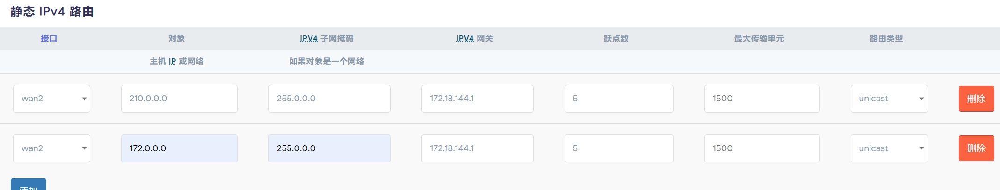

# 软路由配置

## 刷机

推荐刷机工具balenaEtcher

下载r2s安装包 推荐骷髅头 https://github.com/DHDAXCW/NanoPi-R2S-rk3328

有正式版稳定版精简版，稳定版即可

ext4 squashfs两个版本，对于普通刷机无所谓

插上tf卡将固件写入即可

刷完后插卡开机，默认控制界面192.168.11.1 账号root 密码password

## 端口设置

为了既使用宽带，也使用校园网连接服务器，采用虚拟端口

打开 网络-接口-新建接口

wan1采用pppoe登录宽带 

wan2采用dhcp或静态地址连接校园网

防火墙都为wan 关闭内置ipv6

### 设置跃点

wan宽带：10    wan2校园网：50     只要宽带比校园网小即可

现在你发现可以联网了 默认走宽带

之后设置静态路由，将内部ip走校园网

跃点同样比宽带小即可

现在，内部ip走校园网，其他走宽带