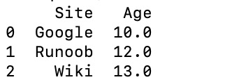

# 基础知识

## numpy

n维数组对象ndarray，一系列**同类型数据**的集合

封装了python原生的同数据类型的 *n* 维数组

### 特点

- NumPy 数组在创建时具有固定的大小，与Python的原生数组对象（可以动态增长）不同。更改ndarray的大小将创建一个新数组并删除原来的数组。
- NumPy 数组中的元素都需要具有相同的数据类型，因此在内存中的大小相同。 例外情况：Python的原生数组里包含了NumPy的对象的时候，这种情况下就允许不同大小元素的数组。
- NumPy 数组有助于对大量数据进行高级数学和其他类型的操作。通常，这些操作的执行效率更高，比使用Python原生数组的代码更少。

### 基础属性

- **ndarray.ndim** - 数组的轴（维度）的个数。在Python世界中，维度的数量被称为rank。
- **ndarray.shape** - 数组的维度。这是一个整数的元组，表示每个维度中数组的大小。对于有 *n* 行和 *m* 列的矩阵，`shape` 将是 `(n,m)`。因此，`shape` 元组的长度就是rank或维度的个数 `ndim`。
- **ndarray.size** - 数组元素的总数。这等于 `shape` 的元素的乘积。
- **ndarray.dtype** - 一个描述数组中元素类型的对象。可以使用标准的Python类型创建或指定dtype。另外NumPy提供它自己的类型。例如numpy.int32、numpy.int16和numpy.float64。
- **ndarray.itemsize** - 数组中每个元素的字节大小。例如，元素为 `float64` 类型的数组的 `itemsize` 为8（=64/8），而 `complex32` 类型的数组的 `itemsize` 为4（=32/8）。它等于 `ndarray.dtype.itemsize` 。
- **ndarray.data** - 该缓冲区包含数组的实际元素。通常，我们不需要使用此属性，因为我们将使用索引访问数组中的元素。

### 数组创建

```python
>>> a = np.array(1,2,3,4)    # WRONG
>>> a = np.array([1,2,3,4])  # RIGHT
```

```python
>>> b = np.array([(1.5,2,3), (4,5,6)])
>>> b
array([[ 1.5,  2. ,  3. ],
       [ 4. ,  5. ,  6. ]])
```

```python
>>> np.zeros( (3,4) )
>>> np.ones( (2,3,4), dtype=np.int16 ) #指定类型
>>> np.empty( (2,3) )                                 # uninitialized, output may vary
array([[  3.73603959e-262,   6.02658058e-154,   6.55490914e-260],
       [  5.30498948e-313,   3.14673309e-307,   1.00000000e+000]])
```

```python
>>> np.arange( 10, 30, 5 )
array([10, 15, 20, 25])
>>> np.arange( 0, 2, 0.3 )                 # it accepts float arguments
array([ 0. ,  0.3,  0.6,  0.9,  1.2,  1.5,  1.8])
```

当`arange`与浮点参数一起使用时，由于有限的浮点精度，通常不可能预测所获得的元素的数量。出于这个原因，通常最好使用`linspace`函数来接收我们想要的元素数量的函数，而不是步长（step）：

```python
>>> from numpy import pi
>>> np.linspace( 0, 2, 9 )                 # 9 numbers from 0 to 2
array([ 0.  ,  0.25,  0.5 ,  0.75,  1.  ,  1.25,  1.5 ,  1.75,  2.  ])
>>> x = np.linspace( 0, 2*pi, 100 )        # useful to evaluate function at lots of points
>>> f = np.sin(x)
```

### 基础操作

乘积运算符`*`在NumPy数组中按元素进行运算。矩阵乘积可以使用`@`运算符（在python> = 3.5中）或`dot`函数或方法执行

某些操作（例如`+=`和 `*=`）会更直接更改被操作的矩阵数组而不会创建新矩阵数组

当使用不同类型的数组进行操作时，结果数组的类型对应于更一般或更精确的数组（称为向上转换的行为）

1. 通用函数(ufunc)

   - 常用的一元函数(eg: np.abs(arr)等 )

   | 函数                            | 描述                                              |
   | ------------------------------- | ------------------------------------------------- |
   | abs、fabs                       | 计算整数、浮点数或负数的绝对值                    |
   | sqrt                            | 计算各元素的平方根                                |
   | square                          | 计算各元素的平方                                  |
   | exp                             | 计算各元素的指数                                  |
   | log、log10                      | 自然对数、底数为10的log                           |
   | sign                            | 计算各元素的正负号                                |
   | ceil                            | 计算各元素的ceiling值，即大于或等于该值的最小整数 |
   | floor                           | 计算各元素的floor值，即小于或等于该值的最大整数   |
   | cos、cosh、sin、sinh、tan、tanh | 普通和双曲型三角函数                              |

   - 常用的二元函数

   | 函数            | 描述                                                       |
   | --------------- | ---------------------------------------------------------- |
   | add             | 将数据中对应的元素相加                                     |
   | subtract        | 从第一个数组中践去第二个数组中的元素                       |
   | multiply        | 数组元素相乘                                               |
   | divide          | 数组对应元素相除                                           |
   | power           | 对第一个数组中的元素A，根据第二个数组中的相应元素B，计算AB |
   | mod             | 元素级的求模运算                                           |
   | copysign        | 将第二个数组中的值的符号复制给第一个数组中的值             |
   | equal,not_equal | 执行元素级的比较运算，产生布尔型数组                       |

2. 聚焦函数

   - 常用的聚集函数

   | 函数           | 描述                  |
   | -------------- | --------------------- |
   | sum            | 求和                  |
   | mean           | 算数平均值            |
   | min、max       | 最小值和最大值        |
   | argmin、argmax | 最小值和最大值的索引  |
   | cumsum         | 从0开始向前累加各元素 |
   | cumprod        | 从1开始向前累乘各元素 |

### npy，npz文件

1. npy文件——Numpy专用的二进制格式

   np.load()和np.save()是读写磁盘数组数据的两个重要函数。使用时，数组会以未压缩的原始二进制格式保存在扩展名为.npy的文件中。

   [](javascript:void(0);)

   ```
   import numpy as np
   
   # 将数组以二进制格式保存到磁盘
   arr=np.arange(5)
   np.save('test',arr)
   # 读取数组
   print(np.load('test.npy'))
   ```

   [](javascript:void(0);)

   保存为.npy文件后如果使用记事本等工具打开浏览会出现乱码，所以如果想在保存后能够浏览内容的话建议不要使用.npy文件

2. npz文件——压缩文件

   使用np.savez()函数可以将多个数组保存到同一个文件中。

   np.savez()函数的第一个参数是文件名，其后的参数都是需要保存的数组。传递数组时可以使用关键字参数为数组命名，非关键字参数传递的数组会自动起名为arr_0、arr_1……

   np.savez()函数输出的是一个扩展名为.npz的压缩文件，它包含多个与保存的数组对应的npy文件（由save()函数保存），文件名对应数组名

   读取.npz文件时使用np.load()函数，返回的是一个类似于字典的对象，因此可以通过数组名作为关键字对多个数组进行访问

   [](javascript:void(0);)

   ```
   import numpy as np
   
   # 将多个数组保存到磁盘
   a = np.arange(5)
   b = np.arange(6)
   c = np.arange(7)
   np.savez('test', a, b, c_array=c)  # c_array是数组c的命名
   # 读取数组
   data = np.load('test.npz')  #类似于字典{‘arr_0’:a,’arr_1’:b,’c_array’:c}
   print('arr_0 : ', data['arr_0'])
   print('arr_1 : ', data['arr_1'])
   print('c_array : ', data['c_array'])
   
   --------------------------------------------------------------------------------
   arr_0 :  [0 1 2 3 4]
   arr_1 :  [0 1 2 3 4 5]
   c_array :  [0 1 2 3 4 5 6]
   ```

## pandas

Pandas 的主要数据结构是 Series （一维数据）与 DataFrame（二维数据）,基于numpy

### 数据结构

**Series**是一种类似于一维数组的对象，它由一组数据（各种Numpy数据类型）以及一组与之相关的数据标签（即索引）组成。

**DataFrame** 是一个表格型的数据结构，它含有一组有序的列，每列可以是不同的值类型（数值、字符串、布尔型值）。DataFrame 既有行索引也有列索引，它可以被看做由 Series 组成的字典（共同用一个索引）。

### Series

初始化

```python
pandas.Series( data, index, dtype, name, copy)
```

- **data**：一组数据(ndarray 类型)。
- **index**：数据索引标签，如果不指定，默认从 0 开始。
- **dtype**：数据类型，默认会自己判断。
- **name**：设置名称。
- **copy**：拷贝数据，默认为 False。

```python
import pandas as pd
a = ["Google", "Runoob", "Wiki"]
myvar = pd.Series(a, index = ["x", "y", "z"])
print(myvar)
```


我们也可以使用 key/value 对象，类似字典来创建 Series：

```python
sites = {1: "Google", 2: "Runoob", 3: "Wiki"}
myvar = pd.Series(sites)
```

### DataFrame


DataFrame 构造方法如下：

```
pandas.DataFrame( data, index, columns, dtype, copy)
```

参数说明：

- **data**：一组数据(ndarray、series, map, lists, dict 等类型)。
- **index**：索引值，或者可以称为行标签。
- **columns**：列标签，默认为 RangeIndex (0, 1, 2, …, n) 。
- **dtype**：数据类型。
- **copy**：拷贝数据，默认为 False。

实例 - 使用列表创建

```python
import pandas as pd
data = [['Google',10],['Runoob',12],['Wiki',13]]
df = pd.DataFrame(data,columns=['Site','Age'],dtype=float)
print(df)
```

输出结果如下：



以下实例使用 ndarrays 创建，ndarray 的长度必须相同， 如果传递了 index，则索引的长度应等于数组的长度。如果没有传递索引，则默认情况下，索引将是range(n)，其中n是数组长度。

```python
import pandas as pd
data = {'Site':['Google', 'Runoob', 'Wiki'], 'Age':[10, 12, 13]}
df = pd.DataFrame(data)
print (df)
```


还可以使用字典（key/value），其中字典的 key 为列名:

```python
data = [{'a': 1, 'b': 2},{'a': 5, 'b': 10, 'c': 20}]
df = pd.DataFrame(data)
```

```
   a   b     c
0  1   2   NaN
1  5  10  20.0
```

没有对应的部分数据为 **NaN**。

## 相互转换

- **ndarray = df.values** ：取二维数组的数据

- np.array(pd)

- pd.as_matrix()

- **df = series.to_frame()** ：转换为1列的df保留原有索引

- ```python
  dict_month = {'month':month.index,'numbers':month.values}
  df_month = pd.DataFrame(dict_month)
  # 把索引也作为一列转换
  ```

# 常用功能

## 数组访问、切片及条件筛选

### Series

| 选取类型       | 选取方法                 | 说明                   |
| -------------- | ------------------------ | ---------------------- |
| 基于索引名选取 | obj[index]               | 选取某个值             |
| obj[indexList] | 选取多个值               |                        |
| 基于位置选取   | obj[loc]                 | 选取某个值             |
| obj[locList]   | 选取多个值               |                        |
| obj[a:b,c]     | 选取位置a~(b-1)以及c的值 |                        |
| 条件筛选       | obj[condition]           | 选取满足条件表达式的值 |

### DataFrame

| 选取类型                     | 选取方法                                    | 说明                                    |
| ---------------------------- | ------------------------------------------- | --------------------------------------- |
| 基于索引名选取               | obj[col]                                    | 选取某列                                |
| obj[colList]                 | 选取某几列                                  |                                         |
| obj.loc[index,col]           | 选取某行某列                                |                                         |
| obj[indexList,colList]       | 选取多行多列                                |                                         |
| 基于位置序号选取             | obj.iloc[iloc,cloc]                         | 选取某行某列                            |
| obj.iloc[ilocList,clocList]  | 选取多行多列                                |                                         |
| obj.iloc[a:b,c:d]            | 选取a\~(b-1)行,c~(d-1)列                    |                                         |
| 条件筛选                     | obj.loc[condition,colList]                  | 使用索引构造条件表达式 选取满足条件的行 |
| obj.iloc[condition,colcList] | 使用位置序号构造条件表达式 选取满足条件的行 |                                         |

- **如果行或列部分用“:”代替，则表示选中整行或整列**。
- **DataFrame根据索引或位置选取一列时得到Series数据，选取多列时得到DataFrame数据**
- 实例：
  - longest[longest < 0] = 0
  - can = other[other['7、(其他（补充在后）)'] == '会']
  - language.applymap(lambda x: rule[x])
  - languageMap.apply(lambda x: x.sum(), axis=1)

## 添加删除

### Series

- 添加 series.append(series),原Series不变

  ```python
  series = pd.Series({1:123,2:1234,3:12345,4:123456})
  new1 = series.append(pd.Series({5:67}))
  print(new1)
  """
  1       123
  2      1234
  3     12345
  4    123456
  5        67
  dtype: int64
  """
  ```

- 删除 series.drop(索引值、索引值集合)

  Series的drop()**不能删除原始对象的数据**（解释在下一段）

  ```python
  series = pd.Series({1:123,2:1234,3:12345,4:123456})
  new2 = series.drop([1,2])
  print(series)
  print(new2)
  """
  1       123
  2      1234
  3     12345
  4    123456
  dtype: int64
  3     12345
  4    123456
  dtype: int64
  """
  ```

### DataFrame

- 添加

  DataFrame对象可以添加新的列，但不能直接增加新的行。增加新的行需要通过2个DataFrame对象的合并实现。当新增的列索引标签不存在时，增加新列；**若存在增修改列值**。

- 删除

  DataFrame对象的drop()函数通过axis指明按照行(0)或列(1)删除，且**不修改原始对象的数据**

**“不修改原始对象的数据”说明：**它不改变原有的df中的数据，而是返回另一个dataframe来存放删除后的数据。

即可以 newdf = df.drop()

注意：凡是会对原数组作出修改并返回一个新数组的，往往都有一个 inplace可选参数。如果手动设定为True（默认为False），那么原数组直接就被替换。也就是说，采用inplace=True之后，原数组名对应的内存值直接改变。

而采用inplace=False之后，原数组名对应的内存值并不改变，需要将新的结果赋给一个新的数组或者覆盖原数组的内存位置。

## 生成随机数

常用函数

| 函数    | 描述                                           |
| ------- | ---------------------------------------------- |
| random  | 随机产生[0,1)之间的浮点值                      |
| randint | 随机生成给定范围的一组整数                     |
| uniform | 随机生成给定范围内服从均匀分布的一组浮点数     |
| choice  | 在给定的序列内随机选择元素                     |
| normal  | 随机生成一组服从给定均值和方差的正态分布随机数 |

## 正则表达式

来源：https://www.runoob.com/regexp/regexp-syntax.html

正则表达式(regular expression)描述了一种字符串匹配的模式（pattern），可以用来检查一个串是否含有某种子串、将匹配的子串替换或者从某个串中取出符合某个条件的子串等。

### 普通字符

普通字符包括没有显式指定为元字符的所有可打印和不可打印字符。这包括所有大写和小写字母、所有数字、所有标点符号和一些其他符号。

| 字符   | 描述                                                         |
| :----- | :----------------------------------------------------------- |
| [ABC]  | 匹配 **[...]** 中的所有字符，例如 **[aeiou]** 匹配字符串 "google runoob taobao" 中所有的 e o u a 字母。 |
| [^ABC] | 匹配除了 **[...]** 中字符的所有字符，例如 **[^aeiou]** 匹配字符串 "google runoob taobao" 中**除了** e o u a 字母的所有字母。 |
| [A-Z]  | [A-Z] 表示一个区间，匹配所有大写字母，[a-z] 表示所有小写字母。 |
| .      | 匹配除换行符（\n、\r）之外的任何单个字符，相等于 [^\n\r]。   |
| [\s\S] | 匹配所有。\s 是匹配所有空白符，包括换行，\S 非空白符，不包括换行。 |
| \w     | 匹配字母、数字、下划线。等价于 [A-Za-z0-9_]                  |

### 限定符

限定符用来指定正则表达式的一个给定组件必须要出现多少次才能满足匹配。有 ***** 或 **+** 或 **?** 或 **{n}** 或 **{n,}** 或 **{n,m}** 共6种。

正则表达式的限定符有：

| 字符  | 描述                                                         |
| :---- | :----------------------------------------------------------- |
| *     | 匹配前面的子表达式零次或多次。例如，zo* 能匹配 "z" 以及 "zoo"。* 等价于{0,}。 |
| +     | 匹配前面的子表达式一次或多次。例如，'zo+' 能匹配 "zo" 以及 "zoo"，但不能匹配 "z"。+ 等价于 {1,}。 |
| ?     | 匹配前面的子表达式零次或一次。例如，"do(es)?" 可以匹配 "do" 、 "does" 中的 "does" 、 "doxy" 中的 "do" 。? 等价于 {0,1}。 |
| {n}   | n 是一个非负整数。匹配确定的 n 次。例如，'o{2}' 不能匹配 "Bob" 中的 'o'，但是能匹配 "food" 中的两个 o。 |
| {n,}  | n 是一个非负整数。至少匹配n 次。例如，'o{2,}' 不能匹配 "Bob" 中的 'o'，但能匹配 "foooood" 中的所有 o。'o{1,}' 等价于 'o+'。'o{0,}' 则等价于 'o*'。 |
| {n,m} | m 和 n 均为非负整数，其中n <= m。最少匹配 n 次且最多匹配 m 次。例如，"o{1,3}" 将匹配 "fooooood" 中的前三个 o。'o{0,1}' 等价于 'o?'。请注意在逗号和两个数之间不能有空格。 |

以下正则表达式匹配一个正整数，**[1-9]**设置第一个数字不是 0，**[0-9]\*** 表示任意多个数字：

```
/[1-9][0-9]*/
```

*****  和 **+ ** 限定符都是贪婪的，因为它们会尽可能多的匹配文字，只有在它们的后面加上一个 **?** 就可以实现非贪婪或最小匹配

### 非打印字符

非打印字符也可以是正则表达式的组成部分。下表列出了表示非打印字符的转义序列：

| 字符 | 描述                                                         |
| :--- | :----------------------------------------------------------- |
| \cx  | 匹配由x指明的控制字符。例如， \cM 匹配一个 Control-M 或回车符。x 的值必须为 A-Z 或 a-z 之一。否则，将 c 视为一个原义的 'c' 字符。 |
| \f   | 匹配一个换页符。等价于 \x0c 和 \cL。                         |
| \n   | 匹配一个换行符。等价于 \x0a 和 \cJ。                         |
| \r   | 匹配一个回车符。等价于 \x0d 和 \cM。                         |
| \s   | 匹配任何空白字符，包括空格、制表符、换页符等等。等价于 [ \f\n\r\t\v]。注意 Unicode 正则表达式会匹配全角空格符。 |
| \S   | 匹配任何非空白字符。等价于 [^ \f\n\r\t\v]。                  |
| \t   | 匹配一个制表符。等价于 \x09 和 \cI。                         |
| \v   | 匹配一个垂直制表符。等价于 \x0b 和 \cK。                     |

### 特殊字符

所谓特殊字符，就是一些有特殊含义的字符，如上面说的 **runoo\*b** 中的 *****，简单的说就是表示任何字符串的意思。如果要查找字符串中的 ***** 符号，则需要对 ***** 进行转义，即在其前加一个 **\**，**runo\*ob** 匹配字符串 **runo\*ob**。

许多元字符要求在试图匹配它们时特别对待。若要匹配这些特殊字符，必须首先使字符"转义"，即，将反斜杠字符**\** 放在它们前面。下表列出了正则表达式中的特殊字符：

| 特别字符 | 描述                                                         |
| :------- | :----------------------------------------------------------- |
| $        | 匹配输入字符串的结尾位置。如果设置了 RegExp 对象的 Multiline 属性，则 $ 也匹配 '\n' 或 '\r'。要匹配 $ 字符本身，请使用 \$。 |
| ( )      | 标记一个子表达式的开始和结束位置。子表达式可以获取供以后使用。要匹配这些字符，请使用 \( 和 \)。 |
| *        | 匹配前面的子表达式零次或多次。要匹配 * 字符，请使用 \*。     |
| +        | 匹配前面的子表达式一次或多次。要匹配 + 字符，请使用 \+。     |
| .        | 匹配除换行符 \n 之外的任何单字符。要匹配 . ，请使用 \. 。    |
| [        | 标记一个中括号表达式的开始。要匹配 [，请使用 \[。            |
| ?        | 匹配前面的子表达式零次或一次，或指明一个非贪婪限定符。要匹配 ? 字符，请使用 \?。 |
| \        | 将下一个字符标记为或特殊字符、或原义字符、或向后引用、或八进制转义符。例如， 'n' 匹配字符 'n'。'\n' 匹配换行符。序列 '\\' 匹配 "\"，而 '\(' 则匹配 "("。 |
| ^        | 匹配输入字符串的开始位置，除非在方括号表达式中使用，当该符号在方括号表达式中使用时，表示不接受该方括号表达式中的字符集合。要匹配 ^ 字符本身，请使用 \^。 |
| {        | 标记限定符表达式的开始。要匹配 {，请使用 \{。                |
| \|       | 指明两项之间的一个选择。要匹配 \|，请使用 \|。               |

## 映射

字典如：{"男":1, "女":0}

fun(x)代表只能传入一个参数

fun(x，y,...)代表能传入多个参数

### Series.map( 字典或函数fun(x) )

### Series.apply( 函数fun(x,y,...), 参数args=(x,y,...) )

在`DataFrame`对象的大多数方法中，都会有`axis`这个参数，它控制了你指定的操作是沿着0轴还是1轴进行。`axis=0`代表操作对`列columns`进行，`axis=1`代表操作对`行row`进行

### DataFrame.apply( fun(), axis=? )

1. 当`axis=0`时，对`每列columns`执行指定函数；当`axis=1`时，对`每行row`执行指定函数。
2. 无论`axis=0`还是`axis=1`，其传入指定函数的**默认形式均为**`Series`，可以通过设置`raw=True`传入`numpy数组`。
3. 对每个Series执行结果后，会将结果整合在一起返回（若想有返回值，定义函数时需要`return`相应的值）
4. 当然，`DataFrame`的`apply`和`Series`的`apply`一样，也能接收更复杂的函数，如传入参数等，实现原理是一样的，具体用法详见官方文档。

### DataFrame.applyMap(fun())

对DataFrame中每一个值进行处理，不能使用字典，但可以以函数的方式传入，如：lambda x: rule[x] rule为字典类型，如字典中没有对应的索引会返回nan

## 数据清洗Pandas

### 空值类型

|      | 类型          | 说明             |
| ---- | ------------- | ---------------- |
| None | NoneType      | 字符串类型的空值 |
| Nan  | numpy.float64 | 数值型的空值     |
| “”   | str           | 空字符串         |
| “ ”  | str           | 空格             |

注：Nan为Numpy里的类型 为Not a number 不是一个数

**可以判断pandas中单个空值对象的方式：**

1、利用pd.isnull(),pd.isna();

2、利用np.isnan();

3、利用is表达式；

4、利用in表达式。

**不可以用来判断pandas单个空值对象的方式：**

1、不可直接用==表达式判断；

2、不可直接用bool表达式判断；

3、不可直接用if语句判断。

### 清洗空值

如果我们要删除包含空字段的行，可以使用 **dropna()** 方法，语法格式如下：

```python
DataFrame.dropna(axis=0, how='any', thresh=None, subset=None, inplace=False)
```

**参数说明：**

- axis：默认为 **0**，表示逢空值剔除整行，如果设置参数 **axis＝1** 表示逢空值去掉整列。
- how：默认为 **'any'** 如果一行（或一列）里任何一个数据有出现 NA 就去掉整行，如果设置 **how='all'** 一行（或列）都是 NA 才去掉这整行。
- thresh：设置需要多少非空值的数据才可以保留下来的。
- subset：设置想要检查的列。如果是多个列，可以使用列名的 list 作为参数。
- inplace：如果设置 True，将计算得到的值直接覆盖之前的值并返回 None，修改的是源数据。

### 填充空值

我们也可以 **fillna()** 方法来替换一些空字段：

使用 12345 替换空字段：

```python
import pandas as pd
df = pd.read_csv('property-data.csv') 
df.fillna(12345, inplace = True) #全部替换
df['PID'].fillna(12345, inplace = True) #指定列
```

### 数据错误

条件筛选重新赋值：

```python
if df.loc[x, "age"] > 120:
  df.loc[x, "age"] = 120
```

删除错误的行：

```python
if df.loc[x, "age"] > 120:
    df.drop(x, inplace = True)
```

### 清洗重复数据

如果我们要清洗重复数据，可以使用 **duplicated()** 和 **drop_duplicates()** 方法。

如果对应的数据是重复的，**duplicated()** 会返回 True，否则返回 False。

```python
import pandas as pd

person = {
 "name": ['Google', 'Runoob', 'Runoob', 'Taobao'],
 "age": [50, 40, 40, 23] 
}
df = pd.DataFrame(person)

print(df.duplicated())
```

以上实例输出结果如下：

```
0    False
1    False
2     True
3    False
dtype: bool
```

删除重复数据，可以直接使用**drop_duplicates**() 方法。

```python
import pandas as pd

persons = {
 "name": ['Google', 'Runoob', 'Runoob', 'Taobao'],
 "age": [50, 40, 40, 23] 
}

df = pd.DataFrame(persons)

df.drop_duplicates(inplace = True)
print(df)
```

以上实例输出结果如下：

```
     name  age
0  Google   50
1  Runoob   40
3  Taobao   23
```

### 数据替换

pandas.DataFrame.replace

```python
DataFrame.replace(to_replace=None,value=None,inplace=False,limit=None,regex=False,method='pad'）
```

替代范围：

str, regex, list, dict, Series, int, float, or None

**数值取代**

```python
>>> s = pd.Series([0, 1, 2, 3, 4])
>>> s.replace(0, 5)
0    5
1    1
2    2
3    3
4    4
dtype: int64
```

```python
>>> df = pd.DataFrame({'A': [0, 1, 2, 3, 4],
...                    'B': [5, 6, 7, 8, 9],
...                    'C': ['a', 'b', 'c', 'd', 'e']})
>>> df.replace(0, 5)
   A  B  C
0  5  5  a
1  1  6  b
2  2  7  c
3  3  8  d
4  4  9  e
```

**列表取代**

```python
>>> df.replace([0, 1, 2, 3], 4)
   A  B  C
0  4  5  a
1  4  6  b
2  4  7  c
3  4  8  d
4  4  9  e
```

```python
>>> df.replace([0, 1, 2, 3], [4, 3, 2, 1])
   A  B  C
0  4  5  a
1  3  6  b
2  2  7  c
3  1  8  d
4  4  9  e
```

```python
>>> s.replace([1, 2], method='bfill')
0    0
1    3
2    3
3    3
4    4
dtype: int64
```

**字典取代**

```python
>>> df.replace({0: 10, 1: 100})   
     A  B  C
0   10  5  a
1  100  6  b
2    2  7  c
3    3  8  d
4    4  9  e
```

```python
 df.replace({'A': {0: 100, 4: 400}})
     A  B  C
0  100  5  a
1    1  6  b
2    2  7  c
3    3  8  d
4  400  9  e
```

**正则表达式取代**

```python
>>> df = pd.DataFrame({'A': ['bat', 'foo', 'bait'],
...                    'B': ['abc', 'bar', 'xyz']})
>>> df.replace(to_replace=r'^ba.$', value='new', regex=True)
      A    B
0   new  abc
1   foo  new
2  bait  xyz

>>> df.replace({'A': r'^ba.$'}, {'A': 'new'}, regex=True)
      A    B
0   new  abc
1   foo  bar
2  bait  xyz

>>> df.replace(regex=r'^ba.$', value='new')
      A    B
0   new  abc
1   foo  new
2  bait  xyz

>>> df.replace(regex={r'^ba.$': 'new', 'foo': 'xyz'})
      A    B
0   new  abc
1   xyz  new
2  bait  xyz

>>> df.replace(regex=[r'^ba.$', 'foo'], value='new')
      A    B
0   new  abc
1   new  new
2  bait  xyz
```

## 数据合并

### pd.concat

```python
pd.concat( objs, axis=0, join='outer', join_axes=None, ignore_index=False, keys=None, levels=None, names=None, verify_integrity=False, sort=None, copy=True,)
```

当axis = 1的时候，concat就是行对齐，然后将不同列名称的两张表合并

```
In [9]: result = pd.concat([df1, df4], axis=1)
```


加上join参数的属性，如果为’inner’得到的是两表的交集，如果是outer，得到的是两表的并集。

```
In [10]: result = pd.concat([df1, df4], axis=1, join='inner')
```


如果有join_axes的参数传入，可以指定根据那个轴来对齐数据 
例如根据df1表对齐数据，就会保留指定的df1表的轴，然后将df4的表与之拼接

```
In [11]: result = pd.concat([df1, df4], axis=1, join_axes=[df1.index])
```


### series.append,df.append

使用它就是默认沿着列进行拼接（axis=0，列对齐）

```
In [12]: result = df1.append(df2)
```


**无视index的concat**

如果两个表的index都没有实际含义，使用ignore_index参数，置true，合并的两个表就会根据列字段对齐，然后合并。最后再重新整理一个新的index。 


**合并的同时增加区分数据组的键**

前面提到的keys参数可以用来给合并后的表增加key来区分不同的表数据来源

可以直接用key参数实现

```
In [27]: result = pd.concat(frames, keys=['x', 'y', 'z'])
```


**传入字典来增加分组键**

```
In [28]: pieces = {'x': df1, 'y': df2, 'z': df3}
 
In [29]: result = pd.concat(pieces)
```


**在dataframe中加入新的行**

append方法可以将series和字典中的数据作为dataframe的新的一行插入。

```
In [34]: s2 = pd.Series(['X0', 'X1', 'X2', 'X3'], index=['A', 'B', 'C', 'D'])
 
In [35]: result = df1.append(s2, ignore_index=True)
```


**表格列字段不同的表合并**

如果遇到两张表的列字段本来就不一样，但又想将两个表合并，其中无效的值用nan来表示。那么可以使用ignore_index来实现。

```
In [36]: dicts = [{'A': 1, 'B': 2, 'C': 3, 'X': 4},
   ....:          {'A': 5, 'B': 6, 'C': 7, 'Y': 8}]
   ....: 
 
In [37]: result = df1.append(dicts, ignore_index=True)
```


## 数据排序

1. 值排序

   ```python
   #DataFrame值排序的函数格式如下:
   pd.DataFrame.sort_values(by, ascending, inplace...)
   """
   参数说明:
   by:列索引,定义用于排序的列
   ascending:排序方式,True为升序,False为降序
   inplace:是否修改原始数据对象,True为修改,默认为False
   
   Series值排序省略参数by即可
   """
   
   res = stu.sort_values(by=['身高','体重'],ascending=True)
   #先按"身高"排序,若某些行的"身高"相同,这些行再按"体重"排序
   ```

2. 排名

    排名在排序基础上,进一步给出每行的名次,排名时可以定义等值数据的处理方式,如并列名次最小值或最大值,也可以取均值.

   ```python
   pd.DataFrame.rank(axis,method,ascending, ...)
   
   """
   参数说明:
   axis:0为按行数据排名,1为按列数据排名
   method:并列取值,min、max、mean
   ascending:排序方式,True为升序,False为降序
   """
   
   stu['成绩排名'] = stu['成绩'].rank(method='min',ascending=False)
   
   ```

## 数据分割

**pandas.Series.str.split(pat=None, n=-1, expand=False)**的参数如下：

- **pat：**string 或者 正则表达式，若为空，则为连续的空格，包括（换行符、空格、制表符）
- **n：**默认值为-1，若为None, 0 都会被修改成-1（从上图中的源码也能看出来），即能分割多少次就分割多少次，与str.split()的n=-1，re.split()的maxsplit=0一致；
- **expand：**决定了分割后的结果是分布在多列（返回DataFrame）还是以列表的形式分布在一列中（返回Series）


## 统计分析

### 通用函数与运算

DataFrame可以实现与DataFrame、Series或标量之间的算数运算

- DataFrame算术运算

  | 运算符                    | 描述                                |
  | ------------------------- | ----------------------------------- |
  | df.T                      | DataFrame转置                       |
  | df1 + df2                 | 按照行列索引相加，得到并集，NaN填充 |
  | df1.add(df2,fill_value=0) | 按照行列索引相加，NaN用指定值填充   |
  | df1.add/sub/mul/div       | 四则运算                            |
  | df - sr                   | DataFrame的所有行同时减去Series     |
  | df * n                    | 所有元素乘以n                       |
  | df.dot()                  | 矩阵乘法                            |

- DataFrame元素级的函数运算可以通过Numpy的一元通用函数(ufunc)实现，格式如下

  ```python
  np.ufunc(df)
  
  # BMI(kg/m^2) = 体重 / 身高^2
  stu['BMI'] = stu['体重'] / (np.square(stu['身高']/100))
  print(stu[:3])
  """
          性别  年龄   身高  体重        省份  成绩  月生活费  课程兴趣  案例教学  成绩排名        BMI
  序号                                                                      
  21  female  21  165  45  ShangHai  93  1200     5     5   2.0  16.528926
  22  female  19  167  42     HuBei  89   800     5     5   4.0  15.059701
  23    male  21  169  80     GanSu  93   900     5     5   2.0  28.010224
  """
  ```

### 统计函数

- pandas的常用统计函数，包括Series和DataFrame

  | 函数                           | 描述                               |
  | ------------------------------ | ---------------------------------- |
  | sr.value_counts()              | 统计频数                           |
  | sr.describe()                  | 返回基本统计量和分位数             |
  | sr1.corr(sr2)                  | sr1与sr2的相关系统                 |
  | df.count()                     | 统计每列数据的个数                 |
  | df.max()、df.min()             | 最大值和最小值                     |
  | dif.idxmax()、dif.idxmin()     | 最大值、最小值对应的索引           |
  | df.sum()                       | 按行或列求和                       |
  | df.mean()、df.median()         | 计算均值、中位数                   |
  | df.quantile()                  | 计算给定的四分位数                 |
  | df.var()、df.std()             | 计算方差、标准差                   |
  | df.mode()                      | 计算众数                           |
  | df.cumsum()                    | 从0开始向前累加各元素              |
  | df.cow()                       | 计算协方差矩阵                     |
  | pd.crosstab(df[col1],df[col2]) | pandas函数，交叉表，计算分组的频数 |

```python
stu = pd.read_excel('data/studentsInfo.xlsx','Group3',index_col=0)
print(stu[:3])
print('-----------------------------------')
print(stu['成绩'].mean()) #计算成绩的平均值
print('-----------------------------------')
print(stu['月生活费'].quantile([.25, .75])) # 计算月生活费的上、下四分位数
print('-----------------------------------')
# 函数describe()可以一次性计算多项统计值，也称为描述统计
print(stu[['身高','体重','成绩']].describe()) # 对身高、体重和成绩3；列数据进行描述统计
print('-----------------------------------')

"""
        性别  年龄   身高  体重        省份  成绩  月生活费  课程兴趣  案例教学
序号                                                     
21  female  21  165  45  ShangHai  93  1200     5     5
22  female  19  167  42     HuBei  89   800     5     5
23    male  21  169  80     GanSu  93   900     5     5
-----------------------------------
78.0
-----------------------------------
0.25     800.0
0.75    1175.0
Name: 月生活费, dtype: float64
-----------------------------------
               身高       体重         成绩
count   10.000000  10.0000  10.000000
mean   165.500000  55.1000  78.000000
std      6.381397  12.8448  14.476034
min    160.000000  42.0000  59.000000
25%    161.250000  49.0000  65.750000
50%    163.500000  51.5000  76.500000
75%    167.750000  53.5000  92.000000
max    181.000000  80.0000  98.000000
-----------------------------------
"""
```

- 分组是根据某些索引将数据对象划分为多个组，然后对每个分组进行排序或统计计算，具体方法如下：

  ```python
  grouped = pd.DataFrame.groupby(col)
  grouped.aggregate({'col1':fun1, 'col2':fun2, ...})
  
  """
  参数说明：
  col：统计列索引名
  fun：NumPy的聚合函数名，如sum、mean、std等
  """
  
  stu = pd.read_excel('data/studentsInfo.xlsx','Group3',index_col=0)
  grouped = stu.groupby(['性别', '年龄'])
  grouped.aggregate({'身高':np.mean,'月生活费':np.max})
  """
          身高    月生活费
  性别    年龄        
  female    19    167.00    800
  20    164.50    1250
  21    162.25    1300
  22    160.00    800
  male    21    175.00    900
  """
  ```

- pandas提供类似Excel交叉表的统计函数crosstab(),格式如下。

  函数按照给定的第1列分组，对第2列计数。

  ```python
  pd.crosstab(obj1, obj2, ...)
  """
  参数说明：
  obj1:用于分组的列
  obj2:用于计数的列
  """
  
  pd.crosstab(stu['性别'],stu['月生活费']) #pandas函数
  """
  月生活费    700    800    900    950    1100    1200    1250    1300
  性别                                
  female    1    2    0    1    1    1    1    1
  male    0    1    1    0    0    0    0    0
  """
  ```

## Pandas csv excel

### 读取csv txt

```python
pd.read_csv(file,sep=',',header='infer',index_col=None,names,skiprows,...)
"""
参数说明：
file:字符串，文件路径和文件名
sep：字符串，每行各数据之间的分隔符，默认为“，”
header：header=None，文件中第一行不是列索引
index_col：数字，用作行索引的列序号
names:列表，定义列索引，默认文件中第一行为列索引
skiprows：整数或列表，需要忽略的行数或需要跳过的行号列表
```

读取txt时**需要设置分隔符参数sep**

- 下表列出最常用的通配符

| 通配符 | 描述           |
| ------ | -------------- |
| \s     | 空格等空白字符 |
| \S     | 非空白字符     |
| \t     | 制表符         |
| \n     | 换行符         |
| \d     | 数字           |
| \D     | 非数字字符     |

### 保存csv

```python
pd.to_csv(file, sep, mode, index, header, ...)
"""
参数说明：
file：文件路径和文件名
sep：分隔符，默认为逗号
mode：导出模式，'w'为导出到新文件，'a'为追加到现有文件
index：是否导出行索引，默认为True
header：是否导出列索引，默认为True
encoding='gbk':可设置编码
"""

data = [[19,68,170],[20,65,165],[18,65,175]]
student = pd.DataFrame(data,index=[1,2,3],columns=['age','weight','height'])
student.to_csv('out.csv', mode='w', header=True, index=False)
dataFrame = pd.read_csv('out.csv')
print(dataFrame)
"""
   age  weight  height
0   19      68     170
1   20      65     165
2   18      65     175
"""

data = [[19,68,170],[20,65,165],[18,65,175]]
student = pd.DataFrame(data,index=[1,2,3],columns=['age','weight','height'])
student.to_csv('out.csv', mode='w', header=True, index=True)
dataFrame = pd.read_csv('out.csv',index_col=0)
print(dataFrame)
"""
   age  weight  height
1   19      68     170
2   20      65     165
3   18      65     175
"""

data = [[19,68,170],[20,65,165],[18,65,175]]
student = pd.DataFrame(data,index=[1,2,3],columns=['age','weight','height'])
student.to_csv('out.csv', mode='w', header=False, index=False)
dataFrame = pd.read_csv('out.csv',header=None)
print(dataFrame)

"""
    0   1    2
0  19  68  170
1  20  65  165
2  18  65  175
```

### 读取excel

 从Excel文件读取数据的函数类似CSV文件，只需再给出数据所在的表单名即可，其余的参数含义一致。

```python
pd.read_excel(file, sheetname, ...)

"""
从student3.xlsx文件中名为Group1的表单中读取数据，保存为DataFrame对象
skiprows=3，表示忽略前3行(0,1,2行)；
如果只忽略指定行，则需给出行号，如忽略2、3行，skiprows=[1,2]
"""
student = pd.read_excel('data/student3.xlsx','Group1',index_col=0,skiprows=3)
print(student[:2])
"""
      性别  年龄   身高  体重        省份  成绩
序号                                 
1   male  20  170  70  LiaoNing  71
2   male  22  180  71   GuangXi  77
```

## Pandas JSON

JSON（**J**ava**S**cript **O**bject **N**otation，JavaScript 对象表示法），是存储和交换文本信息的语法，类似 XML。

JSON 比 XML 更小、更快，更易解析，更多 JSON 内容可以参考 [JSON 教程](https://www.runoob.com/json/json-tutorial.html)。

Pandas 可以很方便的处理 JSON 数据，本文以 [sites.json](https://static.runoob.com/download/sites.json) 为例，内容如下：

```python
[   {   "id": "A001",   "name": "菜鸟教程",   "url": "www.runoob.com",   "likes": 61   },   {   "id": "A002",   "name": "Google",   "url": "www.google.com",   "likes": 124   },   {   "id": "A003",   "name": "淘宝",   "url": "www.taobao.com",   "likes": 45   } ]
```

```python
import pandas as pd

df = pd.read_json('sites.json')

print(df.to_string())
```

**to_string()** 用于返回 DataFrame 类型的数据，我们也可以直接处理 JSON 字符串。

```python
import pandas as pd

data =[
  {
   "id": "A001",
   "name": "菜鸟教程",
   "url": "www.runoob.com",
   "likes": 61
  },
  {
   "id": "A002",
   "name": "Google",
   "url": "www.google.com",
   "likes": 124
  },
  {
   "id": "A003",
   "name": "淘宝",
   "url": "www.taobao.com",
   "likes": 45
  }
]
df = pd.DataFrame(data)

print(df)
```

以上实例输出结果为：

```python
     id    name             url  likes
0  A001    菜鸟教程  www.runoob.com     61
1  A002  Google  www.google.com    124
2  A003      淘宝  www.taobao.com     45
```

JSON 对象与 Python 字典具有相同的格式，所以我们可以直接将 Python 字典转化为 DataFrame 数据：

```python
import pandas as pd


\# 字典格式的 JSON                                                
s = {
  "col1":{"row1":1,"row2":2,"row3":3},
  "col2":{"row1":"x","row2":"y","row3":"z"}
}

\# 读取 JSON 转为 DataFrame                                              
df = pd.DataFrame(s)
print(df)
```

以上实例输出结果为：

```python
      col1 col2
row1     1    x
row2     2    y
row3     3    z
```

从 URL 中读取 JSON 数据：

```python
import pandas as pd

URL = 'https://static.runoob.com/download/sites.json'
df = pd.read_json(URL)
**print**(df)
```

以上实例输出结果为：

```python
     id    name             url  likes
0  A001    菜鸟教程  www.runoob.com     61
1  A002  Google  www.google.com    124
2  A003      淘宝  www.taobao.com     45
```

### 内嵌的 JSON 数据

假设有一组内嵌的 JSON 数据文件 **nested_list.json** ：

**nested_list.json 文件内容**

```python
{
  "school_name": "ABC primary school",
  "class": "Year 1",
  "students": [
  {
    "id": "A001",
    "name": "Tom",
    "math": 60,
    "physics": 66,
    "chemistry": 61
  },
  {
    "id": "A002",
    "name": "James",
    "math": 89,
    "physics": 76,
    "chemistry": 51
  },
  {
    "id": "A003",
    "name": "Jenny",
    "math": 79,
    "physics": 90,
    "chemistry": 78
  }]
}
```

使用以下代码格式化完整内容：

```python
import pandas as pd

df = pd.read_json('nested_list.json')

print(df)
```

以上实例输出结果为：

```python
          school_name   class                                           students
0  ABC primary school  Year 1  {'id': 'A001', 'name': 'Tom', 'math': 60, 'phy...
1  ABC primary school  Year 1  {'id': 'A002', 'name': 'James', 'math': 89, 'p...
2  ABC primary school  Year 1  {'id': 'A003', 'name': 'Jenny', 'math': 79, 'p...
```

这时我们就需要使用到 **json_normalize()** 方法将内嵌的数据完整的解析出来：

```python
import pandas as pd
import json

\# 使用 Python JSON 模块载入数据
with open('nested_list.json','r') as f:
  data = json.loads(f.read())

\# 展平数据
df_nested_list = pd.json_normalize(data, record_path =['students'])
print(df_nested_list)
```

以上实例输出结果为：

```python
     id   name  math  physics  chemistry
0  A001    Tom    60       66         61
1  A002  James    89       76         51
2  A003  Jenny    79       90         78
```

**data = json.loads(f.read())** 使用 Python JSON 模块载入数据。

**json_normalize()** 使用了参数 **record_path** 并设置为 **['students']** 用于展开内嵌的 JSON 数据 **students**。

显示结果还没有包含 school_name 和 class 元素，如果需要展示出来可以使用 meta 参数来显示这些元数据：

```python
import pandas as pd
import json

\# 使用 Python JSON 模块载入数据
with open('nested_list.json','r') as f:
  data = json.loads(f.read())

\# 展平数据
df_nested_list = pd.json_normalize(
  data,
  record_path =['students'],
  meta=['school_name', 'class']
)
print(df_nested_list)
```

以上实例输出结果为：

```python
     id   name  math  physics  chemistry         school_name   class
0  A001    Tom    60       66         61  ABC primary school  Year 1
1  A002  James    89       76         51  ABC primary school  Year 1
2  A003  Jenny    79       90         78  ABC primary school  Year 1
```

接下来，让我们尝试读取更复杂的 JSON 数据，该数据嵌套了列表和字典，数据文件 **nested_mix.json** 如下：

**nested_mix.json 文件内容**

```python
{
  "school_name": "local primary school",
  "class": "Year 1",
  "info": {
   "president": "John Kasich",
   "address": "ABC road, London, UK",
   "contacts": {
    "email": "admin@e.com",
    "tel": "123456789"
   }
  },
  "students": [
  {
    "id": "A001",
    "name": "Tom",
    "math": 60,
    "physics": 66,
    "chemistry": 61
  },
  {
    "id": "A002",
    "name": "James",
    "math": 89,
    "physics": 76,
    "chemistry": 51
  },
  {
    "id": "A003",
    "name": "Jenny",
    "math": 79,
    "physics": 90,
    "chemistry": 78
  }]
}
```

nested_mix.json 文件转换为 DataFrame：

```python
import pandas as pd
import json

\# 使用 Python JSON 模块载入数据
with open('nested_mix.json','r') as f:
  data = json.loads(f.read())

df = pd.json_normalize(
  data,
  record_path =['students'],
  meta=[
    'class',
    ['info', 'president'],
    ['info', 'contacts', 'tel']
  ]
)

print(df)
```

以上实例输出结果为：

```python
     id   name  math  physics  chemistry   class info.president info.contacts.tel
0  A001    Tom    60       66         61  Year 1    John Kasich         123456789
1  A002  James    89       76         51  Year 1    John Kasich         123456789
2  A003  Jenny    79       90         78  Year 1    John Kasich         123456789
```

### 读取内嵌数据中的一组数据

以下是实例文件 **nested_deep.json**，我们只读取内嵌中的 **math** 字段：

**nested_deep.json 文件内容**

```python
{
  "school_name": "local primary school",
  "class": "Year 1",
  "students": [
  {
    "id": "A001",
    "name": "Tom",
    "grade": {
      "math": 60,
      "physics": 66,
      "chemistry": 61
    }
 
  },
  {
    "id": "A002",
    "name": "James",
    "grade": {
      "math": 89,
      "physics": 76,
      "chemistry": 51
    }
    
  },
  {
    "id": "A003",
    "name": "Jenny",
    "grade": {
      "math": 79,
      "physics": 90,
      "chemistry": 78
    }
  }]
}
```

这里我们需要使用到 **glom** 模块来处理数据套嵌，**glom** 模块允许我们使用 **.** 来访问内嵌对象的属性。

第一次使用我们需要安装 glom：

```
pip3 install glom
```

```python
import pandas as pd
from glom import glom

df = pd.read_json('nested_deep.json')

data = df['students'].apply(lambda row: glom(row, 'grade.math'))
print(data)
```

以上实例输出结果为：

```python
0    60
1    89
2    79
Name: students, dtype: int64
```

## 可视化

### pandas.DataFrame.hist

**DataFrame.hist(column=None, by=None, grid=True, xlabelsize=None, xrot=None, ylabelsize=None, yrot=None, ax=None, sharex=False, sharey=False, figsize=None, layout=None, bins=10, backend=None, legend=False, \**kwargs)**

Examples

This example draws a histogram based on the length and width of some animals, displayed in three bins

```
>>> df = pd.DataFrame({
...     'length': [1.5, 0.5, 1.2, 0.9, 3],
...     'width': [0.7, 0.2, 0.15, 0.2, 1.1]
...     }, index=['pig', 'rabbit', 'duck', 'chicken', 'horse'])
>>> hist = df.hist(bins=3)
```


### 绘图基础

> Python的Matplotlib是专门用于开发二维(包括三维)图表的工具包，可以实现图像元素精细化控制，绘制专业的分析图表，是目前应用最广泛的数据可视化工具。pandas封装了Matplotlib的主要绘图功能，利用Series和DataFrame对象的数据组织特点简便、快捷地创建标准化图表

#### 4.1.1 认识基本图形

 按照数据值特性，常用可视图形大致可以分为以下3类：

 1）展示离散数据：散点图、柱状图、饼图等

 2）展示连续数据：直方图、箱型图、折线图、半对数图等

 3）展示数据的区域或空间分布：统计地图、曲面图等

#### 4.1.2 pandas快速绘图

 pandas基于Series和DataFrame绘图非常简单，只要3个步骤：

 1）导入Matplotlib、pandas：导入Matplotlib用于图形显示

 2）准备数据：使用Series或DataFrame封装数据

 3）绘图：调用Series.plot()或DataFrame.plot()函数完成绘图

```python
# 将绘图显示在控制台console
%matplotlib inline
import matplotlib.pyplot as plt
from pandas import DataFrame
gdp = [41.3,48.9,54.0,59.5,64.4,68.9,74.4]
data = DataFrame({'GDP: Trillion':gdp}, index=['2010','2011','2012','2013','2014','2015','2016'])
print(data)
data.plot()
plt.show() # 显示图形

"""
绘图显示需要自行编写类似的代码查看结果
      GDP: Trillion
2010           41.3
2011           48.9
2012           54.0
2013           59.5
2014           64.4
2015           68.9
2016           74.4
"""
```

 pandas默认的plot()函数完成了图形的主要信息绘制，但添加各类图元信息，如标题、图例、刻度标签及注释等，或者选择图形的展示类别、控制颜色、位置等，则需要在plot()函数中对相关参数进行设置。

- 下面列举DataFrame.plot()函数的常用参数，Series.plot()的多数参数与之类似

  | 参数名     | 说明                                                         |
  | ---------- | ------------------------------------------------------------ |
  | x          | x轴数据，默认值为None                                        |
  | y          | y轴数据，默认值为None                                        |
  | kind       | 绘图类型。'line'：折线图，默认值；'bar'：垂直柱状图；'barh':水平柱状图；‘hist’：直方图； ‘box’：箱型图；'kde'：Kernel核密度估计图；'density'与kde相同；‘pie’：饼图；‘scatter’：散点图 |
  | title      | 图形标题，字符串                                             |
  | color      | 画笔颜色。用颜色缩写，如'r'、'b'，或者RBG值，如#CECECE。 主要颜色缩写：‘b’:blue; 'c':cyan; 'g':green; 'k':black; 'm':magenta; 'r':red; 'w':white; 'y':yellow |
  | grid       | 图形是否有网络，默认值为None                                 |
  | fontsize   | 坐标轴(包括x轴和y轴)刻度的字体大小。整数，默认值为None       |
  | alpha      | 图表的透明度，值为0~1，值越大颜色越深                        |
  | use_index  | 默认为True，用索引作为x轴刻度                                |
  | linewidth  | 绘图线宽                                                     |
  | linestyle  | 绘图线型。'-'：实线；‘- -’：破折线；‘-.’：点画线；‘:’虚线    |
  | marker     | 标记风格。‘.’：点；‘,’：像素(极小点)；’o‘:实心圆；’v‘:倒三角；’^‘：上三角；’>‘:右三角；’<‘:左三角； ’1‘：下花三角；’2‘：上花三角；’3‘：左花三角；’4‘：右花三角；’s‘：实心方形；’p‘：实星五角； '*'：星形；'h/H'：竖/横六边形；’\|‘：垂直线；’+‘：十字；’x‘：x；'D'：菱形；’d‘：瘦菱形 |
  | xlim、ylim | x轴、y轴的范围，二元组表示最小值和最大值                     |
  | ax         | axes对象                                                     |

  ```python
  """
  为上面一个绘图的data.plot()函数增加相关参数，自行运行查看效果
  """
  # 将绘图显示在控制台console
  %matplotlib inline
  import matplotlib.pyplot as plt
  from pandas import DataFrame
  gdp = [41.3,48.9,54.0,59.5,64.4,68.9,74.4]
  data = DataFrame({'GDP: Trillion':gdp}, index=['2010','2011','2012','2013','2014','2015','2016'])
  data.plot(title='2010~2016 GDP',linewidth=2, marker='o', linestyle='dashed',color='r', grid=True,alpha=0.9,use_index=True,yticks=[35,40,45,50,55,60,65,70,75])
  plt.show() # 显示图形
  ```

#### 4.1.3 Matplotlib精细绘图

 pandas绘图简单直接，可以完成基本的标准图形绘制，但如果需要更细致地控制图表样式，如添加标注、在一幅图中包括多幅子图等，必须使用Matplotlib提供的基础函数。

1. 绘图

   使用Matplotlib绘图，需要4个步骤：

   1）导入Matplotlib。导入绘图工具包Matplotlib的pyplot模块。

   2）**创建figure对象。Matplotlib的图像都位于figure对象内**。

   3）绘图。利用pyplot的绘图命令或pandas绘图命令。其中plot()是主要的绘图函数，可实现基本绘图。

   4）设置图元。使用pyplot的图元设置函数，实现图形精细控制。

   ```python
   %matplotlib inline
   import matplotlib.pyplot as plt # 导入绘图库
   plt.figure() # 创建绘图对象
   GDPdata = [41.3,48.9,54.0,59.5,64.4,68.9,74.4] # 准备绘图的序列数据
   plt.plot(GDPdata,color="red",linewidth=2,linestyle='dashed',marker='o',label='GDP') # 绘图
   # 精细设置图元
   plt.title('2010~2016 GDP: Trillion')
   plt.xlim(0,6) # x轴绘图范围（两头闭区间）
   plt.ylim(35,75) # y轴绘图范围
   plt.xticks(range(0,7),('2010','2011','2012','2013','2014','2015','2016')) # 将x轴刻度映射为字符串
   plt.legend(loc='upper right') # 在右上角显示图例说明
   plt.grid() # 显示网格线
   plt.show() # 显示并关闭绘图
   """
   使用matplotlib.pyplot库，图形绘制完成后再通过plt.show()函数显示图形并关闭此次绘图
   """
   ```

2. 多子图

    **figure对象可以绘制多个子图**，以便从不同角度观察数据。首先在figure对象创建子图对象axes，然后在子图上绘制图形，绘图使用pyplot或axes对象提供的各种绘图命令，也可以使用pandas绘图。

   > 【Python】 【绘图】plt.figure()的使用
   >
   > https://blog.csdn.net/m0_37362454/article/details/81511427
   >
   > python使用matplotlib:subplot绘制多个子图
   >
   > https://www.cnblogs.com/xiaoboge/p/9683056.html

   ```python
   # 创建子图的函数如下：
   figure.add_subplot(numRows, numCols, plotNum)
   """
   参数说明：
   numRows：绘图区被分成numRows行
   numCols：绘图区被分成numCols列
   plotNum：创建的axes对象所在的区域
   """
   
   """
   用多个子图绘制2010-2016年的GDP状况
   """
   %matplotlib inline
   from pandas import Series
   data = Series([41.3,48.9,54.0,59.5,64.4,68.9,74.4], 
                 index=['2010','2011','2012','2013','2014','2015','2016'])
   fig=plt.figure(figsize=(6,6)) #figsize定义图形大小
   ax1=fig.add_subplot(2,1,1)   #创建子图1 
   ax1.plot(data)               #用AxesSubplot绘制折线图
   ax2=fig.add_subplot(2,2,3)   #创建子图2 
   data.plot(kind='bar',use_index=True,fontsize='small',ax=ax2)#用pandas绘柱状图
   ax3=fig.add_subplot(2,2,4)   #创建子图3 
   data.plot(kind='box',fontsize='small',xticks=[],ax=ax3) #用pandas绘柱状图
   ```

3. 设置图元属性和说明

    Matplotlib提供了对图中各种图元信息增加和设置的功能，常用图元设置函数如下，具体参数参见官方文档资料。

   | 函数                   | 说明                 |
   | ---------------------- | -------------------- |
   | plt.title              | 设置图标题           |
   | plt.xlabel、plt.ylabel | 设置x轴、y轴标题     |
   | plt.xlim、plt.ylim     | 设置x轴、y轴刻度范围 |
   | plt.xticks、plt.yticks | 设置x轴、y轴刻度值   |
   | plt.legend             | 添加图例说明         |
   | plt.grid               | 显示网格线           |
   | plt.text               | 添加注释文字         |
   | plt.annotate           | 添加注释             |

   ```python
   %matplotlib inline
   import matplotlib.pyplot as plt #导入matplotlib.pyplot
   import pandas as pd
   from pandas import Series
   data=Series([41.3,48.9,54.0,59.5,64.4,68.9,74.4], index=['2010','2011','2012','2013','2014','2015','2016'])
   data.plot(title='2010-2016 GDP',LineWidth=2, marker='o', linestyle='dashed',color='r',grid=True,alpha=0.9)
   plt.annotate('turning point',xy=(1,48.5),xytext=(1.8,42), arrowprops=dict(arrowstyle='->'))
   plt.text(1.8,70,'GDP keeps booming!',fontsize='larger')
   plt.xlabel('Year',fontsize=12)
   plt.ylabel('GDP Increment Speed(%)',fontsize=12)
   
   """
   #将绘制图形保存到文件
   plt.savefig("2010-2016GDP.png",dpi=200,bbox_inches='tight')
   plt.show()  #注意保存文件需在显示之前
   """
   ```

4. 保存图表到文件

   可以将创建的图表保存到文件中，函数格式如下

   ```python
   figure.savefig(filename, dpi, bbox_inches)
   plt.savefig(filename, dpi, bbox_inches)
   """
   参数说明：
   filename:文件路径及文件名，文件类型可以是jpg、png、pdf、svg、ps等
   dpi：图片分辨率，每英寸点数，默认值为100
   bbox_inches：图表需保存的部分，设置为"tight"可以剪除当前图表周围的空白部分
   """
   plt.savefig('2010-2016GDP.jpg',dpi=400,bbox_inches='tight')
   # savefig()函数必须在show()函数前使用方能保存当前图像
   ```

   - **savefig()函数必须在show()函数前使用方能保存当前图像**

#### 绘制常用图形

 数据探索中常用的图形有曲线图、散点图、柱状图等，每种图形的特点及适应性各不相同。本节绘制实现以pandas绘图函数为主，辅以Matplotlib的一些函数

1. 函数绘图

    函数y=f(x)描述了变量y随自变量x的变化过程。通过函数视图可以直观地观察两个变量之间的关系，也可以为线性或逻辑回归等模型提供结果展示。绘制函数plt.plot()根据给定的x坐标值数组，以及对应的y坐标值数组绘图。x的采样值越多，绘制的曲线越精确。

   ```python
   %matplotlib inline
   import numpy as np
   x = np.linspace(0,6.28,50) # start, end, num-points
   y = np.sin(x) # #计算y=sin(x)数组
   plt.plot(x,y,color='r') # 用红色绘图y=sin(x)
   plt.plot(x,np.exp(-x),c='b') # 用蓝色绘图y=exp(-x)
   ```

2. 散点图(Scatter Diagram)

    散点图描述两个一维数据序列之间的关系，可以表示两个指标的相关关系。它将两组数据分别作为点的横坐标和纵坐标。通过散点图可以分析两个数据序列之间是否具有线性关系，辅助线性或逻辑回归算法建立合理的预测模型

   - 散点图的绘制函数：

   ```python
   DataFrame.plot(kind='scatter',x,y,title,grid,xlim,ylim,label,...)
   DataFrame.plot.scatter(x,y,title,grid,xlim,ylim,label,...)
   """
   参数说明
   x：DataFrame中x轴对应的数据列名
   y：DataFrame中y轴对应的数据列名
   label:图例标签
   """
   
   """
   Matplotlib的scatter()函数也可以绘制散点图，这时各种图元的设置需要采用独立的语句实现
   """
   plt.scatter(x,y,...)
   """
   参数说明：
   x:x轴对应的数据列表或一维数组
   y:y轴对应的数据列表或一维数组
   """
   ```

   - 散点图例子，这里不上传文件，了解下参数使用就好了

   ```python
   %matplotlib inline
   stdata = pd.read_csv('data\students.csv')      #读文件
   stdata.plot(kind='scatter',x='Height',y='Weight',title='Students Body Shape', marker='*',grid=True, xlim=[150,200], ylim=[40,80], label='(Height,Weight)')    #绘图
   plt.show()
   """
   使用Height列作为散点图的x轴，Weight列作为散点图y轴；
   限制x显示范围[150,200],y显示范围[40,80]
   label设置‘(Height,Weight)’作为图例标签的文字
   """
   
   #将数据按性别分组，分别绘制散点图
   #将数据按男生和女生分组
   data1= stdata[stdata['Gender'] == 'male']  #筛选出男生
   data2= stdata[stdata['Gender'] == 'female']  #筛选出女生
   #分组绘制男生、女生的散点图
   plt.figure()
   plt.scatter(data1['Height'],data1['Weight'],c='r',marker='s',label='Male')   
   plt.scatter(data2['Height'],data2['Weight'],c='b',marker='^',label='Female') 
   plt.xlim(150,200)                 #x轴范围
   plt.ylim(40,80)              #y轴范围
   plt.title('Student Body')    #标题
   plt.xlabel('Weight')             #x轴标题
   plt.ylabel('Height')             #y轴标题
   plt.grid()                         #网格线
   plt.legend(loc='upper right')  #图例显示位置
   plt.show()
   ```

   - 绘制散点图矩阵

   ```python
   """
   在数据探索时，可能需要同时观察多组数据之间的关系，可以绘制散点图矩阵。
   pandas提供了scatter_matrix()函数实现此功能
   """
   pd.plotting.scatter_matrix(data,diagonal, ...)
   """
   参数说明：
   data：包含多列数据的DataFrame对象
   diagonal：对角线上的图形类型。通常放置该列数据的密度图或直方图
   """
   
   data = stdata[['Height','Weight','Age','Score']] # 准备数据
   pd.plotting.scatter_matrix(data,diagonal='kde',color='k') # 绘图
   ```

3. 柱状图(Bar Chart)

    柱状图用多个柱体描述单个总体处于不同状态的数量，并按状态序列的顺序排序，柱体高度或长度与该状态下的数量成正比。

    柱状图易于展示数据的大小和比较数据之间的差别，还能用来表示均值和方差估计。按照排列方式的不同，可分为垂直柱状图和水平柱状图。按照表达总体的个数可分为单式柱状图和复式柱状图。**把多个总体同一状态的直条叠加在一起称为堆叠柱状图**。

   - pandas使用plot()函数绘制柱状图，格式如下：

     ```python
     Series.plot(kind,xerr,yerr,stacked,...)
     DataFrame.plot(kind,xerr,yerr,stacked,...)
     """
     参数说明：
     kind:‘bar’为垂直柱状图;'barh'为水平柱状图
     xerr,yerr:x轴、y轴的轴向误差线
     stacked:是否为堆叠图，默认为False
     rot:刻度标签旋转度数，值为0-360
     
     Series和DataFrame的索引会自动作为x轴或y轴的刻度
     """
     ```

   - 柱状图的例子,不上传文件，只需搞懂参数即可

     ```python
     import matplotlib.pyplot as plt #导入matplotlib.pyplot
     import pandas as pd
     import numpy as np
     
     #3. 柱状图 
     #例4-7：绘制出生人口性别比较图
     
     data = pd.read_csv('data\population.csv', index_col ='Year') 
     data1 = data[['Boys','Girls']]
     mean = np.mean(data1,axis=0)      #计算均值
     std = np.std(data1,axis=0)        #计算标准差     
     #创建图
     fig = plt.figure(figsize = (6,2)) #设置图片大小
     plt.subplots_adjust(wspace = 0.6) #设置两个图之间的纵向间隔
     #绘制均值的垂直和水平柱状图，标准差使用误差线来表示
     ax1 = fig.add_subplot(1, 2, 1)
     mean.plot(kind='bar',yerr=std,color='cadetblue',title = 'Average of Births', rot=45, ax=ax1)
     ax2 = fig.add_subplot(1, 2, 2)
     mean.plot(kind='barh',xerr=std,color='cadetblue',title = 'Average of Births', ax=ax2)
     plt.show()
     
     #绘制复式柱状图和堆叠柱状图
     data1.plot(kind='bar',title = 'Births of Boys & Girls')
     data1.plot(kind='bar', stacked=True,title = 'Births of Boys & Girls')
     plt.show()
     """
     print(data)
           Total   Boys  Girls   Ratio
     Year                             
     2010    1592   862    730  117.94
     2011    1604   867    737  117.78
     2012    1635   884    751  117.70
     2013    1640   886    754  117.60
     2014    1683   903    780  115.88
     2015    1655   880    775  113.51
     2016    1786   947    839  112.88
     """
     ```

4. 折线图

    折线图用线条描述事物的发展变化及趋势。横、纵坐标轴上都使用算数刻度的则先图称为**普通折线图，反映事物变化趋势**。一个坐标轴使用算数刻度、另一个坐标轴使用对数刻度的折线图称为**半对数折线图，反应事物变化速度**。

    当比较的两种或多种事物的数据值域相差较大时，用半对数折线图可确切反映出指标“相对增长量”的变化关系。

   > 例如，GDP和人均可支配收入有一定的相关性。但两者不在一个数量级，GDP在几十万亿间变化，人均可支配收入在几万元间变化，两者的“绝对增长量”相差较远；“相对增长量”却各自保持相对稳定的范围，用半对数折线图可以直观看出变化速度。

   - **绘制半对数折线图需要在plot()函数中设置参数logx或logy为True**

   ```python
   data = pd.read_csv('data/GDP.csv',index_col = 'Year') # 读取数据
   # 绘制GDP和Income的折线图
   data.plot(title='GDP & Income',linewidth=2,marker='o',linestyle='dashed',grid=True,use_index=True)
   
   # 绘制GDP和Income的半对数折线图
   data.plot(logy=True,LineWidth=2,marker='o',linestyle='dashed',color='G')
   """
   print(data)
                  GDP  Income
   Year                      
   2006  2.190000e+13  0.6416
   2007  2.700000e+13  0.7572
   2008  3.200000e+13  0.8707
   2009  3.490000e+13  0.9514
   2010  4.130000e+13  1.0919
   2011  4.890000e+13  1.3134
   2012  5.400000e+13  1.4699
   2013  5.950000e+13  1.6190
   2014  6.440000e+13  1.7778
   2015  6.890000e+13  1.9397
   2016  7.440000e+13  2.3821
   """
   
   """
   有兴趣的存储上面数据后运行会发现，普通折线图可以看出GDP增长趋势，但Income值太小，在相同刻度下无法反应其变化；使用半对数图，则可以看出人均可支配收入随GDP增长，其增长速度超过了GDP增长速度。
   """
   ```

5. 直方图(Histogram)

    直方图用于描述总体的频数分布情况。它将横坐标按区间个数等分，每个区间上长方形的高度表示该区间样本的频率，面积表示频数。直方图的外观和柱状图相似，但表达含义不同。柱状图的一个柱体高度表示横坐标某点对应的数据值，柱体间有间隔；直方图的一个柱体表示一个区间对应的样本个数，柱体间无分割。

   - pandas使用plot()函数绘制直方图，格式如下:

   ```python
   Series.plot(kind='hist',bins,normed,...)
   """
   参数说明：
   bins：横坐标区间个数
   normed：是否标准化直方图，默认值为False
   """
   ```

   - 直方图例子：在直方图中，分箱的数量与数据集大小和分布本身有关，通过改变分箱bins的数量，可以改变分布的离散化程度。

   ```python
   stdata = pd.read_csv('data/students.csv') # 读文件
   stdata['Height'].plot(kind='hist',bins=6,title='Students Height Distribution')
   ```

6. 密度图(Kernel Density Estimate)

    密度图基于样本数据，采用平滑的峰值函数(称为"核")来拟合概率密度函数，对真实的概率分布曲线进行模拟。有很多种核函数，默认采用高斯核。

    密度图经常和直方图画在一起，这时直方图需要标准化，以便与估计的概率密度进行对比。

   - pandas使用plot()函数绘制概率密度函数曲线，格式如下：

   ```python
   Series.plot(kind='kde', style, ...)
   """
   参数说明：
   style：风格字符串，包括颜色和线型，如'k--','r-'
   """
   ```

   - 密度图使用样例，看看参数使用就好了.

   ```python
   stdata['Height'].plot(kind='hist',bins=6,normed=True,title='Students Height Distribution') # 绘制直方图
   stdata['Height'].plot(kind='kde',title='Students Height Distribution',xlim=[155,185],style= 'k--') # 绘制密度图
   ```

7. 饼图(Pie Chart)

    饼图又称扇形图，描述总体的样本值构成比。它以一个圆的面积表示总体，以各扇形面积表示一类样本占总体的百分数。饼图可以清楚地反应出部分与部分、部分与整体之间的数量关系。

   - pandas使用plot()函数绘制饼图，格式如下：

   ```python
   Series.plot(kind='pie',explode,shadow,startangle,autopct, ...)
   """
   参数说明：
   explode:列表，表示各扇形块离开中心的距离
   shadow:扇形块是否有阴影，默认值为False
   startangle:起始绘制角度，默认从x轴正方向逆时针开始
   autopct:百分比格式，可用format字符串或format function，'%1.1f%%'指小数点前后各1位(不足空格补齐)
   """
   ```

   - 饼图示例

   ```python
   # 准备数据，计算各类广告投入费用总和
   data = pd.read_csv('data/advertising.csv')
   piedata = data[['TV','Weibo','WeChat']]
   datasum = piedata.sum()
   # 绘制饼图
   datasum.plot(kind='pie',figsize=(6,6),title='Advertising Expenditure',
                fontsize=14,explode=[0,0.2,0],shadow=True,startangle=60,autopct='%1.1f%%')
   ```

8. 箱型图(Box Plot)

    箱型图又称盒式图，适于表达数据的**分位数**分布，帮助找到异常值。它将样本居中的50%值域用一个长方形表示，较小和较大的四分之一值域更用一根线表示，异常值用'o'表示。

   - pandas可以使用plot()函数绘制箱型图，格式如下：

   ```python
   Series.plot(kind='box', ...)
   ```

   - Series.plot绘制箱型图示例

   ```python
   import matplotlib.pyplot as plt
   import pandas as pd
   data = pd.read_csv('data\Advertising.csv')
   advdata = data[['TV','Weibo','WeChat']]
   advdata.plot(kind='box', figsize=(6,6), title='Advertising Expenditure')
   plt.show()
   ```

    观察箱型图，可以快速确定一个样本是否有利于进行分组判别。再分配直方图和密度图就可以更完整地观察数据的分布。

    pandas也提供了专门绘制箱型图的函数boxplot(),方便将观察样本按照其他特征进行分组对比，格式如下：

   ```python
   DataFrame.boxplot(by, ...)
   # by: 用于分组的别名
   ```

   - 使用示例：

   ```python
   stdata = pd.read_csv('data\students.csv')
   stdata1 = stdata[['Gender','Score']]
   stdata1.boxplot(by='Gender',figsize=(6,6))
   plt.show()
   ```

#### 4.2.2 绘制数据地图

 将总体样本的数量与地域上的分布情况用各种几何图形、实物形象或不同线纹、颜色等在地图上表示出来的图形，称为数据地图。它可以直观地描述某种现象的地域分布。

 Basemap是Matplotlib的扩展工具包，可以处理地理数据，但Anaconda3中没有包含，需要下载和安装pyproj和basemap工具包后方可导入。

 这里不展开作笔记了，因为用得也不多，感兴趣的可以再查查