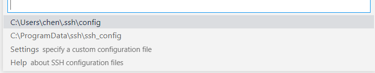

# vscode使用说明

## 基础安装

- 下载vscode

  https://code.visualstudio.com/

- 安装扩展

  - 中文（可选）
  - python
  - pylance
  - remote ssh 连接服务器用
  - prettier-code formatter 文档格式化
  - markdown all in one（markdown，默认也支持但比较丑 可选）
  - markdown preview enhanced（markdown主题 可选）

## 常用设置介绍

文件-首选项-设置    或是  左下角齿轮-设置

设置可以显示为两种格式 GUI界面（默认）  json格式 （需点击右上角 打开设置json）

files.autoSave 自动保存

editor.fontSize 文字大小

editor.fontFamily 文字字体

editor.tabSize table空格字符数

关键字颜色

括号颜色

## 调试教程

# 连接服务器

需下载remote ssh扩展

完成后会在左侧栏中出现 远程资源管理器 界面

点击ssh target栏中的＋号

提示输入连接服务器命令 按照提示 ssh hello @microsoft.com -A

hello为账户名

@后为ip地址

-A 不知道 照抄

例 ssh maya@172.18.65.192 -A

提示选择配置文件 任意均可 一般建议本用户的  第一个

确定后会在左侧中出现该服务器 点击服务器那一栏右侧的连接按钮

打开新窗口 提示输入系统类型linux，输入密码，连接完成

## 每次登录设置无需密码自动登录

生成 私约公约

（1）在本地机器生成密钥对(公钥+私钥)：ssh-keygen

（2）私钥放本机，公钥放远程(~/.ssh路径下)

（3）在远程机器用公钥生成authorized_keys：

- 进入home目录下的.ssh文件夹：cd ~/.ssh

- cat id_rsa.pub >> authorized_keys

（4）vscode config文件加入本机私钥路径

SSH对公钥、私钥的权限和所有权的要求是非常严格的，总结如下：

1、下面两个目录的所有权必须是user，所属组也应该是user，权限必须为700

/home/user

/home/user/.ssh

2、下面公钥文件的所有权必须是user，所属组也应该是user，权限必须为600

/home/user\.ssh/authorized_keys

3、下面私钥文件的所有权必须是user，所属组也应该是user，权限必须是600

/home/user/.ssh/id_rsa