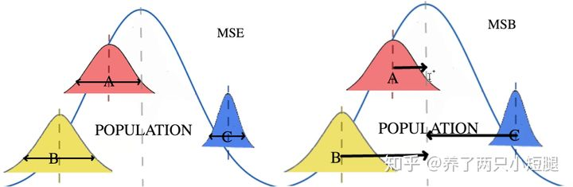
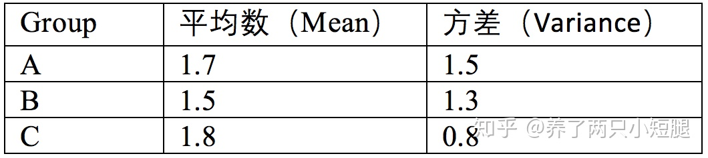

# 特征选择

特征选择也称为变量选择或属性选择。

自动选择数据中与您正在处理的预测建模问题最相关的属性（例如表格数据中的列）

特征选择方法可用于从数据中识别和删除不需要的、不相关的和冗余的属性，这些属性对预测模型的准确性没有贡献，或者实际上可能会降低模型的准确性。

将特征选择视为模型选择过程的一部分很重要。如果不这样做，您可能会无意中将偏差引入模型，从而导致过度拟合。

- **减少过度拟合**：更少的冗余数据意味着更少的机会基于噪声做出决策。
- **提高准确性**：减少误导性数据意味着提高建模准确性。
- **减少训练时间**：更少的数据意味着算法训练得更快。

## Filter(过滤法)

按照`发散性`或`相关性`对各个特征进行评分，设定阈值或者待选择特征的个数进行筛选

如分别对每个特征 x_i ，计算 x_i 相对于类别标签 y 的信息量 S(i) ，得到 n 个结果。然后将 n 个 S(i) 按照从大到小排序，输出前 k 个特征。显然，这样复杂度大大降低。那么关键的问题就是使用什么样的方法来度量 S(i) ，我们的目标是选取与 y 关联最密切的一些 特征x_i 。

- 去掉取值变化小的特征
- 单变量特征选择
  - Pearson相关系数
  - 卡方验证
  - 互信息和最大信息系数
  - 距离相关系数
  - 基于模型的特征排序 (Model based ranking)

### 去掉取值变化小的特征

原理很简单，假设某个特征的特征值只有0和1，在所有输入样本中，某个特征百分之95的值都是取相同的数，那就可以认为这个特征作用不大。如果100%都是1，那这个特征就没意义了。

### 单变量特征选择

对于分类问题(y离散) 可采用：

卡方检验，f_classif, mutual_info_classif

对于回归问题(y连续) 可采用：

皮尔森相关系数，f_regression, mutual_info_regression，最大信息系数

#### f_classif 方差分析（ANOVA）

我们想研究某种药物在不同剂量下对人们的作用。我们可能会将病人随机分为同等大小的三组，A组每天吃一片，B组每天吃两片，C组每天吃三片。因为我们只研究这个药品计量对病人的影响，所以是单因素分析，如果想要加入别的因素，例如，年龄，就需要用到多因素分析了。在上述实验中，我们给了三种不同的计量，所以这个药物计量因素下有三个水平（level）。

ANOVA的零假设（null hypothesis）是 
$$
H_0:\mu_A=\mu_B=\mu_C
$$
ANOVA中有两个重要概念：组间均方（mean squared between, MSB），相当于每个族群相对于总体的方差；组内均方（mean squared error, MSE），也就是每个分布自身的方差。下图是这两个概念的一个图像化的理解：

从图中可以看出，MSE来自各组的平均数。所以， ![[公式]](https://www.zhihu.com/equation?tex=MSE+%3D+%5Cfrac%7B%5Csigma%5E2_A%2B%5Csigma%5E2_B%2B%5Csigma%5E2_C%7D%7Bk%7D%3D%5Cfrac%7B1.5%2B1.3%2B0.8%7D%7B3%7D%3D1.2)

同样，看图发现，MSB来自各组平均值的方差。前面说过，如果这三组数据并无显著差别，我们可以将这个实验理解为从同一总体中，随机抽取三组样本。MSB就是总体的方差估计。我们知道，抽样分布的平均值方差是总体方差除以样本大小，即 ![[公式]](https://www.zhihu.com/equation?tex=%5Csigma%5E2_%7B%5Cmu%7D%3D%5Cfrac%7B%5Csigma%5E2%7D%7Bn%7D) 。假设，A，B，C都有34人，

![[公式]](https://www.zhihu.com/equation?tex=%5Cmu+%3D+%5Cfrac%7B%5Cmu_A%2B%5Cmu_B%2B%5Cmu_C%7D%7Bk%7D%3D1.667%2C+%5Csigma%5E2_%7B%5Cmu%7D+%3D0.023)，

![[公式]](https://www.zhihu.com/equation?tex=MSB%3D%5Csigma%5E2%3Dn%5Csigma%5E2_%7B%5Cmu%7D%3D34%5Ctimes0.023%3D0.782+)

最后我们需要做的，就是对比组间均方（MSB）和组内均方（MSE）。最简单的对比方法就是把他们相除，也就是我们常说的F-statistics，即 ![[公式]](https://www.zhihu.com/equation?tex=F%3D%5Cfrac%7BMSB%7D%7BMSE%7D) 。

第一种，MSB大，MSE小， ![[公式]](https://www.zhihu.com/equation?tex=F%3D%5Cfrac%7B%5Cbold%7BMSB%7D%7D%7BMSE%7D) 较大。这个情况说明，至少有一个分布相对其他分布较远，且每个分布都非常集中，即每个分布方差较小。所以，我们不能得出三个分布都有相同的均值，于是拒绝 ![[公式]](https://www.zhihu.com/equation?tex=H_0) 

#### 卡方(Chi2)检验

经典的卡方检验是检验**类别型变量**对**类别型变量**的相关性。假设自变量有N种取值，因变量有M种取值，考虑自变量等于i且因变量等于j的样本频数的观察值与期望的差距，构建统计量：
$$
x^2 = \sum \frac{(A-T)^2}{T}
$$
其中A为实际观测值，T为理论推断值。从上式可以很清晰地看到，计算得到的x2值越大，相关性越高。

假如现在有一批肿瘤内科患者的数据，想判断患者的收入水平（简单以穷人和富人代替）是否与患者患肠癌有关。简单制作下表表示真实观测值的分布：

| 肠癌患者 | 非肠癌患者 | 总计 |      |
| -------- | ---------- | ---- | ---- |
| 穷人     | 67         | 83   | 150  |
| 富人     | 102        | 64   | 166  |
| 总计     | 169        | 147  | 316  |

在上表中四个频数就是卡方检验公式里的A，即A=[67, 83, 102, 64]。

在这个数据中，肠癌患者约占总患者人数的53.48%。如果我们假设患者的收入水平与其患肠癌无关，那理论上，表格应该如下

|      | **肠癌患者**    | 非肠癌患者      | 总计 |
| ---- | --------------- | --------------- | ---- |
| 穷人 | 150x53.48% ≈ 80 | 150x46.52% ≈ 70 | 150  |
| 富人 | 166x53.48% ≈ 89 | 166x46.52% ≈ 77 | 166  |
| 总计 | 169             | 147             | 316  |

那么这时候，理论推断值T=[80, 70, 89, 77]。

这下就很明白了，带入卡方检验公式得：
$$
x^2= \frac{(67-80)^2}{80}+\frac{(83-70)^2}{70}+\frac{(102-89)^2}{89}+\frac{(64-77)^2}{77}\approx8.62
$$
计算得到了x2值，如何判断“患者的收入水平与其患肠癌无关”的假设是否成立呢？聪明的人早已整理了卡方分布临界值表，根据x2值和其对应的自由度（自由度=(行数 - 1) * (列数 - 1)，如上表，行数和列数不计入“总计”列和行。）去表里查一下就可以了（见下图），这个例子中，8.62 > 6.64, 就认为有1%的概率认为“患者的收入水平与其患肠癌无关”的假设成立，即有99%的置信度认为“患者的收入水平与其患肠癌有关”。

#### Pearson相关系数

皮尔森相关系数是一种最简单的，能帮助理解特征和响应变量之间关系的方法，该方法衡量的是变量之间的线性相关性，结果的取值区间为[-1，1]，-1表示完全的负相关(这个变量下降，那个就会上升)，+1表示完全的正相关，0表示没有线性相关。

总体相关系数:
$$
\rho_{X,Y}= \frac{cov(X,Y)}{\sigma_X\sigma_Y}=\frac{E[(X-\mu_X)(Y-\mu_Y)]}{\sigma_X\sigma_Y}
$$
**皮尔逊相关系数**:
$$
r= \frac{ \sum\limits_{i=1}^n (X_i-\overline{X}) (Y_i-\overline{Y}) }  {\sqrt{\sum\limits_{i=1}^n (X_i-\overline{X})^2}\sqrt{\sum\limits_{i=1}^n(Y_i-\overline{Y})^2}}
$$

#### 互信息和最大信息系数

经典的互信息也是评价**类别型变量**对**类别型变量**的相关性的，互信息公式如下：

![[公式]](https://www.zhihu.com/equation?tex=MI%28x_i%2Cy%29%3D%5Csum_%7Bx_i%5Cin%7B0%2C1%7D%7D%5Csum_%7By%5Cin%7B0%2C1%7D%7Dp%28x_i%2Cy%29log%5Cfrac%7Bp%28x_i%2Cy%29%7D%7Bp%28x_i%29p%28y%29%7D+)

当x_i是0/1离散值的时候，这个公式如上。很容易推广到 x_i 是多个离散值的情况。这里的 p(x_i,y) , p(x_i) 和 p(y) 都是从训练集上得到的。若问这个 MI 公式如何得来，请看它的 KL 距离（Kullback-Leibler）表述： ![[公式]](https://www.zhihu.com/equation?tex=+MI%28x_i%2Cy%29%3DKL%28P%28x_i%2Cy%29%7C%7Cp%28x_i%29p%28y%29%29++) 也就是说, MI 衡量的是 x_i 和 y 的独立性。如果它俩独立 P(x_i,y)=p(x_i)p(y) ，那么 KL 距离值为0，也就是 x_i 和 y 不相关了，可以去除 x_i 。相反，如果两者密切相关，那么 MI 值会很大。在对 MI 进行排名后，最后剩余的问题就是如何选择 k 个值（前 k 个 x_i ）。(后面将会提到此方法)我们继续使用交叉验证的方法，将 k 从 1 扫描到 n ，取评分最高的k 。 不过这次复杂度是线性的了。比如，在使用朴素贝叶斯分类文本的时候，词表长度 n 很大。 使用filiter特征选择方法，能够增加分类器精度。

想把互信息直接用于特征选择其实不是太方便：

1. 它不属于度量方式，也没有办法归一化，在不同数据及上的结果无法做比较
2. 对于连续变量的计算不是很方便（ X 和 Y 都是集合, x_i, y 都是离散的取值），通常变量需要先离散化，而互信息的结果对离散化的方式很敏感

最大信息系数克服了这两个问题。它首先寻找一种最优的离散化方式，然后把互信息取值转换成一种度量方式，取值区间在 [0,1]

#### 距离相关系数

距离相关系数是为了克服Pearson相关系数的弱点而生的。在x和x^2这个例子中，即便Pearson相关系数是0，我们也不能断定这两个变量是独立的（有可能是非线性相关）；但如果距离相关系数是0，那么我们就可以说这两个变量是独立的。

#### 基于模型的特征排序 (Model based ranking)

这种方法的思路是直接使用你要用的机器学习算法，针对 **每个单独的特征** 和 **响应变量**建立预测模型。假如 特征 和 响应变量 之间的关系是**非线性**的，可以用基于树的方法(决策树、随机森林)、或者 扩展的线性模型 等。基于树的方法比较易于使用，因为他们对非线性关系的建模比较好，并且不需要太多的调试。但要注意过拟合问题，因此树的深度最好不要太大，再就是**运用交叉验证**。

## Wrapper(包装法)

根据目标函数（往往是预测效果评分），每次选择若干特征，或者排除若干特征

基本思想：基于hold-out方法，对于每一个待选的特征子集，都在训练集上训练一遍模型，然后在测试集上根据误差大小选择出特征子集。需要先选定特定算法，通常选用普遍效果较好的算法， 例如Random Forest， SVM， kNN等等。

- 前向搜索
- 后向搜索
- 递归特征消除法

### 前向搜索

### 后向搜索

### 递归特征消除法

递归特征消除的主要思想是反复的构建模型（如SVM或者回归模型）然后选出最好的（或者最差的）的特征（可以根据系数来选），把选出来的特征选择出来，然后在剩余的特征上重复这个过程，直到所有特征都遍历了。这个过程中特征被消除的次序就是特征的排序。因此，这是一种寻找最优特征子集的贪心算法。 

RFE的稳定性很大程度上取决于在迭代的时候底层用哪种模型。例如，假如RFE采用的普通的回归，没有经过正则化的回归是不稳定的，那么RFE就是不稳定的；假如采用的是Ridge，而用Ridge正则化的回归是稳定的，那么RFE就是稳定的。

## Embedded(嵌入法)：

先使用某些机器学习的模型进行训练，得到各个特征的权值系数，根据系数从大到小选择特征（类似于Filter，只不过系数是通过训练得来的）

# 降维方法

## 主成分分析

主成分分析是设法将原来众多具有一定相关性（比如P个指标），重新组合成一组新的互相无关的综合指标来代替原来的指标。

主成分分析，是考察多个变量间相关性一种多元统计方法，研究如何通过少数几个主成分来揭示多个变量间的内部结构，即从原始变量中导出少数几个主成分，使它们尽可能多地保留原始变量的信息，且彼此间互不相关.通常数学上的处理就是将原来P个指标作线性组合，作为新的综合指标。

最经典的做法就是用F1（选取的第一个线性组合，即第一个综合指标）的方差来表达，即Var(F1)越大，表示F1包含的信息越多。因此在所有的线性组合中选取的F1应该是方差最大的，故称F1为第一主成分。如果第一主成分不足以代表原来P个指标的信息，再考虑选取F2即选第二个线性组合，为了有效地反映原来信息，F1已有的信息就不需要再出现在F2中，用数学语言表达就是要求Cov(F1, F2)=0，则称F2为第二主成分，依此类推可以构造出第三、第四，……，第P个主成分。

## 奇异值分解

## Sammon 映射