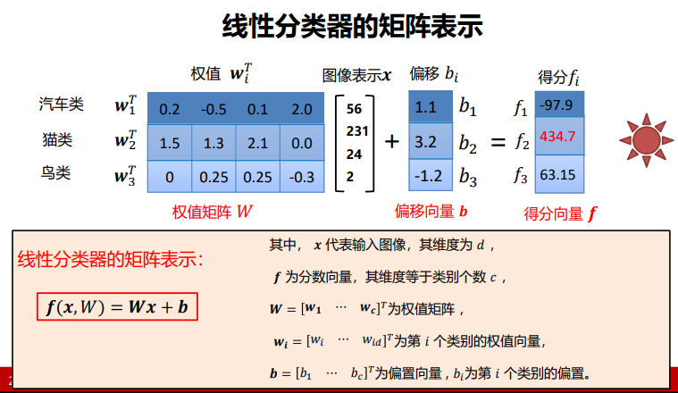
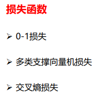
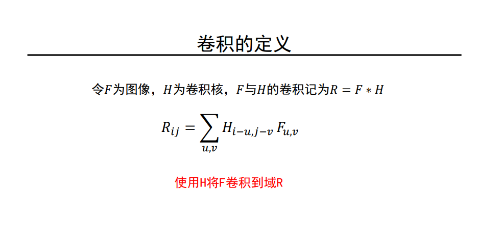
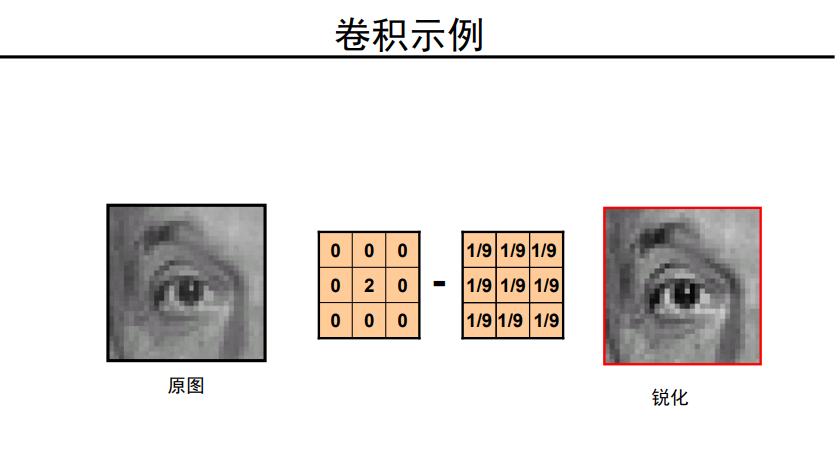
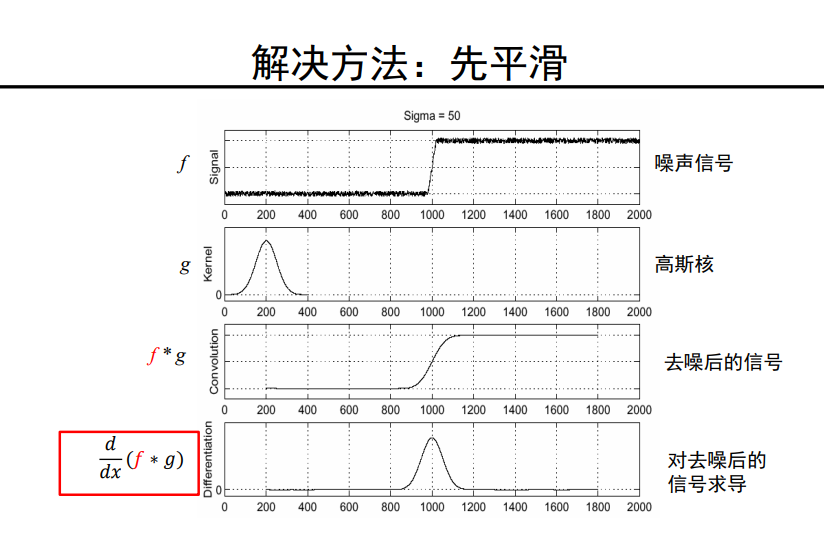
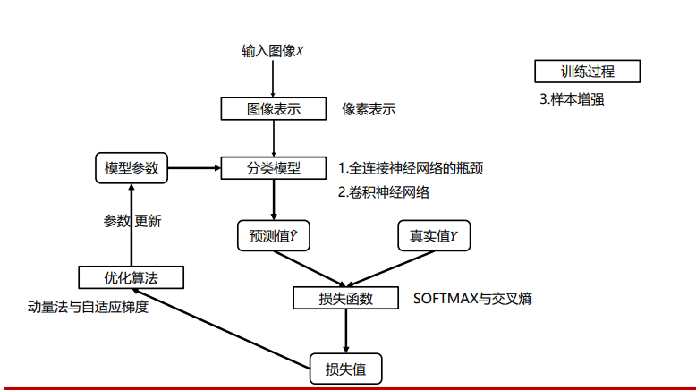
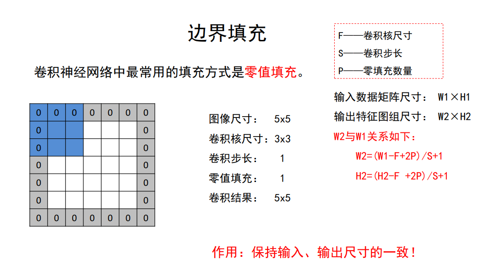
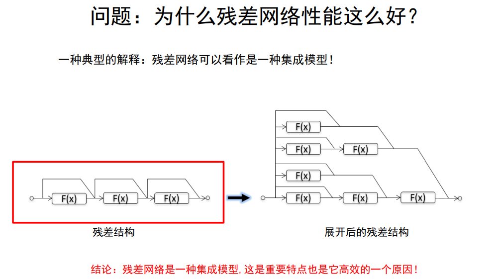
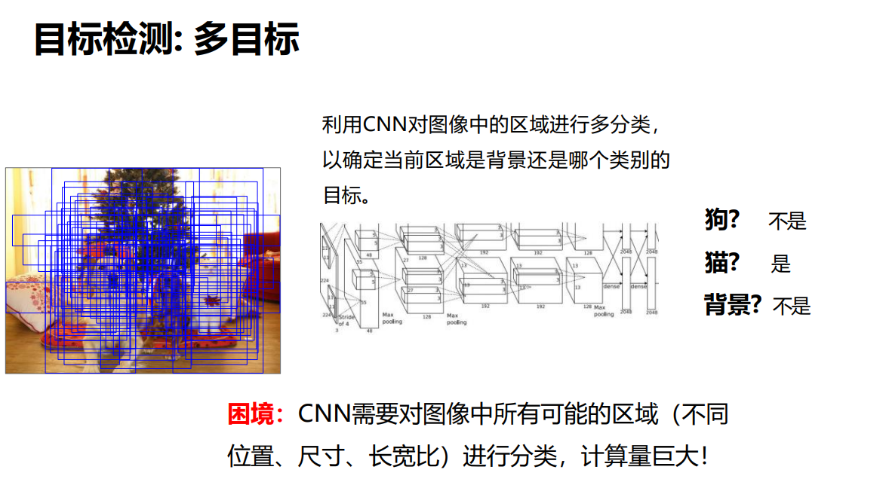

#  计算机视觉和深度学习

## 前言

## 图像分类

### 图像表示

直接将图像按顺序拉成一维向量

### 分类模型

#### 线性分类器

第i个类的线性分类器：
$$
f_i(x,w_i)=w_i^Tx+b_i, \quad i=1,\cdots,c
$$

$$
x代表输入的d维图像向量，c为类别个数 \qquad w_i=[w_{i1}\;\cdots\;w_{id}]^T为第i个类别的权值向量，b_i为偏置
$$

### 损失函数

损失函数每个类别预测值与真实类别的预测值之间的损失之和的平均值

### 优化方法

#### 梯度下降

### 训练过程

#### 数据预处理

去均值

归一化

## 全连接神经网络

### 多层感知器

### 激活函数

### SOFTMAX 结果处理

### 交叉熵损失

### 计算图

### 梯度算法改进

#### 动量法

#### 自适应梯度

#### Adam

### 权值初始化

### 批归一化

### 欠拟合 过拟合 Dropout

### 模型正则与超参数调优

## 卷积与图像去噪

****

### 卷积核

### 高斯卷积核

### 图像去噪

#### 椒盐噪声

## 卷积与边缘提取

## 纹理表示

## 卷积神经网络

### 图像表示

### 全连接神经网络的瓶颈

### 卷积神经网络

## 经典网络解析

### AlexNet

### VGG

### GoogleNet

### ResNet

## 图像分割和目标检测

### 语义分割

### 目标检测

## 可视化

## 生成模型