# 3D分类/语义分割

## PointNet

> PointNet: Deep Learning on Point Sets for 3D Classification and Segmentation

***直接使用点云作为输入，点云具有无序型，但实际点云的顺序对于物体识别是有关的，网络需要学习这种关系***

### 本文主要贡献

- 网络直接使用点云作为输入
- 展示了如何训练这样的网络
- 对该方法的稳定性和效率作了理论分析
- 可视化网络学习的特征

从数据结构的角度来看，点云是一个无序的向量集。大多数深度学习网络都在学习常规的输入表示，如序列（语音和语言处理）、图像和体积（视频或三维数据），但在点集的深度学习上并没有作太多的工作。

### 问题定义

点云：n个点 每个点（x, y, z） N* 3   共k类

分类任务：从场景中分割出某个物体区域  该区域的点云作为输入  -》 输出类别 k

分割任务：该场景点云作为输入 -》输出每个的类别 N* k

### 点云输入特性

- 无序性
- 点之间存在相互关系
- 变换下点云特性不变（如经过旋转和平移后，全局点云类别不变，分割语义不变）

### 网络架构

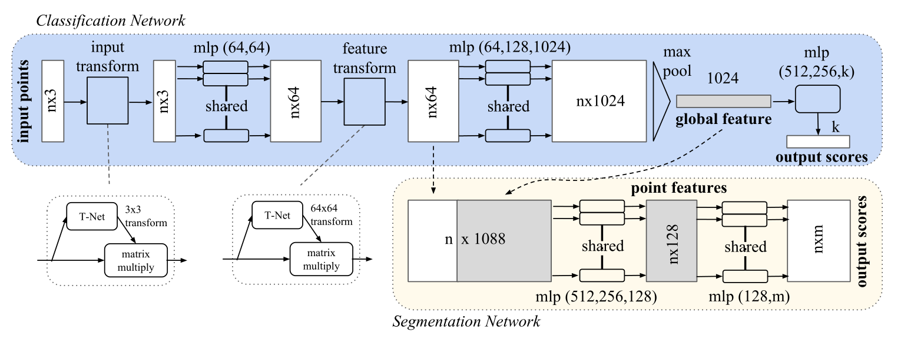

three key modules:

- the max pooling layer as a symmetric function to aggregate information from all the points

- a local and global information combination structure

- two joint alignment networks that align both input points and point features.

**三个关键模块：**

- 作为对称函数的最大池化层用来聚合点云信息 

- 一个局部全局关系组合结构

- 两个联合对齐网络用来对齐输入的点和点的特征

#### 1. 无序输入的对称函数

为了使模型对输入的变化不产生影响，有三种策略

- 将输入按一定顺序排序，需有一定的顺序，但找不到一个合适的排序方式
- 将输入作为一个序列训练RNN，通过各种排列组合增强数据，使输出对输入顺序不敏感，但顺序很重要不能忽略
- 使用一个简单的对称函数来汇总每个点的信息，这里将n个向量作为输入，输出一个对输入位置不变的新向量例如，+和∗运算符是对称的二进制函数。

作者选择第三种方式，通过对集合中的转换元素应用对称函数来近似定义在一个点集合上的一般函数
$$
f({x_1,...,x_n})\approx g(h(x_1),...,h(x_n))
$$
where $f : 2^{\mathbb{R}^N} → \mathbb{R}, h : \mathbb{R}^N → \mathbb{R}^K $and $g :\underbrace{\mathbb{R}^{K} \times \cdots \times \mathbb{R}^{K}}_{n} \rightarrow \mathbb{R} $ is a symmetric function.

从经验上看，我们的基本模块非常简单：我们用一个多层感知器网络来近似h，用一个单变量函数和一个最大集合函数的组合来近似g。实验发现这样做效果很好。通过一个h的集合，我们可以学习一些f来捕捉集合的不同属性。

#### 2. 局部全局信息聚合

直接拼接见图

#### 3. 联合对齐网络

为了使点云经过某种变换对语义标签不变，一个普遍的解决方案是将输入集对齐到一个典型的空间***（如二维深度学习中的resize、归一化）***

我们通过一个预测一个变换矩阵，并将这个变换应用与输入点的坐标***（类似于一个直角坐标系里的圆变换到极坐标系，或是一个矩形通过乘以一个矩阵，实现这个矩形的放缩，旋转，平移）***

然而特征空间的变换矩阵比空间变换矩阵的维度高得多，这大大增加了优化的难度，所以我们在损失中加入了一个正则化项，将特征变换矩阵约束为接近正交矩阵
$$
L_{reg}=||I-AA^T||_F^2
$$
A是预测的变换矩阵，正交变换不会丢失输入的信息***（在空间变换中正交变换不改变物体形状）***

### 理论分析

#### 通用近似

直觉上讲，对输入集的扰动不改变函数值，如分类或分割结果

Formally, let  $\mathcal{X}=\left\{S: S \subseteq[0,1]^{m}\right.  and  \left.|S|=n\right\}$,$ f:   \mathcal{X} \rightarrow \mathbb{R} $ is a continuous set function on  $\mathcal{X}$  w.r.t to Hausdorff distance  $d_{H}(\cdot, \cdot)$ , i.e.

$ \forall \epsilon>0, \exists \delta>0$ , for any $ S, S^{\prime} \in \mathcal{X}$ , if  $d_{H}\left(S, S^{\prime}\right)<\delta$ , then $ \left|f(S)-f\left(S^{\prime}\right)\right|<\epsilon$ . 

在原坐标系，$S，S^{\prime}$ 距离近，通过f变换后依然近，f为整个网络，S为点的子集(可以想象成是一把椅子由多个点组成，一张桌子由点云组成，在原坐标系距离近，经过f变换后，依然较近)

理论表明在最大集合层有足够多的神经元的情况下，即K足够大，f可以被网络任意的近似

#### 理论1：

$$
Suppose\  f: \mathcal{X} \rightarrow \mathbb{R}  \ is \ a \ continuous \ set \ function 
\ w.r.t \ Hausdorff \ distance \ d_{H}(\cdot, \cdot) 
\\ \quad \forall \epsilon>   0, \exists \ a \ continuous\ function\  h\  and\ a\ symmetric\ function\  g\left(x_{1}, \ldots, x_{n}\right)=\gamma \circ M A X,\\
such\ that\ for\ any\  S \in \mathcal{X} ,
\left|f(S)-\gamma\left(\underset{x_{i} \in S}{M A X}\left\{h\left(x_{i}\right)\right\}\right)\right|<\epsilon
$$

这个定理的证明可以在我们的补充材料中找到。关键的想法是，在最坏的情况下，网络可以通过将空间划分为同等大小的体素，学习将点云转换为体积表示。然而，在实践中，网络学会了一种更聪明的策略来探测空间，正如我们将在点函数可视化中看到的。

#### 瓶颈尺寸和稳定性

在理论和实验上，我们发现我们的网络的表现力受到最大集合层维度的强烈影响，即（1）中的K。

我们定义$u = MAX\ {h(x_i)}\ x_i∈S $为f的子网络，它将[0, 1]m中的一个点集映射为K维的矢量。

下面的定理告诉我们，输入集合中的小腐败或额外的噪声点不可能改变我们网络的输出。

#### 理论2：

$$
Theorem\ 2. \ Suppose\  \mathbf{u}: \mathcal{X} \rightarrow \mathbb{R}^{K}  \ such \ that\  \mathbf{u}=   \underset{x_{i} \in S}{\operatorname{MAX}}\left\{h\left(x_{i}\right)\right\}  \ and \ f=\gamma \circ \mathbf{u} . Then,\\
(a)  \forall S, \exists \mathcal{C}_{S}, \mathcal{N}_{S} \subseteq \mathcal{X}, f(T)=f(S)  \ if \ \mathcal{C}_{S} \subseteq T \subseteq \mathcal{N}_{S} ;\\
(b)  \left|\mathcal{C}_{S}\right| \leq K
$$

我们解释该定理的含义。(a)说，如果CS中的所有点都被保留，那么f(S)在输入腐败之前是不变的；它在NS之前也是不变的，有额外的噪声点。(b)说CS只包含有限数量的点，由（1）中的K决定。换句话说，f(S)实际上完全由一个少于或等于K元素的有限子集CS⊆S决定。因此我们称CS为S的临界点集，K为f的瓶颈维度。

结合h的连续性，这就解释了我们的模型对点扰动、腐败和额外噪声点的鲁棒性。稳健性是通过类似于机器学习模型中的稀疏性原则获得的。

直观地说，我们的网络学会了用一组稀疏的关键点来概括一个形状。在实验部分，我们看到关键点形成了一个物体的骨架。

### 实验

#### 应用

**3D目标检测**

原始点云处理

我们根据面的面积对网格面上的1024个点进行均匀采样，并将其归一化为一个单位球体。

在训练过程中，我们通过沿上轴随机旋转物体和用零平均值和0.02标准差的高斯噪声抖动每个点的位置来即时增加点云。

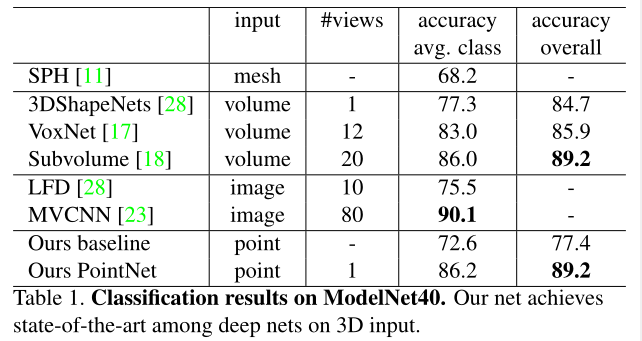

**3D目标部分分割**

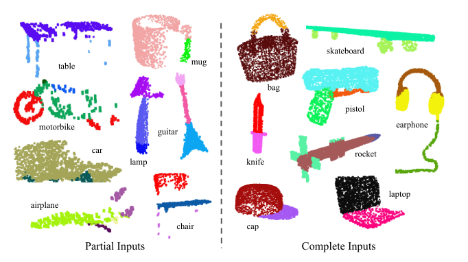

**语义分割**

为了准备训练数据，我们首先按房间分割点，然后将房间抽成面积为1米乘1米的块。

每个点由一个9维的XYZ、RGB和归一化的房间位置（从0到1）的向量表示。在训练时，我们在每个区块中随机抽取4096个点。在测试时间，我们对所有的点进行测试。我们遵循与[1]相同的协议，使用k-fold策略进行训练和测试。

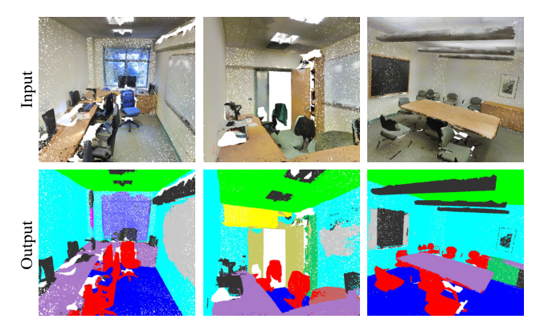

#### 架构设计分析

**与其他顺序无关方法比较**

***验证取max pooling （1.） 的有效性***

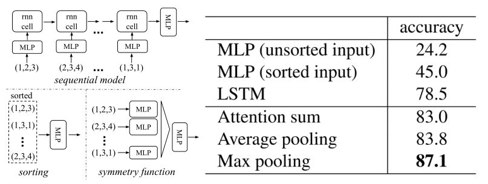

**输入和特征转换的有效性**

***验证特征变换（3.）的有效性，感觉没什么用***

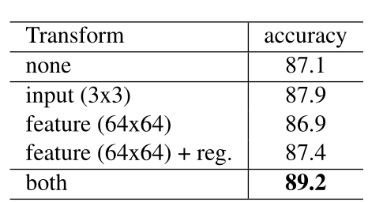

特征变换有两部分input transform和feature transform见图，根据实验和不使用相比提高2.1%

**鲁棒性测试**

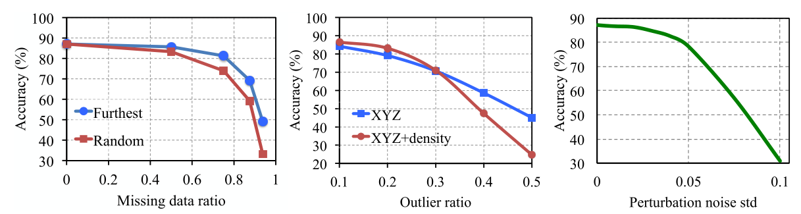

左图：x轴：删除一定比例的点，furthest为对最原始的1024个点最远取样

中图：x轴：异常值均匀地散布在单位球体中，在空间中手动添加异常值   只用xyz坐标和加入密度

右图：x轴：高斯核的啥  在每个点独立添加高斯噪声

结论：在忽略部分点或施加噪声时，准确率依然很高

#### 网络可视化

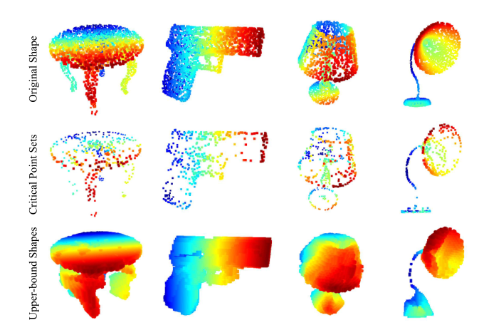

1.原始形状  2.关键点集（下界）  3.最大上界

#### 时间空间复杂性分析

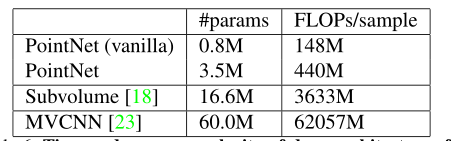

参数量和运行速度很快，结果差不多

## PointNet++

> PointNet++: Deep Hierarchical Feature Learning on Point Sets in a Metric Space

***针对 pointnet网络上的缺陷不能识别局部特征做改进***

***根据卷积可以提取局部特征的特性，参考滑动窗口，需要在点云上类似设计，可以想到定义一个局部的邻域球，然后进行滑动，但点云由于不连续，各区域密度不同，怎样设计结构有待解决***

***本论文的主要贡献为利用多个尺度的邻域实现鲁棒性和细节捕捉，在随机输入的协助下，该网络学会了自适应地加权在不同尺度上检测到的模式，并根据输入数据结合多尺度特征。***

### 本文方法

#### 回顾pointnet

见上面，略

#### 层次化的点集特征学习

集合抽象层由三个关键层组成。采样层、分组层和点网层。采样层从输入点中选择一个点集，它定义了局部区域的中心点。然后，分组层通过寻找中心点周围的 "相邻 "点来构建局部区域集。点网层使用迷你点网将局部区域模式编码为特征向量。如图

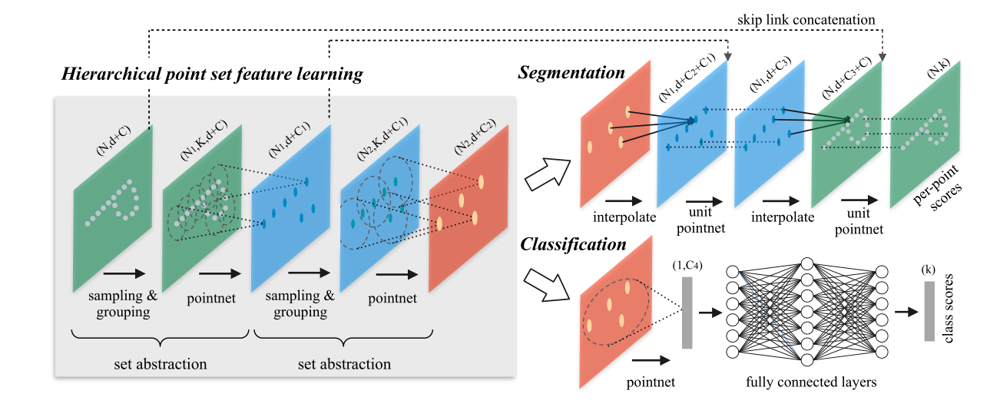

集合抽象层：(N, d+C)  -> (N1, d+C1)  ***N个点 d维坐标 C维其他特征  类似于卷积的下采样 降尺寸升通道***

- **采样层：** (N, d+C)  -> (N1, d)   

  FPS 最远点采样 **纯算法** 得到所有点的覆盖采样 作为分组中心

  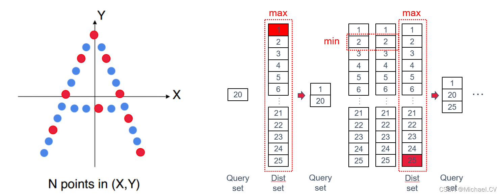

- **分组层：**输入( N, d+C ), ( N1, d )(采样结果)   ->  (N1, K, d+C )

  卷积神经网络中，像素的局部区域为卷积核的大小，在点集中，点的邻域是一定半径内的区域，或是根据KNN得到最近的点 最多为K个点（可以设置）

  该层实际为根据采样层得到的中心点，每个点周围找K个点最为该点的邻域 **纯算法**

  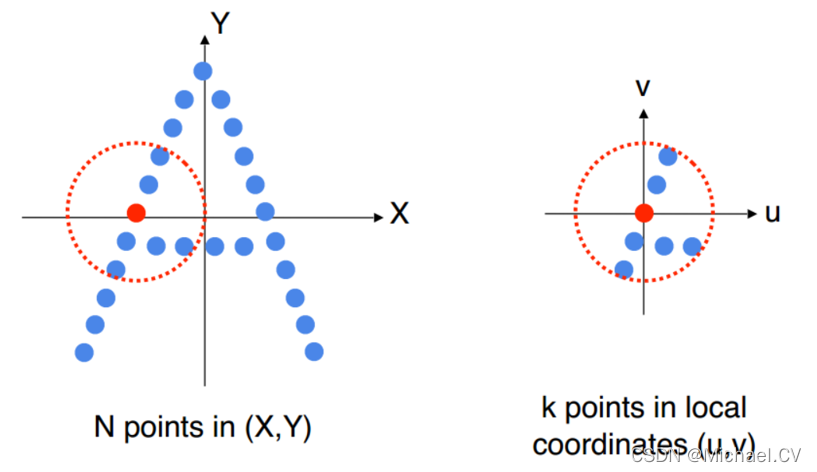

- **点网层：** (N1, K, d+C )  -> (N1, d+C1)  

   (N1, K, d+C )  -> 卷积 (N1, K, d+C1)  -> pooling (N1, 1, d+C1)  

  提取特征，网络为pointnet

#### 非均匀采样密度下的鲁棒性特征学习

在分组局部区域和结合不同尺度的特征方面，我们提出了两类密度自适应层，如下所述。

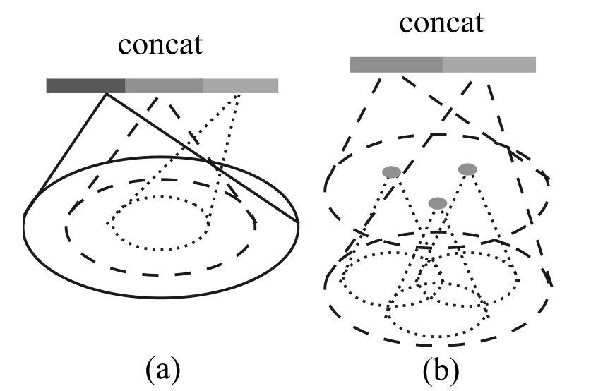

#### 语义分割的点特征传播

为了实现点云的语义分割任务，我们需要获得所有原始坐标点的特征。一种解决方案是在所有点集的Set Segmentation层中，将所有的点作为中心点进行采样，但是这会导致较高的计算成本。另一种方法是将特征从亚采样点逐层传播到原始点（图3.9）。作者采用了基于反距离权重插值（Inverse Distance Weight，IDW）和跨水平跳跃链接的分级传播策略（类似CNN的上采样）。具体实现流程如下：

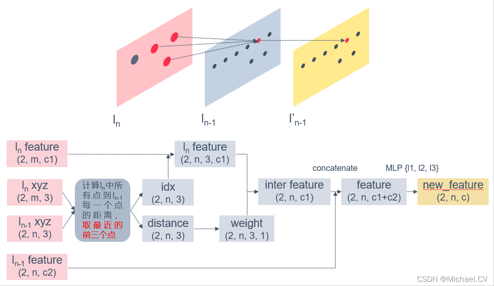

# 3D目标检测

## Frustum PointNets (F-PointNet)

> Frustum PointNets for 3D Object Detection from RGB-D Data

***使用2d目标检测器辅助提出区域建议***

***大多数工作是将3d点云转化为图像或体素，然后应用网络，这种数据表示可能会掩盖数据的自然三维模式和不变性。一些论文提出直接处理点云，如pointnet，在分类和分割表现出色。但目前不清楚怎样实现目标检测，为了实现这一目标，必须解决如何实现3d的rpn，模仿2d的操作通过滑动窗口列举是可以的，但代价太高。***

***本文提出通过先按照降维原则减少搜索空间，即使用2d目标检测提取物体的三维边界框，再在每个3d框内实现目标检测实例分割***

**RGB-D图片介绍：在普通的图片上多了深度这第四个维度 （w，h，4） 可以理解为普通的rgb图加上一个代表深度的灰度图，非传统点云结构**

### 问题定义

给定RGB-D图片进行分类和定位

标签：三维边界框 （h, w, l, cx, cy, cz, θ, φ, ψ）长宽高 中心点坐标  相对于每个类别预定义的标准姿态的方向 

### 网络架构

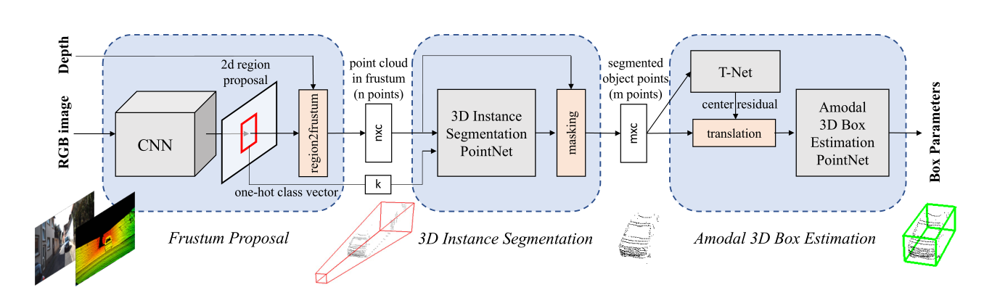

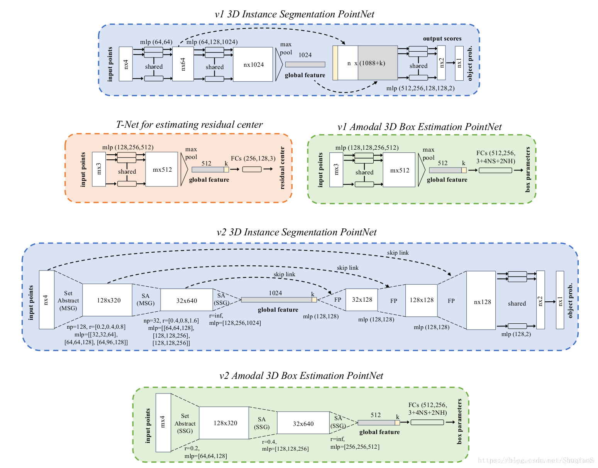

#### Frustum Proposal（截头锥体建议，见图）

深度传感器拍摄的RGB-D图像分辨率不足，远低于普通相机的RGB图像，所以作者通过成熟的2d检测提出一个二维物体区域建议，根据这个区域的方向和深度的近平面和远平面，我们就得到一个三维搜索空间的截头锥体和内部的点云。

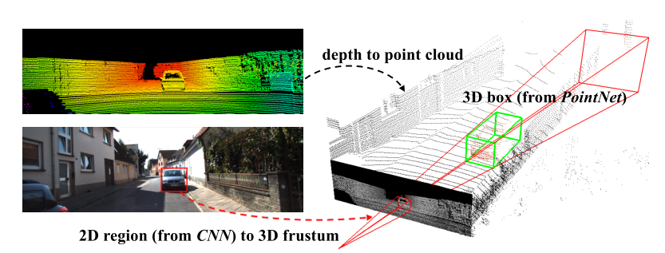

如图a，但是截头锥体可能朝向许多不同的方向，这导致点云的位置变化，因此，通过将锥体向中心旋转，使锥体的中心和图像平面正交，这种正则化有助于提高算法的旋转不变性。

***此部分为2d的目标检测，提取定位和分类***

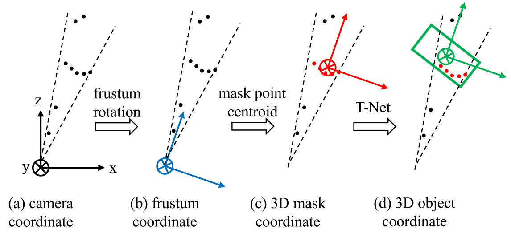

#### 3D Instance Segmentation

输入：（n，c）和 k  ***区域建议的点云和类别***

输出：（m，c）  ***该区域中输入该类的点***

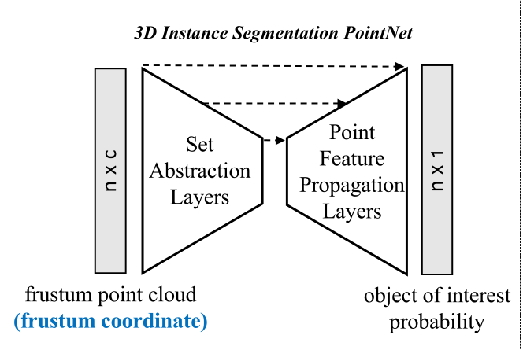

***对该区域的点做分类判断为是否为感兴趣的点  得到可能性分数 类似于RPN***

***根据分数排名选出m个点，现在这m个点的坐标是相对于蓝色中心的，为了便于进行分类和定位，转换到这些点的中心即红色中心，之后进行输出。***

#### 3D amodal bounding box estimation

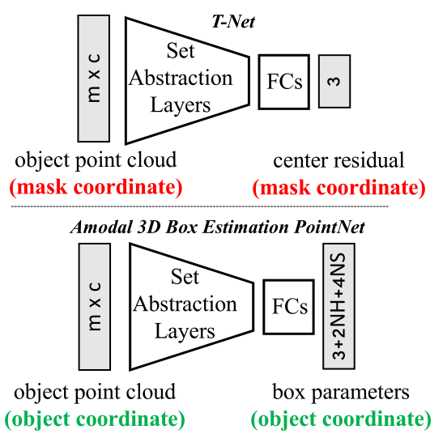

***第一部分已经得到了类别信息，第二部分得到了该类有哪些点，该部分是为了进行定位，也就是找到3d边界框，已经有了这个点的中心，但是由于物体不规范或是缺少部分，导致现在的中心可能不是真正的中心，所以利用T-net计算了一个中心偏移（Δcx，Δcy，Δcz，），用来找到真正的中心，经过中心偏移后，利用pointnet回归边界框（3+2NH+4NS） 3为（w，h，l）***

如第3节所述，我们通过中心（cx、cy、cz）、大小（h、w、l）和航向角θ（沿上轴线）来参数化三维边界框。我们采用“残差”方法进行箱中心估计。盒估计网络预测的中心残差与来自T网络的先前中心残差和屏蔽点的质心相结合，以恢复绝对中心（等式1）。对于箱子大小和航向角度，我们遵循了之前的工作[29，24]，并使用分类和回归公式的混合。具体来说，我们预先定义了N个S大小的模板和N个H等分角箱子。我们的模型将大小/标题（大小的N S分数，标题的N H分数）分类到那些预定义的类别，并预测每个类别的残差数（高度、宽度、长度的3×N S残差维度，标题的N H残差角度）。最后，该网络共输出3+4×N S+2×N H个数。

### 损失函数