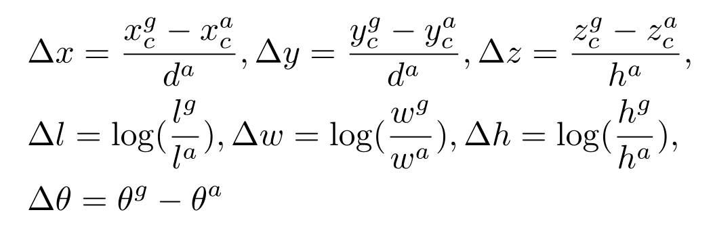
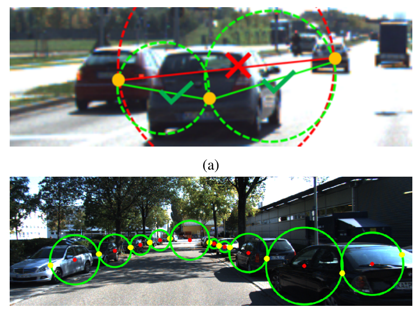
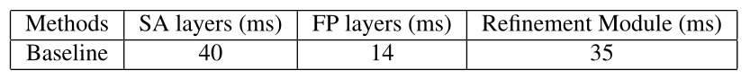

# 目录

|      | 网络                                           | 时间 | 期刊 | 方式               | 类型            |
| ---- | ---------------------------------------------- | ---- | ---- | ------------------ | --------------- |
| 1    | [PointNet](# PointNet)                         | 2017 | CVPR | 基于点云           | 3D分类/语义分割 |
| 2    | [PointNet++](# PointNet++)                     | 2017 | NIPS | 基于点云           | 3D分类/语义分割 |
| 3    | [F-PointNet](# Frustum PointNets (F-PointNet)) | 2018 | CVPR | 2d+点云            | 3D目标检测      |
| 4    | [VoxelNet](# VoxelNet)                         | 2018 | CVPR | 点云转体素         | 3D目标检测      |
| 5    | [PointPillars](# VoxelNet)                     | 2019 | CVPR | 点云转伪图像       | 3D目标检测      |
| 6    | [Votenet](# Votenet)                           | 2019 | ICCV | 基于点云           | 3D目标检测      |
| 7    | [PointRCNN](# PointRCNN)                       | 2019 | CVPR | 基于点云           | 3D目标检测      |
| 8    | [DSGN](# DSGN)                                 | 2020 | CVPR | 双目               | 3D目标检测      |
| 9    | [MonoPair](# MonoPair)                         | 2020 | CVPR | 单目               | 3D目标检测      |
| 10   | [D4LCN](# D4LCN)                               | 2020 | CVPR | 单目               | 3D目标检测      |
| 11   | [Frustum ConvNet](# Frustum ConvNet)           | 2019 | CVPR | 2d+点云            | 3D目标检测      |
| 12   | [Part-A2 Net](# Part-A2 Net)                   | 2020 | PAMI | 点云转体素转伪图像 | 3D目标检测      |
| 13   | [3DSSD](# 3DSSD)                               | 2020 | CVPR | 基于点云           | 3D目标检测      |
| 14   | [VoTr](# VoTr)                                 | 2021 | ICCV | 基于点云           | 3D目标检测      |

# PointNet

> PointNet: Deep Learning on Point Sets for 3D Classification and Segmentation

***直接使用点云作为输入，点云具有无序型，但实际点云的顺序对于物体识别是有关的，网络需要学习这种关系***

## 本文主要贡献

- 网络直接使用点云作为输入
- 展示了如何训练这样的网络
- 对该方法的稳定性和效率作了理论分析
- 可视化网络学习的特征

从数据结构的角度来看，点云是一个无序的向量集。大多数深度学习网络都在学习常规的输入表示，如序列（语音和语言处理）、图像和体积（视频或三维数据），但在点集的深度学习上并没有作太多的工作。

## 问题定义

点云：n个点 每个点（x, y, z） N* 3   共k类

分类任务：从场景中分割出某个物体区域  该区域的点云作为输入  -》 输出类别 k

分割任务：该场景点云作为输入 -》输出每个的类别 N* k

## 点云输入特性

- 无序性
- 点之间存在相互关系
- 变换下点云特性不变（如经过旋转和平移后，全局点云类别不变，分割语义不变）

## 网络架构

three key modules:

- the max pooling layer as a symmetric function to aggregate information from all the points

- a local and global information combination structure

- two joint alignment networks that align both input points and point features.

**三个关键模块：**

- 作为对称函数的最大池化层用来聚合点云信息 

- 一个局部全局关系组合结构

- 两个联合对齐网络用来对齐输入的点和点的特征

### 1. 无序输入的对称函数

为了使模型对输入的变化不产生影响，有三种策略

- 将输入按一定顺序排序，需有一定的顺序，但找不到一个合适的排序方式
- 将输入作为一个序列训练RNN，通过各种排列组合增强数据，使输出对输入顺序不敏感，但顺序很重要不能忽略
- 使用一个简单的对称函数来汇总每个点的信息，这里将n个向量作为输入，输出一个对输入位置不变的新向量例如，+和∗运算符是对称的二进制函数。

作者选择第三种方式，通过对集合中的转换元素应用对称函数来近似定义在一个点集合上的一般函数
$$
f({x_1,...,x_n})\approx g(h(x_1),...,h(x_n))
$$
where $f : 2^{\mathbb{R}^N} → \mathbb{R}, h : \mathbb{R}^N → \mathbb{R}^K $and $g :\underbrace{\mathbb{R}^{K} \times \cdots \times \mathbb{R}^{K}}_{n} \rightarrow \mathbb{R} $ is a symmetric function.

从经验上看，我们的基本模块非常简单：我们用一个多层感知器网络来近似h，用一个单变量函数和一个最大集合函数的组合来近似g。实验发现这样做效果很好。通过一个h的集合，我们可以学习一些f来捕捉集合的不同属性。

### 2. 局部全局信息聚合

直接拼接见图

### 3. 联合对齐网络

为了使点云经过某种变换对语义标签不变，一个普遍的解决方案是将输入集对齐到一个典型的空间***（如二维深度学习中的resize、归一化）***

我们通过一个预测一个变换矩阵，并将这个变换应用与输入点的坐标***（类似于一个直角坐标系里的圆变换到极坐标系，或是一个矩形通过乘以一个矩阵，实现这个矩形的放缩，旋转，平移）***

然而特征空间的变换矩阵比空间变换矩阵的维度高得多，这大大增加了优化的难度，所以我们在损失中加入了一个正则化项，将特征变换矩阵约束为接近正交矩阵
$$
L_{reg}=||I-AA^T||_F^2
$$
A是预测的变换矩阵，正交变换不会丢失输入的信息***（在空间变换中正交变换不改变物体形状）***

## 理论分析

### 通用近似

直觉上讲，对输入集的扰动不改变函数值，如分类或分割结果

Formally, let  $\mathcal{X}=\left\{S: S \subseteq[0,1]^{m}\right.  and  \left.|S|=n\right\}$,$ f:   \mathcal{X} \rightarrow \mathbb{R} $ is a continuous set function on  $\mathcal{X}$  w.r.t to Hausdorff distance  $d_{H}(\cdot, \cdot)$ , i.e.

$ \forall \epsilon>0, \exists \delta>0$ , for any $ S, S^{\prime} \in \mathcal{X}$ , if  $d_{H}\left(S, S^{\prime}\right)<\delta$ , then $ \left|f(S)-f\left(S^{\prime}\right)\right|<\epsilon$ . 

在原坐标系，$S，S^{\prime}$ 距离近，通过f变换后依然近，f为整个网络，S为点的子集(可以想象成是一把椅子由多个点组成，一张桌子由点云组成，在原坐标系距离近，经过f变换后，依然较近)

理论表明在最大集合层有足够多的神经元的情况下，即K足够大，f可以被网络任意的近似

### 理论1：

$$
Suppose\  f: \mathcal{X} \rightarrow \mathbb{R}  \ is \ a \ continuous \ set \ function 
\ w.r.t \ Hausdorff \ distance \ d_{H}(\cdot, \cdot) 
\\ \quad \forall \epsilon>   0, \exists \ a \ continuous\ function\  h\  and\ a\ symmetric\ function\  g\left(x_{1}, \ldots, x_{n}\right)=\gamma \circ M A X,\\
such\ that\ for\ any\  S \in \mathcal{X} ,
\left|f(S)-\gamma\left(\underset{x_{i} \in S}{M A X}\left\{h\left(x_{i}\right)\right\}\right)\right|<\epsilon
$$

这个定理的证明可以在我们的补充材料中找到。关键的想法是，在最坏的情况下，网络可以通过将空间划分为同等大小的体素，学习将点云转换为体积表示。然而，在实践中，网络学会了一种更聪明的策略来探测空间，正如我们将在点函数可视化中看到的。

### 瓶颈尺寸和稳定性

在理论和实验上，我们发现我们的网络的表现力受到最大集合层维度的强烈影响，即（1）中的K。

我们定义$u = MAX\ {h(x_i)}\ x_i∈S $为f的子网络，它将[0, 1]m中的一个点集映射为K维的矢量。

下面的定理告诉我们，输入集合中的小腐败或额外的噪声点不可能改变我们网络的输出。

### 理论2：

$$
Theorem\ 2. \ Suppose\  \mathbf{u}: \mathcal{X} \rightarrow \mathbb{R}^{K}  \ such \ that\  \mathbf{u}=   \underset{x_{i} \in S}{\operatorname{MAX}}\left\{h\left(x_{i}\right)\right\}  \ and \ f=\gamma \circ \mathbf{u} . Then,\\
(a)  \forall S, \exists \mathcal{C}_{S}, \mathcal{N}_{S} \subseteq \mathcal{X}, f(T)=f(S)  \ if \ \mathcal{C}_{S} \subseteq T \subseteq \mathcal{N}_{S} ;\\
(b)  \left|\mathcal{C}_{S}\right| \leq K
$$

我们解释该定理的含义。(a)说，如果CS中的所有点都被保留，那么f(S)在输入腐败之前是不变的；它在NS之前也是不变的，有额外的噪声点。(b)说CS只包含有限数量的点，由（1）中的K决定。换句话说，f(S)实际上完全由一个少于或等于K元素的有限子集CS⊆S决定。因此我们称CS为S的临界点集，K为f的瓶颈维度。

结合h的连续性，这就解释了我们的模型对点扰动、腐败和额外噪声点的鲁棒性。稳健性是通过类似于机器学习模型中的稀疏性原则获得的。

直观地说，我们的网络学会了用一组稀疏的关键点来概括一个形状。在实验部分，我们看到关键点形成了一个物体的骨架。

## 实验

### 应用

**3D目标检测**

原始点云处理

我们根据面的面积对网格面上的1024个点进行均匀采样，并将其归一化为一个单位球体。

在训练过程中，我们通过沿上轴随机旋转物体和用零平均值和0.02标准差的高斯噪声抖动每个点的位置来即时增加点云。

**3D目标部分分割**

**语义分割**

为了准备训练数据，我们首先按房间分割点，然后将房间抽成面积为1米乘1米的块。

每个点由一个9维的XYZ、RGB和归一化的房间位置（从0到1）的向量表示。在训练时，我们在每个区块中随机抽取4096个点。在测试时间，我们对所有的点进行测试。我们遵循与[1]相同的协议，使用k-fold策略进行训练和测试。

### 架构设计分析

**与其他顺序无关方法比较**

***验证取max pooling （1.） 的有效性***

**输入和特征转换的有效性**

***验证特征变换（3.）的有效性，感觉没什么用***

特征变换有两部分input transform和feature transform见图，根据实验和不使用相比提高2.1%

**鲁棒性测试**

左图：x轴：删除一定比例的点，furthest为对最原始的1024个点最远取样

中图：x轴：异常值均匀地散布在单位球体中，在空间中手动添加异常值   只用xyz坐标和加入密度

右图：x轴：高斯核的啥  在每个点独立添加高斯噪声

结论：在忽略部分点或施加噪声时，准确率依然很高

### 网络可视化

1.原始形状  2.关键点集（下界）  3.最大上界

### 时间空间复杂性分析

参数量和运行速度很快，结果差不多

# PointNet++

> PointNet++: Deep Hierarchical Feature Learning on Point Sets in a Metric Space

***针对 pointnet网络上的缺陷不能识别局部特征做改进***

***根据卷积可以提取局部特征的特性，参考滑动窗口，需要在点云上类似设计，可以想到定义一个局部的邻域球，然后进行滑动，但点云由于不连续，各区域密度不同，怎样设计结构有待解决***

***本论文的主要贡献为利用多个尺度的邻域实现鲁棒性和细节捕捉，在随机输入的协助下，该网络学会了自适应地加权在不同尺度上检测到的模式，并根据输入数据结合多尺度特征。***

## 本文方法

### 回顾pointnet

见上面，略

### 层次化的点集特征学习

集合抽象层由三个关键层组成。采样层、分组层和点网层。采样层从输入点中选择一个点集，它定义了局部区域的中心点。然后，分组层通过寻找中心点周围的 "相邻 "点来构建局部区域集。点网层使用迷你点网将局部区域模式编码为特征向量。如图

集合抽象层：(N, d+C)  -> (N1, d+C1)  ***N个点 d维坐标 C维其他特征  类似于卷积的下采样 降尺寸升通道***

- **采样层：** (N, d+C)  -> (N1, d)   

  FPS 最远点采样 **纯算法** 得到所有点的覆盖采样 作为分组中心

  

- **分组层：**输入( N, d+C ), ( N1, d )(采样结果)   ->  (N1, K, d+C )

  卷积神经网络中，像素的局部区域为卷积核的大小，在点集中，点的邻域是一定半径内的区域，或是根据KNN得到最近的点 最多为K个点（可以设置）

  该层实际为根据采样层得到的中心点，每个点周围找K个点最为该点的邻域 **纯算法**

  

- **点网层：** (N1, K, d+C )  -> (N1, d+C1)  

   (N1, K, d+C )  -> 卷积 (N1, K, d+C1)  -> pooling (N1, 1, d+C1)  

  提取特征，网络为pointnet

### 非均匀采样密度下的鲁棒性特征学习

在分组局部区域和结合不同尺度的特征方面，我们提出了两类密度自适应层，如下所述。

### 语义分割的点特征传播

为了实现点云的语义分割任务，我们需要获得所有原始坐标点的特征。一种解决方案是在所有点集的Set Segmentation层中，将所有的点作为中心点进行采样，但是这会导致较高的计算成本。另一种方法是将特征从亚采样点逐层传播到原始点（图3.9）。作者采用了基于反距离权重插值（Inverse Distance Weight，IDW）和跨水平跳跃链接的分级传播策略（类似CNN的上采样）。具体实现流程如下：

# Frustum PointNets (F-PointNet)

> Frustum PointNets for 3D Object Detection from RGB-D Data

***使用2d目标检测器辅助提出区域建议***

***大多数工作是将3d点云转化为图像或体素，然后应用网络，这种数据表示可能会掩盖数据的自然三维模式和不变性。一些论文提出直接处理点云，如pointnet，在分类和分割表现出色。但目前不清楚怎样实现目标检测，为了实现这一目标，必须解决如何实现3d的rpn，模仿2d的操作通过滑动窗口列举是可以的，但代价太高。***

***本文提出通过先按照降维原则减少搜索空间，即使用2d目标检测提取物体的三维边界框，再在每个3d框内实现目标检测实例分割***

**RGB-D图片介绍：在普通的图片上多了深度这第四个维度 （w，h，4） 可以理解为普通的rgb图加上一个代表深度的灰度图，非传统点云结构**

## 问题定义

给定RGB-D图片进行分类和定位

标签：三维边界框 （h, w, l, cx, cy, cz, θ, φ, ψ）长宽高 中心点坐标  相对于每个类别预定义的标准姿态的方向 

## 网络架构

### Frustum Proposal（截头锥体建议，见图）

深度传感器拍摄的RGB-D图像分辨率不足，远低于普通相机的RGB图像，所以作者通过成熟的2d检测提出一个二维物体区域建议，根据这个区域的方向和深度的近平面和远平面，我们就得到一个三维搜索空间的截头锥体和内部的点云。

如图a，但是截头锥体可能朝向许多不同的方向，这导致点云的位置变化，因此，通过将锥体向中心旋转，使锥体的中心和图像平面正交，这种正则化有助于提高算法的旋转不变性。

***此部分为2d的目标检测，提取定位和分类***

### 3D Instance Segmentation

输入：（n，c）和 k  ***区域建议的点云和类别***

输出：（m，c）  ***该区域中输入该类的点***

***对该区域的点做分类判断为是否为感兴趣的点  得到可能性分数 类似于RPN***

***根据分数排名选出m个点，现在这m个点的坐标是相对于蓝色中心的，为了便于进行分类和定位，转换到这些点的中心即红色中心，之后进行输出。***

### 3D amodal bounding box estimation

***第一部分已经得到了类别信息，第二部分得到了该类有哪些点，该部分是为了进行定位，也就是找到3d边界框，已经有了这个点的中心，但是由于物体不规范或是缺少部分，导致现在的中心可能不是真正的中心，所以利用T-net计算了一个中心偏移（Δcx，Δcy，Δcz，），用来找到真正的中心，经过中心偏移后，利用pointnet回归边界框（3+2NH+4NS） 3为（w，h，l）***

如第3节所述，我们通过中心（cx、cy、cz）、大小（h、w、l）和航向角θ（沿上轴线）来参数化三维边界框。我们采用“残差”方法进行箱中心估计。盒估计网络预测的中心残差与来自T网络的先前中心残差和屏蔽点的质心相结合，以恢复绝对中心（等式1）。对于箱子大小和航向角度，我们遵循了之前的工作[29，24]，并使用分类和回归公式的混合。具体来说，我们预先定义了N个S大小的模板和N个H等分角箱子。我们的模型将大小/标题（大小的N S分数，标题的N H分数）分类到那些预定义的类别，并预测每个类别的残差数（高度、宽度、长度的3×N S残差维度，标题的N H残差角度）。最后，该网络共输出3+4×N S+2×N H(3+ 2* 12+ 4* 8)个数。

3 为中心偏移回归

2* 12： 第一个12为朝向角分类，第二个12为朝向角偏移回归

此偏移以每个等分角为单位1

4* 8： 第一个8为尺寸盒分类，后三个8为w，h，l尺寸盒偏移回归

此偏移以实际物体平均大小为单位1

## 损失函数

Lseg：二分类损失

Lc1：T-net损失

Lc2：中心偏移

Lh_cls：朝向角分类损失

Lh_reg：朝向角偏移回归损失

Ls_cls：尺寸盒分类损失

Ls_reg：尺寸盒三维偏移回归损失

rLcorner：正则项

角点损失：类似于边界框的四个坐标的回归损失 这里计算八个点的偏移 pk*指的是真实框的八个点，pk**是指角度转180度后的八个点，取最小，乘系数

# VoxelNet

> VoxelNet: End-to-End Learning for Point Cloud Based 3D Object Detection

***点云转体素，主要有三个模块：***

- ***特征学习网络***
- ***卷积中间层***
- ***区域建议网络***

## 特征学习网络

- **体素划分：**将三维空间（D, H, W）分为等距体素 size $v_D,v_H,v_W$

- **分组：**每个体素空间为一组，如图共4组，但这四组内的点云个数互不相同，有多有少还有空
- **随机采样：**为了减少计算量和平均点云密度，从超过T个点的体素中随机取T个点，不够就全取，没有的不要

- **堆叠VFE层：**在每个体素中提取局部特征

  

  

​	假设体素中有t个点 t≤T 得到输入(4, t) (x, y, z, r)经过全连接网络 得到 (c1, t) 再maxpooling  (c1) 拼接 (2c1, t)

​	n层VFE之后得到(2cn, t) maxpooling (2cn)

​	这样每个体素都提取到了自己的特征，没有点云的体素为空，如图

​	为了使用gpu优化同时训练而不是每一个体素跑一次，设计了如下方法：

初始化了一个K×T×7的张量来存储数据，K为非空体素个数，T为每个体素的最多点云数，7为xyzr和xyz距体素内点云中心偏移，t不够时补0凑T维。预先建立一个哈希表，用来存储每个体素的点，体素坐标为键

输入(7, T, K) 输出(C, 1, K)

根据索引找到对应位置，重新组织为密集体素网格

这样就得到了（C, D, H, W）的特征图

## 卷积中间层

输入（C, D, H, W）128 × 10 × 400 × 352  开卷

Conv3D(128, 64, 3,(2,1,1), (1,1,1))

Conv3D(64, 64, 3, (1,1,1), (0,1,1))

Conv3D(64, 64, 3, (2,1,1), (1,1,1))

输出：64 × 2 × 400 × 352

reshape：128 × 400 × 352

## 区域建议网络

输入：（128, H, W）128×400×352

输出：（2, H/2, W/2）和（2*7, H/2, W/2）

第一个2为是否物体锚框的分类，类似于rpn判断前景背景

后面的2*7是2个锚框，7维的坐标

## 损失函数

## 训练细节

二分类判断标准：

​	汽车：鸟瞰图最高iou或iou>0.6为正样本 <0.45为负样本 中间不考虑α=1.5 β=1

​	行人和单车：iou>0.5为正样本 <0.35

关于输入坐标范围，体素大小，T的选取卷积核步长，锚框尺寸和数量均不同

两层VFEVFE-1(7, 32) and VFE-2(32, 128)  128 × 10 × 400 × 352

|            | 输入坐标范围 m                  | 体素大小D,H,W | T    | 锚框尺寸lwh              | 锚框数量  |
| ---------- | ------------------------------- | ------------- | ---- | ------------------------ | --------- |
| 汽车       | [−3, 1] × [−40, 40] × [0, 70.4] | 10, 400, 352  | 35   | 3.9, 1.6, 1.56 z = −1.0  | 2 0°和90° |
| 行人和单车 | [−3, 1] × [−20, 20] × [0, 48]   | 10,200,240    | 45   | 1.76, 0.6, 1.73 z = −0.6 | 2 0°和90° |

这意思是汽车和行人单车分开检测吗

# PointPillars

> PointPillars: Fast Encoders for Object Detection from Point Clouds

***以点云为输入，实现汽车、行人、单车的3d目标检测，包括三个主要阶段：***

- ***将点云转化为稀疏伪图像***
- ***2d卷积主干进行特征提取***
- ***检测头，回归3d边界框***

## 点云转化为伪图像

为了使用2d卷积，将点云转换为图像处理

按点云数据的XY轴划分成一个个网格假设w* h=P个 ，每个网格为一个pillar，每个pillar里取N个点（取样策略为够N个就随机取N个，不够就全取补0凑N个），每个点有$(x,y,z,r)$四个维度，r为反射强度，现加入$(x_c,y_c,z_c,x_p,y_p)$，c下标为该点到当前pillar里所有点坐标平均值的差值，p下标为该点到当前pillar中心的偏移，共9个维度。现在我们就有了(9, P, N)的点云。

接下来对点云数据进行特征提取，再按照pillar所在维度进行max pooling操作，为了获得伪图像再展成图片格式

即(9, P, N) -> (C, P, N) Maxpooling ->  (C, P) -> (C, H, W) 

## 2d特征提取主干网络

使用了多尺度，见图，每层上采样到（2C, H/2, W/2），再进行拼接。

## 3d检测头

与2d检测头作分类（k）和回归框（x，y，w，h）相比

3d检测头作分类（k）和回归框（x，y，z，w，h，l，θ），使用了两个锚框，结果为k+ 2*7

## 损失函数

 

分类损失 focal loss

由于角度定位损失无法区分翻转的盒子，我们在离散化方向[28]上使用softmax分类损失，Ldir，这使网络能够学习方向，二分类是否翻转

# Votenet

> Deep Hough Voting for 3D Object Detection in Point Clouds

霍夫变换将点样本中检测简单模式的问题转化为在参数空间中检测峰值。广义霍夫变换扩展了这种技术，将图像patch作为复杂物体存在的指示器。

简单霍夫变换：点 -> 线，圆

广义霍夫变换：由线组成的物体边缘 -> 物体

https://zhuanlan.zhihu.com/p/203292567

***3d目标检测主要问题是找到物体中心及表示物体的点云，然后回归出边界框，本论文就是根据物体表面的点云，通过投票的方式投出物体中心，从而根据中心找到谁投的***

## 深度学习中的霍夫投票

传统的霍夫投票2d检测器包含一个离线步骤和一个在线步骤，首先，给定一组带注释的对象边界框的图像，使用存储的图像补丁(或其特征)及其到相应对象中心的偏移量之间的映射来构建一个代码本。在推理时，从图像中选择兴趣点，提取兴趣点周围的斑块。然后将这些补丁与代码本中的补丁进行比较，以检索偏移量并计算选票。由于对象补丁会倾向于投票表示同意，所以在对象中心附近会形成簇。最后，通过跟踪聚类投票返回其生成的patch来获取对象边界。

## 网络架构

### 生成投票种子点 图1-2

从N个点中生成M张投票点并学习特征 (N, 3) -> (M, 3+C)

主干网络：pointnet++ 四层sa和两层fc

sa：通过最远点采样，逐层减少点数量，并提取局部特征

fc：特征提取

### 投票 图2-3

(M, 3+C) -> (M, 3+C)

具体算法：

(M, 3+C)拆分坐标和特征 (M, 3)  (M, C) 

 (M, C) -> (M, (3+C)* factor) resize-> (M, factor, 3+C)

factor为投票系数1，每个点产生的投票数

3为坐标偏移 C为特征偏移

M个点扩充factor倍后分别加上偏移，就得到了(M*factor, 3)个点

对应M个点扩充factor倍的原特征也加上特征偏移得到(M* factor, C)

### 聚类 图3-4

这一步是把各个中心和属于它们的点找到

和pointnet++的一样，得到K个中心点

采样128个点，分组每组16个点

全连接 max

最终得到 (K, 3+C)

### 生成建议 图4-5

三层线性 最后得到 (K, 2+3+12* 2+10* 4+cls)

2：是否是物体分类

3：中心偏移回归

12：朝向分类和偏移回归

10：尺寸分类和偏移回归

cls：类别分类

## 损失函数

和前面一样[点击跳转](# 损失函数)

# PointRCNN

> PointRCNN: 3D Object Proposal Generation and Detection from Point Cloud

对点云直接进行特征提取和RPN操作，类似2d操作

2d目标检测：特征提取 -> 判断前景背景 -> 根据标签判断iou -> nms -> 池化 -> 2d检测头

## 网络架构

1. 先用主干网络提取特征 \# (B, N, 3), (B, C, N)

   - 前景背景分类 \# (B, N, 1)

   - 边界框回归  # (B, N, C)

2. 区域建议 \# (B, M, 7)
3. 根据区域建议和原特征图pooling
   - 根据建议和便签计算iou 每张图选出前景背景各一半共64个建议 # (B, M, 7)
   - 根据建议(B, M, 7)和原图(B, C, N)提取特征 每个区域提取512个点 (B, M, 512, 3 + C)
   - 数据增强 坐标转换 扩大框
4. 特征二次提取
5. 3d检测头
   - 分类 (B, class)
   - 边界框回归 (B, C)  6* 4+ 9* 2 +3+1

### Bottom-up 3D proposal generation

学习点云表示：主干网络pointnet++，也可选voxelnet

前景点分割：对于室外场景，前景点很少，使用focal loss

**基于bin的3d边界框生成**：

共需得到边界框七个值(x, y, z, h, w, l, θ)

bin可以理解为刻度，和对角度的处理差不多，角度是将360度分成几份，每份是一个类别，这样对角度的回归就可以用分类处理，在回归一个偏移量，用于精确角度在每个刻度内的具体值，例将360°分为12份每份30°，以x坐标为0°，这样当分类结果为3时，该物体就落在了90°-120°区域，再根据偏移量，假设为百分比0.2，30× 0.2=6° 这样就得到了具体的角度 96°。本文将角度分为9份，得到结果 9* 2

本论文将xz也这样处理，不过这里没有360°，作者是将以该坐标为中心前后共3米为全域，每份0.5共六份，每个坐标还有一个残差回归，这就是上面的6* 4，y坐标直接回归。注：xyz坐标是点云坐标，xz是车辆的长宽维度，y是高度。

hwl坐标根据锚框直接回归残差。

分类用交叉熵，回归用smoothl1

之后进行nms，iou和建议数如下

训练阶段：0.85 300

推理阶段：0.8   100

### Point cloud region pooling

把建议的边界框稍微放大一点 (xi, yi, zi, hi + η, wi + η, li + η, θi)

把上面图中的四条线送到下一个阶段：点坐标，点原特征，前背景分类，区域建议

### Canonical 3D bounding box refinement

正则变换：如图就是把原坐标系转换到边界框坐标系，根据边界框xyz和θ作平移和旋转变换

细化特征学习：坐标系转换后就失去了深度信息，为了补偿，将距离加入特征中，具体为将坐标特征卷积后拼接到全局特征

损失函数：两部分损失相加

## 实验

网络架构：输入随机16384 rpn区域随机512

# DSGN

> DSGN: Deep Stereo Geometry Network for 3D Object Detection

***基于双目相机实现深度估计，接近直接采用激光雷达的方法***

***现在分成两种解决方案：***

- ***两个子任务：深度预测+目标检测***
- ***两个阶段：生成中间点云+3d目标检测（此方法由于中间转换不可微，需分成两步）***

***我们的方案：通过2d预测3d体素+目标检测（可微，端到端）***

## 网络架构

### 2D Feature Extraction

特征提取主干来自PSMNet，并做出了修改

得到结果(32, H/4, W/4)

### Constructing PSV

将双目的特征图通过计算差异图得到深度维（应该是算法）(64,D/4, H/4, W/4)

经过两层卷积再接Hourglass网络进行特征融合得到(64,D/4, H/4, W/4)

### 3DGV

将上步得到的结果和2d得到的特征图进行拼接

这里的3d特征图为体素特征图，长宽高为（WV , HV , DV）

### 3D  Object Detection

通过将高度为下采样得到鸟瞰图，在经过2d hourglass后回归结果

这篇文章没看到什么亮点，改进的Stereo R-CNN，建议直接看Stereo R-CNN

# MonoPair

> MonoPair: Monocular 3D Object Detection Using Pairwise Spatial Relationships

## 网络架构

输入2d单目图像，经过主干网络centernet后生成(W, H, 64)特征图，有11个预测分支，三个用于2d对象检测，六个用于3d对象检测，两个用于成对约束预测。

### 2D目标检测

heatmap：（W, H, c）进行关键点定位和分类  c=3 三个类别

dimension：边界框大小回归

offest：世界坐标偏移回归，就是2d中心偏移

### 3D目标检测

depth：深度，考虑到深度回归预测困难，采用预测逆深度$z=1/\sigma(\hat{z})-1$

depth σ：深度的不确定性，就是概率或者说置信度

offset：3d中心偏移回归 我们预测的值（ug，vg，z）为相机坐标系，需转为世界坐标系

offset σ：中心偏移概率

dimension：长宽高直接回归

rotation：八个方向分类

### 成对空间约束（重点）

distance：相邻两物体距离

distance σ：置信度

想法：**估计在2D检测中得到的keypoints中两两临近的点构成的空间约束**

不是所有点都构成约束，如图，只有相邻的点之间才有约束。

以两个kepoints之间的距离作为直径去画圆，当圆中有包含有其他object点时就直接忽略该约束。

通过上面两个分支，我们假设知道了两个关键点以及它的2d坐标$c^b_i,c^b_j$，3d坐标$c^w_i,c^w_j$

对于2d，约束可以表示为$p_{ij}^b=(c^b_i+c^b_j)/2$

在3d相机坐标系下的距离为$K_{ij}^w=(c^w_i-c^w_j)$

然后做变换转为世界坐标系

即为空间约束

### 空间约束优化

最终的空间约束优化可以变换成一个非线性最小二乘问题

# D4LCN

> Learning Depth-Guided Convolutions for Monocular 3D Object Detection

整体上是resnet架构，图片输入经过四层得到特征图，直接进入检测头

改进点：在第二层和第三层，第三层和第四层中间加入D-GFM模块，以深度图学到的东西为卷积核使用不同的空洞卷积率在进行叠加得到结果

## 网络主干

Feature extraction network：resnet50前四层

Filter generation network：resnet50前三个模块

## Depth-Guided Filtering Module（看不懂）

**deformable：**

输入：depth（512，w，h）

depth 

- -> conv （2* 3* 3，w，h）（2* kernel_size* kernel_size）

- get p （2* 3* 3，w，h）

depth -> conv （3* 3，w，h）（kernel_size* kernel_size）

depth -> padding （512，w+2，h+2）

输出：depth

**adaptive_diated：**

输入：x，depth  （512，w，h）

x 生成每个通道的权重

- pooling -> （512，w/3，h/3） 
- conv -> （512* 3，w/3- 2，h/3- 2）(padding为0) 
- reshape -> (-1, 1024, 1, 3 )
- softmax ->  (-1, 1024, 1, 3) 对第三维
- 得到weight  (-1, 1024, 1, 3)

dynamic_local_filtering 输入x，depth，空洞率

​	depth： padding -> （512，w+ 2，h+ 2）

​	x： padding -> （512，w+ 2，h+ 2）

​	filter =  depth* x

​	遍历补边 filter +=  depth* x

​	返回 filter/ 9

空洞率分别为1，2，3

x * filter * weight

##  2D-3D Detection Head

最终输出 (h, w, na, 35+nc)

na是每个点的锚框，nc是类别

35=2d 4个   +  3d 中心2+长宽高深方向5+ 8个角 共4+2+5+8* 3

# Frustum ConvNet

> Frustum ConvNet: Sliding Frustums to Aggregate Local Point-Wise Features for Amodal 3D Object Detection

## 将点云与滑动截头体相关联

类似于F-PointNet，通过2d区域建议得到3d感兴趣区域，不使用整个截锥体，而是通过部分截锥体在整个空间中滑动得到具体的物体区域

## 整体架构

### 特征提取通过pointnet

通过2d区域建议得到整个截锥体，使用高度为u步长为s的滑动截锥体

每个区域假设有M个局部点，使用相对位置坐标，每个区域有(M, 3)个点得到d维向量，如图，所有该区域共(L, d)

### 全卷积

卷积核3xd 除第一层外，后面步长都为2，然后后三层上采样到统一尺寸拼接到一起

### 多分辨率截锥体融合

很简单如果u变为2u那么得到的区域就为2L，每个区域的点仍取M，就能得到(L/2, d)

然后和原来采用（s，u）的第二层特征图后拼接到一起就得到了(L/2, 2d)，在经过融合卷积到(L/2, d)

## 检测头

### 分类

得到(L, K+1)

### 定位

就是直接回归，不过每个类别锚框一个结果

朝向角有点问题，应该是使用前面的方法

# Part-A2 Net

> From Points to Parts: 3D Object Detection from Point Cloud with Part-aware and Part-aggregation Network

改进PointRCNN，主要贡献：

- 提出Part-A2框架，通过无偿的对象内部零件信息学习有区别的3d特征，通过ROI-aware pooling和稀疏卷积有效聚合零件特征
- 提出了anchor-based和anchor-free两种方案处理不同场景，anchor-free内存效率高，anchor-based召回率高
- 提出了一种可区分的ROI-aware点云区域池化操作，来消除现有点云区域池化操作中的歧义
- sota

将 **intra-object part location** 译为 **物体内部相对位置**

## 整体架构

主要分两阶段：

part-aware stage 精确预测物体内部相对位置和学习点特征

part-aggregation stage 聚合相对位置信息提高预测框准确度

这项工作的初步版本在PointRCNN中提出，为了使框架更加通用有效，扩展到一个新的端到端3d检测框架，进一步提高点云3d对象检测的性能

## Stage-I: Part-aware 3D proposal generation

### 点特征提取通过稀疏卷积

点云转体素，通过稀疏卷积和稀疏反卷积提取每个非空体素的特征

**体素化：**

每个体素特征简单计算为每个体素内点云特征平均值

整个3d空间（70m×80m×4m）体素尺寸（5cm×5cm×10cm）

kitti中平均大约有16000个体素

**稀疏卷积：**

具体实现，网上搜

### 估计前景点和内部位置

分割掩码帮助网络区分前景点和背景

物体内部相对位置为神经网络识别和检测 3D 对象提供了丰富的信息

**物体内部相对位置格式**

我们将每个前景点的对象内部分位置表示为其在其所属的 3D 真实边界框中的相对位置。我们将三个连续值$(x^{(part)}, y^{(part)}, z^{(part)}) $表示为前景点的目标对象内部分位置$(x^{(p)}, y^{(p)}, z^{(p)}) $，可以计算如下
$$
\begin{aligned}
{\left[x^{(t)}\ y^{(t)}\right] } &=\left[x^{(p)}-x^{(c)} \quad y^{(p)}-y^{(c)}\right]\left[\begin{array}{cc}
\cos (\theta) & \sin (\theta) \\
-\sin (\theta) & \cos (\theta)
\end{array}\right] \\
x^{(p a r t)} &=\frac{x^{(t)}}{w}+0.5, \quad y^{(p a r t)}=\frac{y^{(t)}}{l}+0.5 \\
z^{(p a r t)} &=\frac{z^{(p)}-z^{(c)}}{h}+0.5
\end{aligned}
$$
$(x^{(c)}, y^{(c)}, z^{(c)}) $为边界框中心，θ为朝向角，xy分别减掉中心得到相对位置，在通过右边那个矩阵旋转到上图中坐标系，在除以长宽高归一化，这里实际为（-0.5，0.5），所以再加上0.5得到（0，1）

**学习前景分割和物体内部相对位置**

分割：focal loss
$$
\mathcal{L}_{\mathrm{seg}}\left(p_{t}\right)=-\alpha_{t}\left(1-p_{t}\right)^{\gamma} \log \left(p_{t}\right) \\

where  p_{t}=\left\{\begin{array}{ll}p & \text { for forground points } \\ 1-p & \text { otherwise. }\end{array}\right. 
$$
at=0.25, r=2

相对位置损失：
$$
\begin{aligned}
\mathcal{L}_{\text {part }}\left(u^{(\text {part })}\right)=&-u^{(\text {part })} \log \left(\tilde{u}^{(\text {part })}\right) \\
&-\left(1-u^{(\text {part })}\right) \log \left(1-\tilde{u}^{(\text {part })}\right) \\
& \text { for } u \in\{x, y, z\}
\end{aligned}
$$
网络预测：~u(part) 真实值 u(part)  只针对前景点

### 3d区域建议

**Anchor-free**

这种策略没有二阶段，我们附加了一个额外的分支，为前景的每个点生成 3D 提议

但直接回归相对于中心的偏移，角点的损失肯定比中心位置的大得多，那么整个损失将由角点主导

解决方案基于bin的损失详情见[Bottom-up 3D proposal generation](# Bottom-up 3D proposal generation)

**Anchor-based**

如图取未上采样最小深层特征，使用三种锚框对应人车自行车

正常损失见其他论文

## RoI-aware point cloud feature pooling

### 坐标变换

原点在建议框中心，xy轴和地面平行，x指向朝向

### 特征池化

根据建议得到的框由于朝向角不同，会有重叠部分导致特征重复，对细化不利

我们将3d建议转为规则体素

## Stage-II: Part location aggregation for confidence prediction and 3D box refinement

**物体位置特征和语义位置特征融合**
$$
Q_{k}^{(\text {roi })}=\left[G\left(Q_{k}^{(\text {part })}\right), Q_{k}^{(\text {sem })}\right], k \in\left\{1, \cdots, L_{x} \times L_{y} \times L_{z}\right\}
$$

**稀疏卷积用于信息聚合**

（14，14，14）-> （7，7，7）

**3d IoU引导框评分**
$$
q^{(a)}=\left\{\begin{array}{ll}
1 & \text { if } \mathrm{IoU}>0.75 \\
0 & \text { if } \mathrm{IoU}<0.25 \\
2 \mathrm{IoU}-0.5 & \text { otherwise }
\end{array}\right.
$$

## Overall loss

两阶段网络，损失分两部分

### Losses of part-aware stage-I

$$
\mathcal{L}_{\text {aware }}=\mathcal{L}_{\mathrm{seg}}+\frac{1}{N_{\mathrm{pos}}} \mathcal{L}_{\mathrm{part}}+\lambda \frac{1}{M_{\mathrm{pos}}} \mathcal{L}_{\mathrm{box}}
$$

前景背景分割：focal loss

物体内部相对位置：binary cross entropy loss

3d建议框：smooth-L1 loss

λ = 2.0

Npos 是前景点的总数

Mpos = Npos 在anchor-free里

Mpos 是正锚框数量在anchor-based里

Part-A2-free采用基于bin的box generation loss

Part-A2-anchor模型采用residual-based box regression loss

### Losses of part-aggregation stage-II

$$
\mathcal{L}_{\text {aggregation }}=\mathcal{L}_{\text {score }}+\frac{1}{T_{\text {pos }}} \mathcal{L}_{\text {box refine }}\\
\mathcal{L}_{\text {box refine }}=\sum_{\operatorname{res} \in\{x, y, z, l, h, w, \theta\}} \mathcal{L}_{\text {smooth-L1 }}\left(\widehat{\Delta_{\text {res }}(r)}, \Delta \text { res }{ }^{(r)}\right)+\mathcal{L}_{\text {corner }}
$$

Tpos 是正提议的数量

### 总体损失

两部分相加

# 3DSSD

> 3DSSD: Point-based 3D Single Stage Object Detector

基于点云的一阶段方法，以更快的推理速度实现了与所有两阶段基于点的方法相当的性能。

## 整体架构

经过分析发现，基于点云的pointnet++在SA层和FP层耗时较大，所以建议删除 FP 层和细化模块，以加快基于点的方法。

### 融合采样

**分析：**

现在有两种方法，基于点云和点云转体素，与基于体素的方法比基于点云的方法更耗时

列出pointnet++各层耗时：

因为SA层是必要的，所以考虑移除FP和精炼层

因为FP层是为了恢复SA中的采样点，去除之后SA最后就剩下了很少的点，而SA层用的是D-FPS采样策略，所以最终的采样点很有可能大部分是背景点，根据统计前景点的数量

在 1024 或 512 个代表点的情况下，它们的点召回率分别仅为 65.9% 或 51.8%，这意味着几乎一半的实例被完全擦除

**Feature-FPS：**

为了保留前景点，删除背景点，我们不仅考虑空间距离还要考虑语义信息，在FPS中利用特征距离作为标准，大量的背景点将被删除

但是，仅将语义特征距离作为唯一标准会在同一实例中保留许多点，这也引入了冗余。例如，给定一辆汽车，窗户和车轮周围的点的特征之间存在很大差异。结果，将采样两个部分周围的点，而任一部分中的任何点都可以为回归提供信息。为了减少冗余并增加多样性，我们将空间距离和语义特征距离作为 FPS 的标准。它被制定为

$$
C(A, B)=\lambda L_{d}(A, B)+L_{f}(A, B)
$$
Ld为空间距离，λ为平衡因子，Lf为特征距离，不同λ比较

**融合采样：**

由于使用的F--FPS大量前景点被保留，相应的背景点被大量丢弃，这不利于分类任务，所以还需要一些背景点使得前景背景更容易分开，我们提出了一种新的采样融合策略，分别用 F-FPS 和 D-FPS 对点云进行采样，并将这两个集合一起提供给 下面SA 层中的分组操作。

### 边界框预测

**候选点生成层：**

我们从F-FPS和D-FPS获得点子集用于最终预测，以前的基于点云的方法中采用SA层在预测头前提取特征，为了进一步降低计算成本并充分利用融合采样的优势，我们提出了一个候选生成层。

因为来自D-FPS的点大多为背景点且在边界框回归中无用，我们只使用F-FPS中的点作为初始中心点，这些中心点在监督下向中心移动

使用这些移动后的点作为候选点，然后以它们为中心进行后边操作

**anchor-free检测头：**

长宽高bin，角度bin

**3D 中心分配策略：**

为了**提升检测框的质量，**作者借鉴了Anchor-free 2D检测模型FCOS中的**中心度**来设置最终模型要学习的**类别标签信息**。这里简单解释下何为中心度，如下图所示。

**中心度**反应了某一个点到实例gt bbox中心的（标准化）距离，如上图所示，越靠近实例中心，该中心度越大（热力图越红），越远离小（热力图越蓝）。中心度是一个0到1之间的值，越大表明该点越靠近实例gt bbox中心，其计算公式如下

可以顺利推演到3D点（在3DSSD中采用了候选点）到其对应的**实例gt bbox中心**的中心度计算公式为：

其中 （f,b,l,r,t,d） 表示该候选点到到其对应的实例**前、后、左、右、上、下**六个面的距离。

某一候选点的中心度计算后，**乘上该候选点回归后的检测框的置信度分值**，得到真正用于NMS的置信度分值。

为什么要这么做呢？因为**一些中心度较小的候选点回归的检测框**虽然可能有较大的置信度分值，但是质量确实不太好，

那咋办？只能**乘上他的中心度**，**降低他的置信度分值**，以便在NMS过程中把他删了。

解释完中心度后，我们如何根据计算出来的中心度获得需要学习的类别标签的？

首先需要根据候选点**是否**在某一实例内，确定一个 lmask ，这个lmask是一个非0即1的二值。

最终需要学习的**分类标签**的定义为：
$$
u_i=l_{ctrness}\times l_{mask}
$$

### 损失函数

整体损失由分类损失、回归损失和移动损失组成
$$
\begin{aligned}
L=& \frac{1}{N_{c}} \sum_{i} L_{c}\left(s_{i}, u_{i}\right)+\lambda_{1} \frac{1}{N_{p}} \sum_{i}\left[u_{i}>0\right] L_{r} +\lambda_{2} \frac{1}{N_{p}^{*}} L_{s}
\end{aligned}
$$
其中 Nc 和 Np 是总候选点和正候选点的数量，它们是位于前景实例中的候选点。在分类损失中，我们将 si 和 ui 分别表示为点 i 的预测分类分数和中心度标签，并使用交叉熵损失作为 Lc，这里**只做汽车的分类任务（单分类）**，

回归损失Lr包括距离回归损失Ldist、尺寸回归损失Lsize、角度回归损失Langle和角点损失Lcorner。具体来说，我们对 Ldist 和 Lsize 使用了 smooth-l1 损失，其中目标分别是从候选点到其对应实例中心的偏移量和对应实例的大小。角点损失只有正向

移位损失 Ls，它是 CG 层中移位预测的监督，我们利用一个 smooth-l1 损失来计算预测的移位和从代表点到其对应实例中心的残差之间的距离。 N ∗p 是来自 F-FPS 的正代表点的数量。

# VoTr

> Voxel Transformer for 3D Object Detection

3d目标检测应用transformer

## 整体架构

体素化 - 稀疏体素网格 - 3d主干 - 转鸟瞰图(2d) - 2d主干 - 检测头

3d主干：3个block，每层分成稀疏体素模块（下采样）和两个子流形体素模块（自注意力）

## Voxel Transformer Module

### 稀疏体素上的自注意力

在所有的体素中取出非空体素N个，（N, 3）坐标V和（N, C）特征F

对于其中的一个体素i，需要和部分点建立注意力，通过Ω确定

对于每个特征fi和fj，坐标vi，vj，注意力公式为：
$$
p=r \cdot(v+0.5)\\
E_{p o s}=\left(p_{i}-p_{j}\right) W_{p o s}\\
Q_{i}=f_{i} W_{q}, \ K_{j}=f_{j} W_{k}+E_{p o s},\  V_{j}=f_{j} W_{v}+E_{p o s}\\
f_{i}^{a t t e n d}=\sum_{j \in \Omega(i)} \sigma\left(\frac{Q_{i} K_{j}}{\sqrt{d}}\right) \cdot V_{j}
$$
v为体素大小，p是把体素坐标映射到真实坐标

下面看实际情况：

三维体素（C, L, H, W）

建立稀疏矩阵，其实就是建立坐标和特征之间的一个字典

### 子流形体素模块

就是自注意力模块，输入输出维度不变

区别：

- 前馈层后加了个线性投影层，用来调整通道
- 使用BN代替LN
- 删除所有dropout层，因为体素数量很少

### 稀疏体素模块

也是自注意力模块，不过可以对空位置提取特征，一般在体素下采样中需要

空位置没有特征，所以给出了一个近似值
$$
Q_{i}=\underset{j \in \Omega(i)}{\mathcal{A}}\left(f_{j}\right)
$$
A可以是插值、池化，本论文使用最大池化

由于经过下采样维度改变，所以移除了自注意力层周围的第一个残差

## Efficient Attention Mechanism

自注意力公式在上面已经展示，但如何选取Ω下面给出解释

Ω(i)应该满足以下要求：

- 应该覆盖相邻的体素以保留细粒度的3d结构
- 应该尽可能的获得较大的上下文信息
- 数量应该足够小，例如小于50，以避免繁重的计算开销

为了解决这些问题，提出两种注意机制Local Attention 和 Dilated Attention 来控制注意范围 Ω(i)

### Local Attention

$$
\varnothing(\text { start,end,stride })\\
\Omega_{\text {local }}(i)=\varnothing\left(v_{i}-R_{\text {local }}, v_{i}+R_{\text {local }},(1,1,1)\right)
$$

### Dilated Attention

$$
\begin{array}{r}
\Omega_{\text {dilated }}(i)=\bigcup_{m=1}^{M} \varnothing\left(v_{i}-R_{\text {end }}^{(m)}, v_{i}+R_{\text {end }}^{(m)}, R_{\text {stride }}^{(m)}\right) \backslash \\
\varnothing\left(v_{i}-R_{\text {start }}^{(m)}, v_{i}+R_{\text {start }}^{(m)}, R_{\text {stride }}^{(m)}\right)
\end{array}
$$

其中 \ 是集合减法运算符，函数 S 采用所有非空体素集合的并集。其实就是空洞卷积。

## Fast Voxel Query

为了在稀疏体素中找出对应的非空体素提出了一种新方法，它应用基于 GPU 的哈希表来有效地查找参与的非空体素，且内存消耗很少。

主要由四个步骤组成：

- 构建哈希表，体素坐标为key，哈希值为value
- 对每个查询i，获得的体素索引vj ∈ Ω(i)

- 如果哈希值返回-1，说明为空体素
- 通过对每个查询体素分配一个cuda线程，所有步骤都可以在GPU中并行

## 消融实验

只使用Local Attention和Local Attention&Dilated Attention

dropout

Number of attending voxels

参数量和速度

***虽然说是用了自注意力，但实际使用的仍然是局部自注意力，非全局关系，这种关系用稀疏卷积仍然可以实现，所以结果并没有很大提升，从消融实验中也可以看出attending voxel越多效果越好，可能受限于显存作者没有再加，我觉得可以参考swin，可以通过改变自注意力范围，逐步建立全局关系。***

