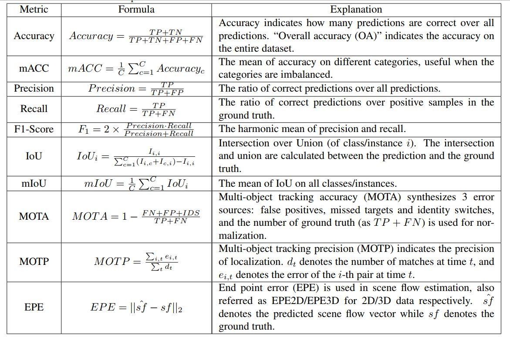
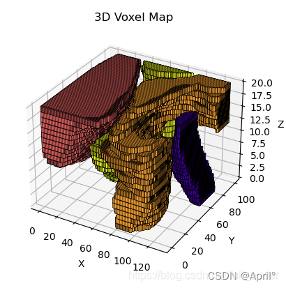
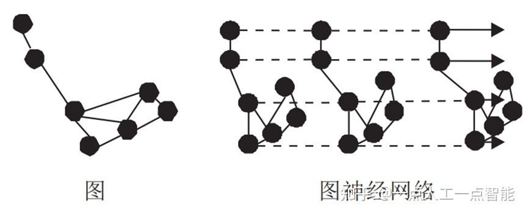
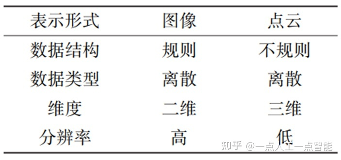

##  3种点云数据

### 点云

点云不是通过普通的相机拍摄得到的，一般是通过三维成像传感器获得，比如**双目相机**、**三维扫描仪**、**RGB-D 相机**等。目前主流的 RGB-D 相机有微软的 Kinect 系列、Intel 的 realsense 系列、structure sensor（需结合 iPad 使用）等。点云可通过扫描的 RGB-D 图像，以及扫描相机的内在参数创建点云，方法是通过相机校准，使用相机内在参数计算真实世界的点（x，y）。因此，RGB-D 图像是网格对齐的图像，而点云则是更稀疏的结构。此外，获得点云的较好方法还包括 **LiDAR 激光**探测与测量，主要通过星载、机载和地面三种方式获取。

3D点云格式为 N* (xyz rgb) 强度等信息

xyz为三维信息  rgb为颜色信息 还有其他信息

3D点云为无序列表

#### Farthest Point Sampling (FPS)最远取样算法

https://zhuanlan.zhihu.com/p/114522377

#### 目标

### 体素表示形式

体素是体积元素的简称，是数字数据在三维空间分割上的最小单位，类似于二维空间的最小单位像素。可以看作是三维的像素 xyz三个维度

点云体素化首先需要设置参数，包括体素大小及每个体素可容纳的点云数量。然后依次根据坐标得到每点在体素的索引，并根据索引判断此体素种类是否已达到设置的最大值。若达到，丢弃此点；未达到，保留。

### 图表示形式

Shi 等提出图表示形式，如图所示。核心在于构建图神经网络，再通过图卷积进行特征提取。图神经网络的计算费时，对于应用是一个严重限制。但是图表示方法能较好地适应点云的不规则性，并且可得到更多局部信息，因此是一种有发展潜力的点云数据表示形式。

除上述 3 种表示形式以外，还有将点云投影为二维鸟瞰图、点云与体素混合等方式。与点云不同，图像的表示形式较单一。图像和点云作为两种常见的数据模态，各有优缺点：图像可提供丰富的纹理，但缺乏深度信息，对光照要求较高；点云可提供深度信息但较稀疏:两者的具体差异如表所示。

大体上，基于点云的三维检测方法精度高于基于图像的三维检测方法。在造价方面，激光雷达(LiDAR)价格远高于摄像机，这是研究基于图像的三维检测方法的一个重要原因。学者们关注图像和点云融合方法，以期达到更好的检测效果。

## 体素处理方法(Voxel-based)

体素处理方法将首先对空间中的点云数据进行**体素化**，体素化过程为此类方法来了如下的优点和缺点：

**优点：**1)体素化后的点云数据将在**内存中有序存储，有利于减小随机内存访问，增加数据运算效率。**

2)得益体素化带来的**数据有序存储和降采样，**此类方法可以处理**数量级较大**的点云数据。

3)体素化后的数据可以高效的使用**空间卷积**，有利于提取**多尺度、多层次的局部特征信息。**

**缺点：**1)体素化过程将不可避免的带来**信息丢失，**信息丢失程度与选择的**分辨率紧密相关。**

2)内存占用大小与分辨率**几乎呈三次方关系，**当分辨率选择较大时，**所需内存将非常大。**

3)由于点云在空间中是**稀疏的**，若不采用稀疏卷积，将有大量的**无意义运算，降低运算效率**。

### 1)VoxelNet:

此方法将点云数据体素化后，提取每个体素中的特征，然后将不同体素的特征放在一起进行全局特征提取。非常典型的Voxel-based方法。

### 2)FaFNet:

此方法将原始点云数据投影到2D鸟瞰图中(特殊体素形式)进行特征提取，然后**将多帧的数据按时间维度拼接在一起。**使用3D卷积处理拼接后的数据，进行目标检测、预测、追踪。

### 3)Center-based Detector:

此方法以VoxelNet或者PointPillars作为backbone进行原始的特征提取，然后使用**center-based**的方法进行后续的目标**检测**和**追踪**任务。

务。

## 原始点云数据方法(Point-based)

此类方法不对点云数据进进行体素化，直接在原始点云数据上进行处理，主要具有如下优点和缺点：

**优点:** 1)由于没有下采样过程，信息**保留完整。**

2)可以采集到区域内比较**完整、语义特征丰富**的特征信息。

**缺点:** 1)数据在内存中**无序存储，**在使用时会有**较多的随机内存访问，进而降低数据运算效率。**

2)由于点云数据的无序性，难以直接使用**空间卷积进行特征提取**

### PointNet:

经典的针对无序点云数据的处理方法，能够有效的提取点云数据的**全局特征信息**。

### PointNet++:

PointNet的升级版，加入了采样和聚类模块，在提取全局特征信息的过程中**也能有效提取局部特征信息。**

### VoteNet:

在3D点云数据中引入了**霍夫投票机制**，利用采样点的到更接近目标选票点，利用选票点优化Propoals生成。

### 3DSSD:

单阶段目标检测算法，其认为两阶段方法中的SA、FP、细化模块太过耗时，故提出F- FPS以代替部分上述部分模块，**在保证精度的情况下，提高速度。**

### P2B：

使用PointNet++提取**模板区域和搜索区域的特征**并进行拼接，之后利用拼接的特征估计出被追踪物体的所在位置。

### Box aware Net:

在P2B的基础上提取初始给定Box的**形状特征，**将形状特征与点特征**融合使用**，估计被追踪物体的所在位置。

### PointTrackNet:

该方法使用PointNet++进行前景和背景的**分割**，在前景点上使用检测算法**检测物体。**将前后帧共同放入网络中预测物体的**运动情况，**进而实现不同帧之间的物体匹配、轨迹生成。

## 混合处理方法(Point-based & Voxel-based)

简单来说，Point-based的方法可以获得**较丰富的语义特征，**Voxel-based的方法具有**较高的运算效率。**故不少团队提出将两种方法混合使用，结合两种优点。

### 1)Fast Point RCNN：

作者利用体素化后的点云数据进行一阶段的目标检测，提出**粗糙的预测框。**将预测框映射**回到原始点云数据后**，利用预测框内及周围的点云数据进行二阶段的目标检测，即**对预测框的优化**。

该方法将体素化处理过程视为一个**采样器，**采样出关键区域的原始点云送入Point-based的特征提取方法，减小运算量。

### 2)STD：

作者在原始点云上进行**球形聚类**，利用不同的**聚类点集**生成一系列的Propoals。同时使用PointNet++对原始点云做**特征提取。**将Propoals的点与PN++中提取的对应特征结合后**投影到鸟瞰视角**(特殊的体素化)。最后在鸟瞰视角的特征图上提出**最终的预测框**。

该方法中首先使用Point-based的方法进行特征提取、Propoals生成，然后送入Voxel-based的方法中提出最终的预测框。

### 3)PV-RCNN:

作者首先将数据进行体素化，使用空间卷积进行**多尺度多层次的特征提取，**多次卷积后，原始数据被压缩到2D的鸟瞰图**。**同时在卷积的**每一个层次**使用Point-based方法中的set abstraction(SA模块)进行**体素级的聚类和特征提取。**根据鸟瞰图特征进行一阶段的目标检测框预测，然后**使用SA模块提取的特征对预测框进行优化**。

该方法最大的特色是使用在体素数据中使用Point-based方法中的SA模块进行特征提取。两种方法进行了模块级的方法融合

### 4)PV-CNN:

此方法着力于**降低运算过程中的内存使用和提高运算效率。**使用两条分支，Voxle分支下对数据进行体素化，空间卷积特征提取，然然后使用**去体素化将得到的特征返还到每个点。**Point分支下将**每个点的信息单独放入MLP进行特征提取**。最后将两条分支下得到的特征融合，进行后续处理。

作者在体素化时使用了较低的分辨率，**避免了巨大的内存占用**。在Point分支下对每个点的信息单独处理，**避免了大量的随机内存访问**。最后结合两者特征，在多任务上取得了较好的效果。

## 点云数据格式

