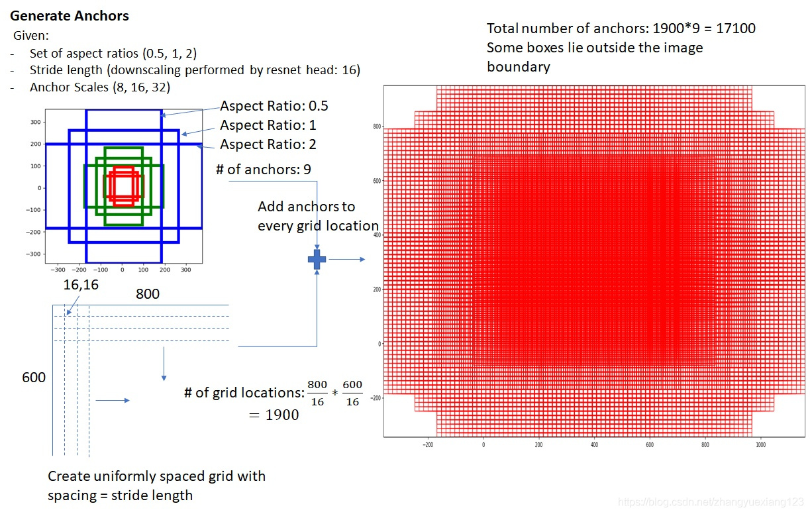
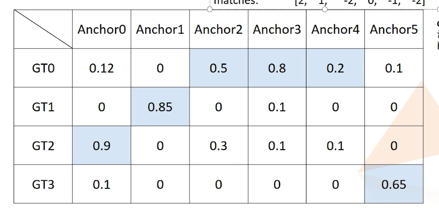

# Mytorch_detection

基于torch的目标检测框架，框架采用pytorch官方流程顺序

框架文件结构：

```python
Mytorch_detection
├── configs	 	# 配置文件
├── datasets	# 数据集文件
├── models		# 网络模型
├── runs		# 运行结果
├── utils		# 工具包
├── weights		# 权重文件
├ train.py
├ val.py
```

## configs

配置文件基于py文件，通过import方式直接引入，相当于引入命名空间 as cfgs

- 基本配置项   一般为训练所需参数
  - 可直接通过 cfgs.配置项  直接使用 

## datasets

| 已支持数据集格式 | 备注                                                         |
| ---------------- | ------------------------------------------------------------ |
| coco             | 除数据集根路径外，需指定**images文件夹**和**json文件**具体位置 |
| yolo(未完成)     |                                                              |
| voc(待移植)      |                                                              |

数据集输出格式:

| item            | 键       | 具体格式                   | 说明              |
| --------------- | -------- | -------------------------- | ----------------- |
| images (tensor) | 无       | tensor: float32 (C, H, W ) | 图片              |
| targets (字典)  | boxes    | tensor: float32 (N, 4)     | xyxy格式          |
|                 | labels   | tensor: int64 (N, 1)       |                   |
|                 | image_id | tensor: int64 (1)          |                   |
|                 | area     | tensor: float32 (N, 1)     | 面积 用于评估     |
|                 | iscrowd  | tensor: int64 (N, 1)       | 是否重合 用于评估 |


## models

| backbone             | neck  | detector(二阶段) | head     |
| -------------------- | ----- | ---------------- | -------- |
| Resnet               | fpn   | rpn              | rpn_head |
| efficientNet(待移植) | PAFPN |                  |          |
| Swin(待移植)         |       |                  |          |

可通过基本组件自由组合

如resnet50+fpn+rpn+head    二阶段faster rcnn改进

## 说明

### 框架文件引用路径：

在主函数设置项目路径为根路径，其中所有文件在引用时：

- 相同文件夹下，优先使用相对路径
- 不同文件夹，以项目路径为根路径

# Faster RCNN代码详解

## backbone

resnet 每一层出一个特征层 共4个

## neck

fpn  对应每一层有一个特征图 4个  最顶层特征再经过卷积出一个 共5个特征层

## rpn

### 特征预处理

对于每个特征层经过 (batch, channel, h, w)

**3x3卷积**+**relu**后 分成两个支路

- 背景前景类别 和锚框 **分数**分支
  - **1x1卷积** 将通道至18   2个类别* 9个锚框   (batch, 18, h, w)
  - **reshape** 把2个类别单独拿出来到一维       (batch, 2, 9*h, w)
  - **softmax **在类别维度上做                            (batch, 2, 9*h, w)
  - **reshape** 回原来大小                                     (batch, 2*9, h, w)
- 坐标偏移 分支
  - **1x1卷积** 降通道数至36  9个锚框* 4个坐标  (batch, 36, h, w)

得到两张特征图   送入RPN区域建议

### RPN_proposal

从特征图中选出2000预选框

#### 输入：

- 类别分数 			  (batch, 9, h, w)  **注：只取前景部分** 
- 坐标偏移               (batch, 9*4, h, w)
- 图片信息（宽高）(batch, h, w)
- 是否训练                train  or  test

#### 生成 特征图对应原图位置关系的矩阵

假设 **特征图宽高 （如4，3）**和**特征图缩放比例（16）**    **原图（64，48）**

得到shift矩阵

tensor([[ 0,  0,  0,  0],
        [16,  0, 16,  0],
        [32,  0, 32,  0],
        [48,  0, 48,  0],
        [ 0, 16,  0, 16],
        [16, 16, 16, 16],
        [32, 16, 32, 16],
        [48, 16, 48, 16],
        [ 0, 32,  0, 32],
        [16, 32, 16, 32],
        [32, 32, 32, 32],
        [48, 32, 48, 32]])

大小 （12 ，4） （4*3 ，4）

可以看出该矩阵作用为 

特征图某一位置坐标  对应的原图坐标

#### 生成锚框

根据**scales=[8, 16, 32]**        **ratios=[0.5, 1, 2]** 生成不同比例大小的锚框

**假设 特征图 4x4**  

[1,1,4,4]  - 1 = [0, 0, 3, 3]   xyxy格式 整个特征图大小的锚框

根据锚框长宽比例  [0.5, 1, 2]  得到三个面积相同的框

[0, 0, 3, 3]转为xywh格式   [1.5，1.5 ，4，4]

面积 4*4 =16   

除以比例 = [32, 16, 8]                       

开根号 取整 得到w=[6, 4, 3]

乘比例 得到h =[3，4，6]

根据 中心 1.5，1.5  [6, 4, 3]   [3，4，6]

转为 xyxy格式

array([[-1. ,  0.5,  4. ,  2.5],
       [ 0. ,  0. ,  3. ,  3. ],
       [ 0.5, -1. ,  2.5,  4. ]])

开根号(面积/比例)  * 比例    即 得到 面积相同 长宽比例不同的框

此时得到了基于特征图大小（4x4）的三个锚框

根据scales=[8, 16, 32]  放大至 原图  得到三个大小的框

[-1. ,  0.5,  4. ,  2.5]  转为 whxy  [6.0, 3.0, 1.5, 1.5]

乘以比例  w： array([ 48.,  96., 192.])   h：array([24., 48., 96.])      1.5, 1.5

转换至xyxy格式

array([[-22., -10.,  25.,  13.],  
       [-46., -22.,  49.,  25.],
       [-94., -46.,  97.,  49.]])

也就是得到了放大到原图的三个框  ，每个有三个 共9个  如图：



**注：可以看到最大的比例32（最大的蓝框） 应为原图相对于特征图的缩放倍数 否则就太大了 **

#### 得到所有锚框设定值

根据上面的 位置关系矩阵+锚框 

得到特征图上每个位置的9个锚框

实际用到了加法广播 

9个锚框（1，9，4）+ 关系矩阵（h* w, 1, 4） =  (h* w, 9 ,4 )   

扩展至所有batch （b，h* w* 9，4）

#### 根据所有锚框设定和坐标偏移得到 实际锚框

每个框加上偏移 

anchor为xyxy格式  偏移为xywh格式

加偏移后得到 xyxy格式

所有锚框 （b，h* w* 9，4）

加偏移后有可能超出原图区域  将超出的坐标调整回去（b，h* w* 9，4）

#### 分类锚框特征图处理

特征图大小(16, h* w* 9)   只取前景框 （概率）

对所有框排序  拿到框的排序索引 也就是找到了前景概率最大的框的位置排名

#### 选框12000 

对于每个batch

（h* w* 9）概率图 

（h* w* 9，4）框

（h* w* 9）顺序排名

先最多取12000（自行指定） 如果h* w* 9大于12000    索引排名

按索引取出这12000个框  （12000，4）和概率（12000，1）

#### 非极大化抑制nms

对于这12000个框 去除掉重合的框

算法详情

按概率顺序依次取最大概率的框

将该框一次和剩余框做对比 计算iou

如iou大于 阈值 则为重合的框 去除 

取剩余的框   重复

这样就得到了不重复的n个框   这里是索引

#### 选框2000

从这n个框中最多选2000

返回  （batch，2000，(batch,坐标) ）

### 损失计算

#### 前景背景分类损失

输入：  分类特征图，真实框，图片大小，框数量

生成特征图大小的对应原位置关系的矩阵（详见上面）

生成锚框（详见上面）

得到所有锚框设定值（详见上面） （h* w* 9，4）

又来一边，有病吧

找出没有超出边界的框 N个 

**注：接下来要找到这N个框里相对于gt（假设有10个）的正样本和负样本 ** 

正样本：N与gt iou>0.7

负样本：N与gt iou<0.3

无关样本：iou<0.3 并且 iou>0.7

**注：当一个gt对应的N可能iou都没大于0.7，也就是没有对应的锚框，选锚框中最大iou的**

需要找到对应的mask，或是索引

这里使用了掩码，对于N的每一个元素 mask对应 

- 为1  正样本
- 为0  负样本
- 为-1 无关

这些框和真实框（假设10个）的iou得到结果 （16，N,  10）

假设每一个batch 有 N=6个anchor  4个gt bbox （4，6）

这里和上面维度相反，只是作为演示，实际维度换过来同理

找出6个anchor对应的gt最大值 及位置

及蓝色的值及对应的gt序号  （6）



找出gt对应的anchor最大值  （4）

建立label 赋值 -1

iou小于0.3的设为背景  0

每个gt的最大iou anchor设为 1

iou大于0.7的设为1

现在有了N的  正样本和负样本  可以猜测 负样本一定很多 正样本很少

把所有的样本都去计算loss计算量太大 所以选取其中的一部分

这里作者选了256个 如果正样本太多 就所以少取点 负样本同理

没有具体数量 使用的随机函数  总之 总数为256

这里找到的锚框是设定的 还需要加上偏移才是用来计算损失的框

最后返回 

**框的mask（1，0，-1）** 

**bbox target  每个框的xywh格式**

**内部框权重 1.0**

**外部框权重** 

损失只计算正样本损失

计算分类损失

找到这256中的正样本对应的类别分数 也就是特征图中的概率 与标签做交叉熵损失

计算边框损失

根据特征图，bbox target  ，内部框权重 ， 外部框权重  直接算smooth l1损失

## 损失函数用

使用gt box for refine

## roi pooling/roi align

根据原特征图（batch, channel, h, w）和 roi (batch, 2000, (batch ,bbox) )

得到等尺寸 物体区域特征图

（2000, channel, 7，7）

## roi Head

对2000后面的维度进行展平 然后全连接