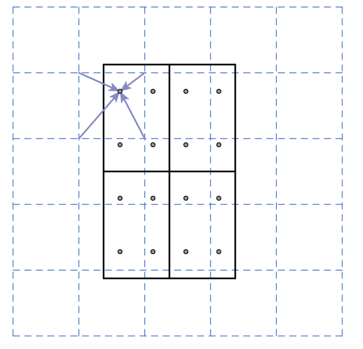
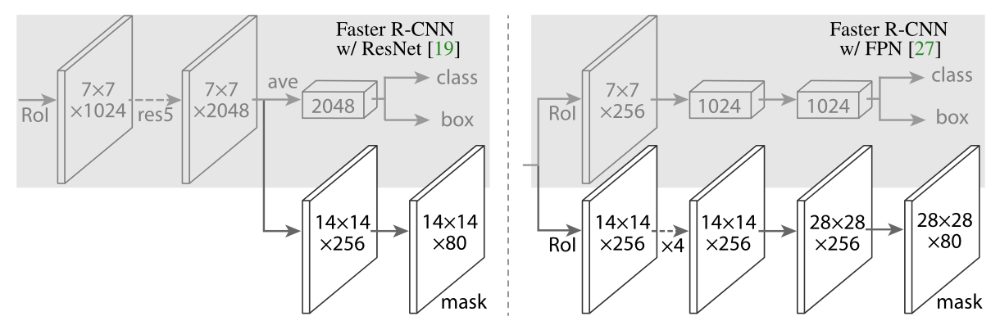
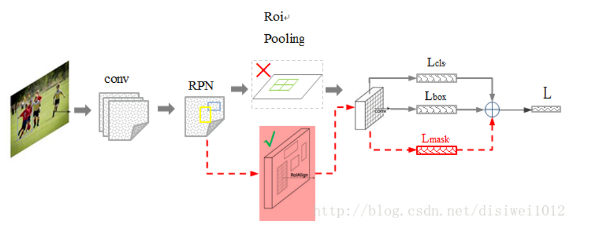

# Mask R-CNN

## 相关工作

### R-CNN:

基于区域的cnn边界框目标检测方法

在每个ROI上独立评估   （Region Of Interest）候选区

### Fast R-CNN:

在特征图的ROI上评估   提高了速度和准确性

### Faster R-CNN:

通过区域建议网络RPN得到候选框，更快

### 实例分割：

早期采用自下而上的分段：分割+识别  速度慢精度低   (不懂)

多阶段级联：定位+语义分割+二次分类  (不懂)

我们的：基于掩码和类标签 并行预测

分段建议系统+目标检测结合  完全卷积实例分割FCIS (不懂)

另一系列解决方案：语义分割结果+分类

## Mask R-CNN

Faster R-CNN 每个候选框输出(x,y,w,h,c)  （box，c）

Mask R-CNN同样采用两阶段

第一阶段RPN相同

第二阶段：再加一个二进制掩码（用来判断同一类的不同物体）

（box，cls，mask）

分类和边界框损失 一样

掩码分支对每一个ROI都有一个K* m* m维的输出

它对应分辨率m* m的k个类别   损失函数交叉熵

mask损失仅添加与类别cls对应的mask位置的损失

如cls是1 则指计算第1类位置的损失 

这里的mask k个类别并没有区分同一类的各个物体

FCNs是全部像素应用交叉熵，各类别之间存在竞争关系，

而我们没有 解耦

### Mask Representation

对每一个rol使用fcn预测m* m* mask

m* m是一个rol的特征图尺寸

如何与原图对应，提出RoIAlign 

### RoIAlign:

原图--特征图--得到候选区域--候选区域特征提取（节省计算量）

RolPool 将候选区域特征提取至7* 7大小

RoIPool 首先对浮点的 RoI 进行量化，然后再提取分块直方图，最后通过 最大池化 组合起来。

这种分块直方图对于分类没有什么大的影响，但是对像素级别精度的 mask 有很大影响。

相对roipooling会造成最后的7* 7和原始的roi区域对不齐的情况，首先roi的坐标是对应的原图的，从原图到feature map有一个stride的对应关系， 比如原始roi是100* 100的，在原图的(15,15)的位置，考虑stride=16，那么对应到feature map上会是 100/16和100/16的区域，坐标是(15/16, 15/16)的点，再对该区域做7* 7 划分，7* 7的图上，横坐标1的距离对应到feature上就是100/112的距离，那么7* 7的图上第一个点(0,0)的点对应到feature map上对应的坐标是(15/16, 15/16)，那么怎么得到7* 7的图上的(0,0)处的值呢，很明显，根据(15/16, 15/16)在feature map上对这个坐标周围的4个整点的坐标进行双线性插值，即得到了7* 7的图上的(0,0)处的值。同理，得到7\*7的图上的坐标为(x,y)处对应到feature map上的坐标为(15/16+x*  100/112, 15/16+y* 100/112)，这个坐标是是一个小数，即在feature map上对该坐标点周围的4个整点坐标进行插值即可。

### 网络结构

