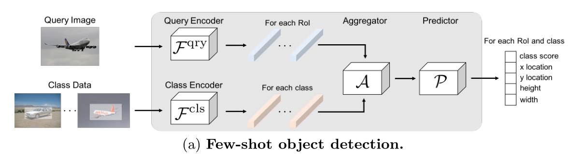

# 小样本目标检测

## 学习方法

### Meta-learning：元学习方法

元学习系统接收大量任务训练，之后用于学习新任务

**Meta-training:** 在大规模数据集上训练出泛化能力

**Base class:** Meta-training阶段借助的源域数据 如coco

**Meta-test:** 学习新任务

**Novel class:** Meta-test阶段要学习的类别 如小样本数据集

**注：Base class和Novel class没有交集**

**Support set:** 相当于带标签的各类数据，类似与训练集

**Query set:** 一张图片，判断和support中是否为一类，类似于测试集

**N-way K-shot:** 在广义上来讲N代表类别数量，K代表每一类别中样本数量，一般指Novel class中，也就是小样本数据集有N类，每类K张图片。

通常为了保持meta training阶段和meta testing阶段的一致性，meta training阶段中Base class的Support set也会相同的设置N和K。

### 度量学习 metric learning

### 数据增强

## 数据集（均为coco格式标签）

### FSOD

共1000个类别

531类来自 ImageNet，469类来自Open Image v4

|                   | **Train**    | Test           |
| ----------------- | ------------ | -------------- |
| No. Class         | 800          | 200            |
| No. Image         | 52350        | 14152          |
| No. Box           | 147489       | 35102          |
| Avg No. Box / Img | 2.82         | 2.48           |
| Min No. Img / Cls | 22           | 30             |
| Max No. Img / Cls | 208          | 199            |
| Avg No. Img / Cls | 75.65        | 74.31          |
| Box Size          | [6, 6828]    | [13, 4605]     |
| Box Area Ratio    | [0.0009, 1]  | [0.0009, 1]    |
| Box W/H Ratio     | [0.0216, 89] | [0.0199, 51.5] |

### LOGO

来自ICME-2022 安全AI挑战者计划第九期：小样本商标检测挑战赛 初赛

初赛50类，每类50张训练图片

划分为50类，每类取1，2，3，5，10 shot  剩余作测试

图片选取非随机，人工挑选10张较代表性图片，取1，2，3，5时从10张中随机

### COCO

由于数据集较大，最后使用，划分方式待定

## 论文

### LSTD 2018

> A Low-Shot Transfer Detector for Object Detection 

大数据集预训练：下面红色部分，类似faster rcnn

小样本迁移训练：主干部分增加LBD损失，使用预训练权重，预测头由于类别数不同无法使用，权重随机初始化（绿色部分），为了使用源域知识，将原预测头当作正则化参数使用，最后一层由于类别不同重新学习（红色部分），其他使用预训练，将结果与新预测头的结果共同作交叉熵使用。

思路不错

### FSRW/MetaYOLO 2019

> Few-shot Object Detection via Feature Reweighting 

reweighting module 图片加mask有物体部分为1 没有为0

分为两阶段训练，第一阶段用基类同时训练三个模块，动机是该模型需要学习通过参考一个好的 reweighting vector 来目标对象。

第二阶段是用基类和新颖数据微调模型，如果新颖类含有 k 个有标签的 bounding box，那么从基类中选的每一类也应包含 k 个有标签的 bounding box。训练策略与一阶段一样，只是迭代次数更少。

### Meta Det 2019

> Meta-Learning to Detect Rare Objects 

基类训练：类别无关部分（绿色）主干网络和rpn    特定类别部分：预测头（蓝色）

在大样本数据集训练类别无关和特定类别

在基类数据种采样多个小样本数据，冻结类别无关部分，训练特定部分

引入权重预测元模型T，映射大样本特定部分权重（深蓝）和小样本特定部分权重（浅蓝）

新类测试：类别无关部分用预训练权重

训练小样本得到浅蓝部分，根据映射得到深蓝部分，共同组成预测新类的模型

### Meta R-CNN 2019

> Meta R-CNN: Towards General Solver for Instance-Level Low-Shot Learning

加入了PRN模块，支持集以向量方式存在

meta train阶段：base class构建支持集查询集训练

meta test阶段：同时考虑base class 和noval class 

### FSOD/Attention-RPN 2019

> Few-Shot Object Detection with Attention-RPN and Multi-Relation Detector 2020

本文提出一种用于小样本目标检测的算法。整个结构采用两阶段的形式，第一阶段利用RPN网络进行定位，第二阶段利用检测器进行分类。针对这两个阶段的结构，本文做了两点改进以满足小样本学习的需求。首先提出一种基于注意力的RPN模块（Attention-Based Region Proposal Network，Attention-RPN），其次是提出一种采用多重关系的检测器（Multi-Relation Detector，MRD），最后作者还对训练方式进行了改进，提出Two-way Contrastive Training Strategy的训练策略。整个网络的结构如下图所示

7

### TFA/FsDet 2020

> Frustratingly Simple Few-Shot Object Detection

使用微调而不是元学习 

### FSDetView 2020

> Few-Shot Object Detection and Viewpoint Estimation for Objects in the Wild

只看目标检测

support：带mask的标签   

A: channel-wise mul

### CME 2021

> Beyond Max-Margin: Class Margin Equilibrium for Few-shot Object Detection

提出了CME模型，其核心包括3个模块：

- Max-Margin
- Feature Filtering
- Feature Disturbance

**Max-Margin Loss:**

由于目标检测网络是一个判别模型，因此将整个特征空间划分为多个子空间，每个子空间被一个类所占据。在微调阶段，新类会嵌入到特征空间，通常嵌入到基类之间的边缘空间。为了避免混叠，基类之间的空白应该足够大，以容纳新的类，为了追求类的max-margin，基类的原型向量需要接近它们的平均原型(即类内方差最小)，而不同类的原型向量之间需要远离(即类间距离最大)。

类间距离：$D^{Intra}_i=\sum^{K-1}_{j=0}||v^{'}_{ij}-\mu^{'}_i||^2_2$

类间边缘距离：$D^{Inter}_i=min_{j,j\neq i}||\mu^{'}_{j}-\mu^{'}_i||^2_2$

作为近似，我们首先计算$M_{i,i^{'}}$的上界和下界

$D^{Inter}_i - D^{Intra}_i- D^{Intra}_{i^{'}} \leq M_{i,i^{'}}\leq D^{Inter}_i$

这表明边界的上界是类间距离，下界是类间距离减去类内距离

根据公式，最大边缘可通过最大化边缘的上下界来逼近  Intra越小 Inter越大
$$
\arg \max _{\theta} \mathcal{M}_{i, i^{\prime}} \simeq \arg \max _{\theta} \mathcal{L}_{m r g}=\frac{\sum_{i}^{N} D_{i}^{I n t r a}}{\sum_{i}^{N} D_{i}^{I n t e r}}
$$
**Feature Disturbance：**

根据梯度修改标签mask的掩码：

梯度越大的像素对应的对象部分识别能力越强，对减少微调损失贡献越大。在检测器训练过程中，对梯度较大的像素进行扰动，对微调后的特征进行扰动。这是通过根据梯度图重新采样地面真值掩模来实现的
$$
T(G(x, y))=\left\{\begin{array}{ll}
0 & G(x, y) \geq \tau(G(x, y)) \\
1 & \text { otherwise }
\end{array}\right.
$$
 		$M^{S}(x, y) \leftarrow M^{S}(x, y) \cdot T(G(x, y))$

损失函数：$min \mathcal{L}_{f t n}=\mathcal{L}_{\text {det }}+\lambda \mathcal{L}_{m r g}\left(M^{S}(x, y)\right)$

追求：
$$
\left\{\begin{array}{ll}
\arg \max _{\theta} \mathcal{M}_{i, i^{\prime}}, & \text { Back Propagation } \\
\arg \min _{M^{S}(x, y)} \mathcal{M}_{i, i^{\prime}}, & \text { Forward Propagation }
\end{array}\right.
$$
具体算法

### Meta-DETR 2021

> Meta-DETR: Image-Level Few-Shot Object Detection with Inter-Class Correlation Exploitation

### DeFRCN 2021

> DeFRCN: Decoupled Faster R-CNN for Few-Shot Object Detection

#### GDL

forward: 经过A    A：为类似通道注意力的权重     input* weight + bias  weight和bias基于结果学习

backward: 在梯度图上直接乘上λ系数

上下两路GDL各有λ1，λ2

#### PCB

pcb的特征提取器 roialign 和 分类器 均来自 imagenet数据集训练

初始化：将support set通过特征提取后得到roi区域 再经过分类器得到结果 各类取平均得到各类的原型向量

校准：把输入图片经过以上特征提取得到roi区域 把该输入的roi特征经过分类器得到结果，和上面的原型向量计算余弦相似度得到当前类的分数s cos，再与原来的类别分数进行比例相加

### DAnA-FasterRCNN 2021

> Dual-Awareness Attention for Few-Shot Object Detection

### imTED+ViT-B 2022
