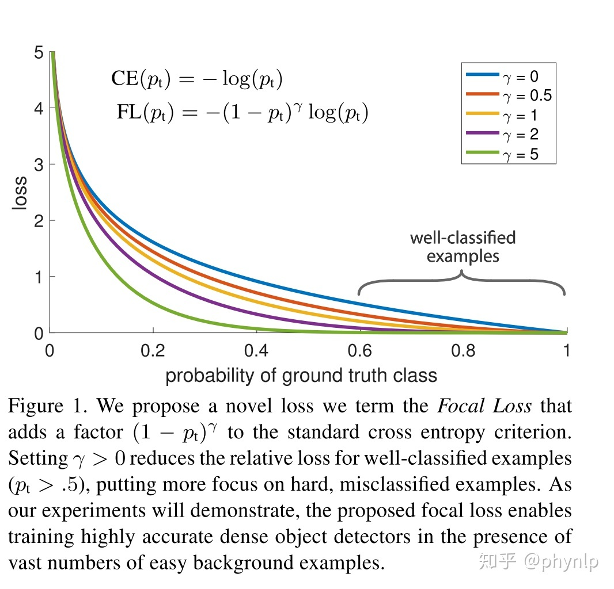
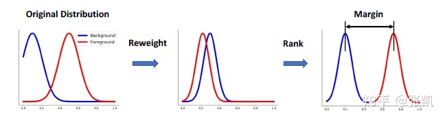
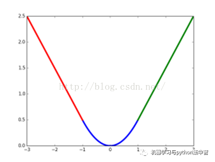
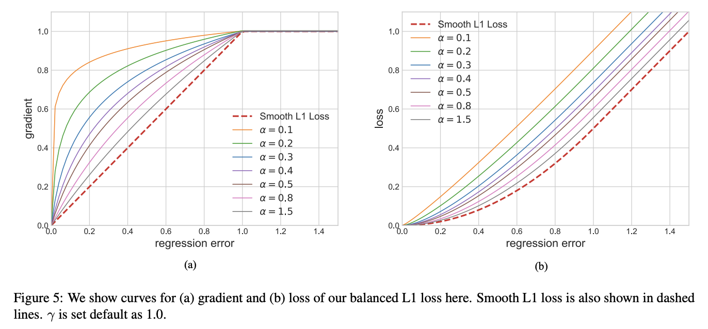
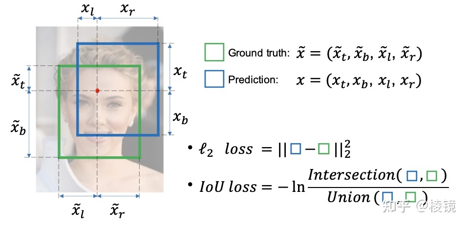
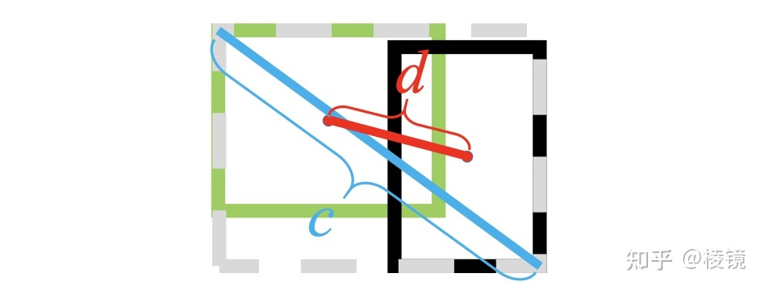

# 目标检测损失函数

## 分类损失

### Cross Entropy Loss  交叉熵损失

**信息熵：**

信息熵描述了**一个事件的不确定性**。**熵是表示随机变量不确定的度量，是对所有可能发生的事件产生的信息量的期望。**所谓不确定性，我们可以把它理解成**可能性**。

如果一个事件的**发生概率小，也就是信息量越大**，那么对应的**信息熵也越大**。

代表事件xi的信息熵，则两个互相独立事件同时发生的信息熵为：
$$
H(X_{i}, X_{j}) = H(X_{i}) + H(X_{j})
$$
在这个定义下，我们可以联想到条件概率：
$$
P(AB) = P(A)\cdot P(B)
$$
这说明 H → P 之间的关系可以用log函数来表示。而我们在思考问题时， 我们认为发生概率越小的事情，信息熵越大。那么信息熵的表示应为一个单调递减函数。

根据上面推导，**我们很容易看出h(x)一定与p(x)的对数有关（因为只有对数形式的真数相乘之后，能够对应对数的相加形式，可以试试）**。因此我们有信息量公式如下:
$$
h(x)=-log_2p(x)
$$
**信息熵：**信息量度量的是一个具体事件发生了所带来的信息，而熵则是在结果出来之前对可能产生的信息量的期望——考虑该随机变量的所有可能取值，即所有可能发生事件所带来的信息量的期望。即
$$
H(X)=-\sum ^{n}_{i=1}p(x_i)\log p(x_i)
$$
**交叉熵:** 两个信息量之间的差异
$$
H(p,q)=-\sum ^{n}_{i=1}p(x_i)\log q(x_i)
$$
对于**二分类问题（即0-1分类），即属于第1类的概率为p，属于第0类的概率为1−p**：则**二元交叉熵损失**可表示为：
$$
f(n)= \begin{cases} -\log (p), & \text {if $y=1$} \\ -\log(1-p), & \text{if $y=0$} \end{cases}
$$

$$
L=-y\log(p)-(1-y)\log(1-p)
$$

**在实际应用中，二分类的类别概率通常采用sigmoid函数把结果映射到（0，1）之间。**

在**多分类**实际应用中，通常采用SoftMax函数来得到样本属于每个类别的概率。

**相对熵：**
$$
KL(p||q)=-\sum ^{n}_{i=1}p(x_i)\log \frac {q(x_i)}{p(x_i)}
$$

### Balanced Cross Entropy Loss  平衡交叉熵

它是**对典型的交叉信息熵损失函数的改进**，主要用于样本分类的不平衡问题。

交叉熵为：
$$
f(n)= \begin{cases} -\log (p), & \text {if $y=1$} \\ -\log(1-p), & \text{if $y=0$} \end{cases}
$$
对于二分类问题，损失函数可以写为：
$$
L=\frac {1}{N}(\sum^{m}_{y_i=1}-\log(p)+\sum^{n}_{y_i=0}-\log(1-p))
$$
其中m为正样本个数，n为负样本个数，N为样本总数，m+n=N。

当样本分布失衡时，在损失函数L的分布也会发生倾斜，如m<<n时，负样本就会在损失函数占据主导地位。由于损失函数的倾斜，模型训练过程中会倾向于样本多的类别，造成模型对少样本类别的性能较差。

基于样本非平衡造成的损失函数倾斜，一个直观的做法就是在损失函数中添加权重因子，提高少数类别在损失函数中的权重，平衡损失函数的分布。如在上述二分类问题中，添加权重参数：
$$
L=\frac {1}{N}(\sum^{m}_{y_i=1}-\alpha\log(p)+\sum^{n}_{y_i=0}-(1-\alpha)\log(1-p))
$$
其中$\frac{\alpha}{1-\alpha}=\frac{n}{m}$, 即权重的大小根据正负样本的分布进行设置。

### Focal Loss 改进交叉熵

focal loss也是针对样本不均衡问题，从loss角度提供的另外一种解决方法。

具体形式为：
$$
f(n)= \begin{cases} -(1-p)^r\log (p), & \text {if $y=1$} \\ -p^r\log(1-p), & \text{if $y=0$} \end{cases}
$$
令
$$
p_t=\begin{cases}
p, & \text {if $y=1$}\\
1-p, & \text{if $y=0$} 
\end{cases}
$$
将focal loss统一为一个表达式：
$$
L_{fl}=-(1-p_t)^r\log(p_t)
$$
同理交叉熵为：
$$
L_{ce}=-\log(p_t)
$$
pt反映了与ground truth即类别y的接近程度，pt 越大说明越接近类别y，即分类越准确。r>0为可调节因子

focal loss对于分类不准确的样本，损失没有改变，对于分类准确的样本，损失会变小。 **整体而言，相当于增加了分类不准确样本在损失函数中的权重。**

$p_t$ 也反应了分类的难易程度，$p_t$越大，说明分类的置信度越高，代表样本越易分； $p_t$ 越小，分类的置信度越低，代表样本越难分。因此focal loss相当于增加了难分样本在损失函数的权重，使得损失函数倾向于难分的样本，有助于提高难分样本的准确度。focal loss与交叉熵的对比，可见下图：

**focal loss vs balanced cross entropy**

focal loss相比balanced cross entropy而言，二者都是试图解决样本不平衡带来的模型训练问题，后者从样本分布角度对损失函数添加权重因子，前者从样本分类难易程度出发，使loss聚焦于难分样本。

### DR loss

具体方法: 如图所示，主要是将正样本的分布和负样本的分布尽可能区别开，具体结合公式来讲下，比较简单。

公式太多,之后看

### AP loss

**Average-Precision loss**

## 回归损失

### MSE (Mean squared error)

$$
M S E=\frac{S S E}{n}=\frac{1}{n} \sum_{i=1}^{m} w_{i}\left(y_{i}-\hat{y}_{i}\right)^{2}
$$

### RMSE (Root mean squared error)

$$
R M S E=\sqrt{M S E}=\sqrt{\frac{S S E}{n}}=\sqrt{\frac{1}{n} \sum_{i=1}^{m} w_{i}\left(y_{i}-\hat{y}_{i}\right)^{2}}
$$

### L1 loss

$$
D_{L 1}=\sum_{i=1}^{n}\left|y_{i}-f\left(x_{i}\right)\right|
$$

这里的$D_{L1}$其实就是平均绝对误差(MAE)
使用L1损失函数也就是$minD_{L1}$

### L2 loss

$$
D_{L 2}=\sum_{i=1}^{n}\left(y_{i}-f\left(x_{i}\right)\right)^{2}
$$

这里的$D_{L2}$其实就是平均平方误差(MSE)
使用L2损失函数也就是$minD_{L2}$

| L1               | L2         |
| ---------------- | ---------- |
| 稳健性高         | 稳健性一般 |
| 没有稳定的解     | 有稳定的解 |
| 可能会得到多组解 | 只有一个解 |

**稳健性**
       L1损失函数稳健性强是它最大的优点。面对误差较大的观测，L1损失函数不容易受到它的影响。这是因为:L1损失函数增加的只是一个误差，而L2损失函数增加的是误差的平方。当误差较大时，使用L2损失函数，我们需要更大程度的调整模型以适应这个观测，所以L2损失函数没有L1损失函数那么稳定。
       那么，当我们认为模型中可能存在异常值时，使用L1损失函数可能会更好；但是，当我们需要把误差较大的观测也纳入模型中时，使用L2损失函数更好一些。

**解的稳定性**
       首先，从求解效率上来说，L2损失函数处处可导，而L1损失函数在零点位置是不可导的，这就使得使用L2损失函数求解可以得到一个解析解，而L1损失函数则没有；
       其次，当数据有一个微小的变化时，L1损失函数的变化更大，其解更加的不稳定。

### Smooth L1 loss

smooth L1说的是光滑之后的L1，前面说过了L1损失的缺点就是有折点，不光滑，那如何让其变得光滑呢？
$$
\operatorname{smooth}_{L_{1}}(x)=\left\{\begin{array}{ll}
0.5 x^{2} & \text { if }|x|<1 \\
|x|-0.5
\end{array}\right.
$$
smooth L1损失函数曲线如下图所示，作者这样设置的目的是想让loss对于离群点更加鲁棒，相比于L2损失函数，其对离群点（指的是距离中心较远的点）、异常值（outlier）不敏感，可控制梯度的量级使训练时不容易跑飞。

**总结：**从上面可以看出，该函数实际上就是一个分段函数，在[-1,1]之间实际上就是L2损失，这样解决了L1的不光滑问题，在[-1,1]区间外，实际上就是L1损失，这样就解决了离群点梯度爆炸的问题。

### Balanced L1 loss

Balanced L1 Loss受Smooth L1损失的启发，Smooth L1损失通过设置一个拐点来分类inliers与outliers，并对outliers通过一个max(p,1.0)进行梯度截断。相比smooth l1 loss，Balanced l1 loss能显著提升inliers点的梯度，进而使这些准确的点能够在训练中扮演更重要的角色。设置一个拐点区分outliers和inliers，对于那些outliers，将梯度固定为1，如下图所示：

梯度：
$$
\frac{\partial L_{b}}{\partial x}=\left\{\begin{array}{ll}
\alpha \ln (b|x|+1) & \text { if }|x|<1 \\
\gamma & \text { otherwise }
\end{array}\right.
$$
公式：
$$
L_{b}(x)=\left\{\begin{array}{l}
\frac{a}{b}(b|x|+1) \ln (b|x|+1)-\alpha|x|, i f|x|<1 \\
\gamma|x|+C, \text { otherwise }
\end{array}\right.
$$

其中参数满足下述条件：

$\alpha \ln (b|x|+1)=\gamma$

默认参数设置：α = 0.5，γ=1.5

### KL loss

### Region-based loss

### IOU loss

## G-IoU Loss

$$
I o U=\frac{|A \cap B|}{|A \cup B|}
$$

$$
G I o U=I o U-\frac{|C \backslash(A \cup B)|}{|C|}
$$

For A and B, find the smallest enclosing convex object C, where C ⊆ S ∈ R n

C：最小外接矩形

$L_{\text {giou }}=1-\text { giou }$

## D-IoU Loss

$d i o u=i o u-\frac{\rho^{2}\left(b, b_{g t}\right)}{c^{2}},\rho^{2}\left(b, b_{g t}\right)$  表示预测框和GT框的中心距离的平方，*c*是两框最小包络的斜对角线长度。

$$
diou loss:  L_{\text {diou }}=1-i o u+\frac{\rho^{2}\left(b, b_{g t}\right)}{c^{2}}
$$

## C-IoU Loss
$$
ciou loss:  L_{c i o u}=1-i o u+\frac{\rho^{2}\left(b, b_{g t}\right)}{c^{2}}+\alpha * v
$$

$$
v=\frac{4}{\pi^{2}}\left(\arctan \frac{w_{g t}}{h_{g t}}-\arctan \frac{w}{h}\right)^{2}  ，表征长宽比的一致性
$$

$$
\alpha=\frac{v}{(1-i o u)+v}  ，调节因子，iou越大其影响越大
$$

## E-IoU Loss

## Focal E-IoU Loss