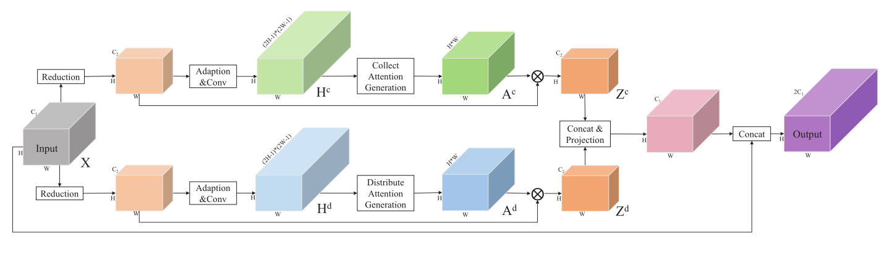

# 注意力机制

**理解有误，废除，注意力机制综述详见 Attention Mechanisms in Computer Vision: A Survey**

## 理解方式

注意力机制实质为在原输入x上，通过某种计算对x的各个维度添加权重 ？（x*权重 (0~1) ）

假设x在目标检测的某一时刻的维度为 batch * w * h * channel  (一般会把维度倒转 b, c, h, w)

根据权重计算方式可分为：

- 基于**矩阵乘法**（叉乘，一般都有卷积）
- 基于**全连接**层  多层感知机
- 基于纯**卷积**

根据权重加权方式可分为

- **点乘**  (a, b) **·** (b, c) = (a* b, b* c)

  根据权重加权在不同维度的位置可分为：

  - 加权在全部位置  权重大小 (b, w, h, c)
  - 加权在空间域   权重 (b, w, h)
  - 加权在通道域   权重 (b, c) 

- **叉乘**  (a, b)x (b, c) = (a, c)

  - 加权在空间域 权重 (wh, wh)
  - 加权在通道域 权重 (c, c)

- **加**   注意力机制没有加法 一般为之后特征加强 

  python中的加法会广播

  - 加权在空间域 权重 (w, h ,1)
  - 加权在通道域 权重 (1, 1 ,c )
  - 加权在全部位置  权重 (w, h ,c )  此时为残差

## 实例目录

注：（时间为论文发表时间，不代表网络提出时间）

- **Non-local ** **矩阵乘法 叉乘**  [点击跳转](# Non-local)
  - Non-local Neural Networks 2018
  - 深度学习注意力机制基础
- Attention to Scale: Scale-aware Semantic Image Segmentation [点击跳转](# Non-local)
  - 待学习
- **Transformer**  **矩阵乘法 叉乘  空间域**  [点击跳转](# Transformer)
  - Attention Is All You Need 2017
- **SENet**  **全连接 点乘 通道域**  [点击跳转](# SENet)
  - Squeeze-and-Excitation Networks 2019
  - 通道注意力机制
- **CBAM**   **全连接 点乘 空间域 通道域 **  [点击跳转](# CBAM)
  - Convolutional Block Attention Module 2018
  - 顺序使用空间和通道
- **GCNet**   **卷积 叉乘 空间？ 加 通道 **  [点击跳转](# GCNet)
  - Non-local Networks Meet Squeeze-Excitation Networks and Beyond  2019
- **SKNet**   **全连接 点乘 通道域**  [点击跳转](# SKNet)
  - Selective Kernel Networks 2019
  - 改进SEnet 多尺度的通道注意力
- **PSANet**   **卷积 叉乘 空间域**  [点击跳转](# PSANet)
  - Point-wise Spatial Attention Network for Scene Parsing 2018
  - 自行学习权重
- **DANet**   **矩阵乘法 叉乘 空间域, 通道域**  [点击跳转](# DANet)
  - Dual Attention Network for Scene Segmentation 2019
  - 同时使用空间和通道 用矩阵乘法 
- **OCNet**   **矩阵乘法 叉乘 空间**  [点击跳转](# OCNet)
  - OCNet: Object Context Network for Scene Parsing  2018
- **CCNet**   **矩阵乘法 叉乘 空间**  [点击跳转](# CCNet)
  - CCNet: Criss-Cross Attention for Semantic Segmentation 2020
  - 交叉注意力  把原来每两点之间的关系 改为和一横一竖之间的关系
- **EMANet**   **矩阵乘法 叉乘 通道（特殊）**  [点击跳转](# EMANet)
  - Expectation-Maximization Attention Networks for Semantic Segmentation 2019
  - 把原来每两点之间的关系wh，降维到k维 再升回去 减少了计算量
- **SANet**   **卷积 点乘 通道**  [点击跳转](# SANet)
  - Squeeze-and-Attention Networks for Semantic Segmentation 2020
- **ECA-Net**  **卷积 点乘 通道**  [点击跳转](# ECA-Net)
  - ECA-Net: Efficient Channel Attention for Deep Convolutional Neural Networks 2019
- **SGE**  **池化 点乘 通道  点乘  全部**  [点击跳转](# SGE)
  - Spatial Group-wise Enhance: Improving Semantic Feature Learning in Convolutional Networks 2019

## 具体实例

### Non-local

> Non-local Neural Networks

**Non-local block**

generic non-local operation：
$$
y_i=\frac {1}{C(x)}\sum_{\forall j}f(x_i,x_j)g(x_j)
$$

### Transformer

> Attention Is All You Need

transform结构：encoder-decoder结构

**encoder**: N个相同的层构成 每层两个子层

- 子层1：多头注意力机制

- 子层2：前馈网络

- 每一层之后都有 Add&Norm 相加+归一化

所以输出为  Norm( x+sublayer(x) )

**decoder**: N个相同的层构成 每层三个子层

- 子层1：对编码器堆栈的输出执行多头注意力 （带mask层）
- 子层2，3：与encoder相同

**自注意力**模块 Scaled Dot-Product Attention

$$
Attention(Q,K,V)=softmax(\frac{QK^T}{\sqrt {d_k}})V
$$
**多头注意力**：

使用多个自注意力模块，最后将结果进行拼接

注：Mask层 为防止解码器信息向左流动，通过屏蔽（setting to −∞）softmax 输入

**前馈网络**：fc+relu+fc
$$
FFN(x) = max(0, xW_1 + b_1)W_2 + b_2
$$

### SENet

> Squeeze-and-Excitation Networks

输入：h* w* c    

全局平均池化  1* 1* c 

全连接2层  中间层维度自定义 输出 1* 1* c

输出：x*权重

### CBAM

> CBAM: Convolutional Block Attention Module

同时使用空间和通道注意力

### GCNet

> Non-local Networks Meet Squeeze-Excitation Networks and Beyond  2019

### SKNet

> Selective Kernel Networks

使用两个特征尺度的输入，再根据比例调节权重加权

a b的比例系数相加为1   a+b=1

### PSANet

> Point-wise Spatial Attention Network for Scene Parsing

首先(h, w, c1)经过卷积分别降维到（h, w, c2)

卷积到（h ,w ,(2h-1)*(2w-1)）

在卷积到（h ,w ,h*w） 权重

与原始（h ,w ,c2）叉乘 得到  （h ,w ,c2）

两个concat后再转为 （h ,w ,c1）

再与原来的拼为（h ,w ,2*c1）

### DANet

> Dual Attention Network for Scene Segmentation

同时使用空间和通道注意力 

### OCNet

> OCNet: Object Context Network for Scene Parsing

X:输入 P：自注意力和另一个的注意力权重

### CCNet  

> CCNet: Criss-Cross Attention for Semantic Segmentation

输入H: (H ,W, C)

Q: (H ,W, C1)  降通道

K: (H ,W, C1) 

Affinity：用Q的每个像素和K上的一横一竖做关联

原来 (H*W, C1)   ( C1，H ,W)  得 （H * W，H*W）

现在 Q上的每个 1* c1 和 K上的一横一竖 （H+W-1)* C1  做叉积 得 1* （H+W-1)

所以全部为   H* W * c1   和 C1* (H+W-1)  得  **H* W * (H+W-1)**   原来为 HW* HW 节省了计算量

softmax后为 H* W * 1   得到A矩阵

V :(H ,W, C ) 与特征A 相乘 的H'

### EMANet  

> Expectation-Maximization Attention Networks for Semantic Segmentation

X: (WH ,C )     AM: (K , C )     AE: (WH , K)   AR: (WH ,C )
$$
Z^{(t)} = softmax(\lambda X(\mu^{t-1})^T )
$$
AE  =  X * AM =  (WH , K )  
$$
\mu^{(t)}=\frac {z_{nk}^{(t)}x_n}{\sum ^N _{m=1}z_{mk}^{(t)}}
$$
AE和 AM 交替执行T布，之后收敛的μ和Z便可以用来对X进行重估计$\widetilde X=Z^{(t)}\mu^{(t)}$

AR = AE * AM = (WH ,C) 

原来为：(wh，c) * (c，wh)  = (wh , wh) 权重矩阵

结果为：(wh , wh) *  (wh，c) = (wh，c)  

现在为：(wh，c) * (c，K)  = (wh，k)

结果为： (wh，k) *  (k，c) = (wh，c)

原图经过c个通道 降到 k  再升回 c

### SANet 

> Squeeze-and-Attention Networks for Semantic Segmentation

aconv 和 upsample 不懂

### ECA-Net

> ECA-Net: Efficient Channel Attention for Deep Convolutional Neural Networks 2019

使用卷积代替矩阵乘法，并没有使用卷积降维，通过步长为一 卷积核尺寸为5 判断每5个通道之间的关联

### SGE

> Spatial Group-wise Enhance: Improving Semantic Feature Learning in Convolutional Networks 2019

强者越强，弱者越弱

