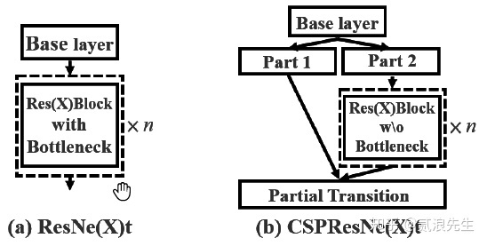

# 目标检测十年

以yolo-v1为例，最后输出一个7×7的网络，然后每个网格预测2个结果，注意不管这里预测多少个结果，其分类只有一个。换句话说每个网格只会负责一个分类，至于边界框可以有多个。
所以，对于anchor-free而言，在特征图中，每个网格负责预测出一个分类，而anchor-base的网络，在特征图中每个节点存储的是以该节点为中心的数个子图的特征，这些特征分别进行分类。本质上来讲：anchor-free根据网格代表的那块图像的特征计算出了分类，而anchor-base则根据周围预设的子图的特征计算分类，而达到这点的手段就是groundtruth的设置规则。
在anchor-free中，物体落到哪个网格，哪个网格就是正样本，其余都是负样本。anchor-base则计算每个anchor和gt的IoU，超过多少阈值就算正。

## NMS-非极大值抑制

在目标检测中，分类器会给每个bounding box计算出一个class score，就是这个bounding box属于每一类的概率，NMS就是根据这些值来进行的，主要流程：

- 对于**每一类**，首先把所有score<threshold的bounding box的score设为0（置信度太低）
- 之后，将所有的bounding box按照得分排序，选中最高分及其对应的bounding box
- 遍历其余的bounding box，如果和当前最高分bounding box的重叠面积(IoU)大于一定的阀值，便将该bounding box删除（删掉不准确的其他边界框，留下该区域该类最准确的）
- 从未处理的bounding box中继续选择一个最高分的bounding box，重复上述过程（遍历所有区域）
- 重复上述过程，直到找到全部保留的bounding box（遍历所有类）
- 然后根据所有保留bounding box的class score和class color画出最后的预测结果

# Anchor based

## 一阶段网络

### SSD 2016

> SSD: Single Shot MultiBox Detector （ECCV 2016）

#### 网络结构

多尺度：多个检测头，低层预测小目标，高层预测大目标。

每个检测头产生对应大小的特征分类结果如 38x38x512 得到 38x38x4x(4+class)

在特征图的每个像素点处，生成不同宽高比的 Default Box (Anchor Box)，论文中设置的宽高比为{1，2，3，1/2，1/3}

SSD300中 Default Box 的数量：（38* 38* 4 + 19* 19* 6 +5* 5* 6 +3* 3* 4 + 1* 1* 4）= 8732

#### 损失函数

$$
L(x,c,l,g)=\frac {1}{N}(L_{conf}(x,c)+\alpha L_{loc(x,l,g)})
$$

未完全看懂

### YOLOv2 2016

#### 网络结构

在yolov1的基础上使用各种改进策略

**Batch Normalization**

每个卷积层后面都添加了Batch Normalization层，并且不再使用droput

**High Resolution Classifier**

在imagenet上预训练10epoch后采用大分辨率

**Convolutional With Anchor Boxes**

卷积代替全连接 分辨率改为416  每个cell改为 （box，cls）* 2 + conf  （4+20）* 2+ 1

map稍微下降，召回率上升

**Dimension Clusters**

根据数据集计算先验框大小代替固定大小

**New Network: Darknet-19**

换新主干网络

**Direct location prediction**

YOLOv2借鉴RPN网络使用anchor boxes来预测边界框相对先验框的offsets。边界框的实际中心位置(x, y)，需要根据预测的坐标偏移值 (tx, ty)，先验框的尺度 (wa, ha) 以及中心坐标(xa, ya) （特征图每个位置的中心点)来计算：

x=(tx * wa) - xa   中心偏移

y=(ty * ha) - ya

改为yolov1的方法，就是预测边界框中心点相对于对应cell左上角位置的相对偏移值

根据边界框预测的4个offsets  $t_x, t_y, t_w, t_h$
$$
b_x=\sigma(t_x)+c_x/W\\
b_y=\sigma(t_y)+c_y/H\\
b_w=p_we^{t_w}/W\\
b_h=p_he^{t_h}/H\\
$$

**Fine-Grained Features**

对于 26x 26x 512的特征图，经passthrough层处理之后就变成了 13x 13x 2048 的新特征图

**Multi-Scale Training**

因为是全卷积层，所以输入无需固定大小

#### 损失函数

### RetinaNet 2018

#### 网络结构

backbone：resnet

neck: fpn

从resnet最后几层分别拿到 x2，x3，x4  输入 fpn网络

fpn网络输出：对应 P5, P4, P3    和 P6, P7  

P6, P7 根据 x4 卷积两次后输出  ？？

每个输出分别进入 class subnet 和 box subnet 后得到五个结果

计算FocalLoss

### YOLOv3 2018

使用Darknet-53作为主干网络，使用三个预测头预测

- loss不同：作者v3替换了v2的softmax loss 变成logistic loss，而且每个ground truth只匹配一个先验框。
- anchor bbox prior不同：v2作者用了5个anchor，一个折衷的选择，所以v3用了9个anchor，提高了IOU。
- detection的策略不同：v2只有一个detection，v3一下变成了3个，分别是一个下采样的，feature map为13* 13，还有2个上采样的eltwise sum，feature map为26* 26，52* 52，也就是说v3的416版本已经用到了52的feature map，而v2把多尺度考虑到训练的data采样上，最后也只是用到了13的feature map，这应该是对小目标影响最大的地方。
- backbone不同：这和上一点是有关系的，v2的darknet-19变成了v3的darknet-53，为啥呢？就是需要上采样啊，卷积层的数量自然就多了，另外作者还是用了一连串的3* 3、1* 1卷积，3* 3的卷积增加channel，而1* 1的卷积在于压缩3* 3卷积后的特征表示，这波操作很具有实用性，一增一减，效果棒棒。

### YOLOv4 2020

**CSPDarknet53：**

CSPResNeXt模块

**Mosaic 数据增强**

Mosaic 是一种数据增强方法，将 4 张训练图像组合成一张进行训练（而不是 CutMix 中的 2 张），这增强了对超出正常图像边框的目标的检测。另外，每个 mini-batch 包含大量的图像（是原来 mini-batch 所包含图像数量的 4 倍），因此，在估计均值和方差时减少了对 large mini-batch sizes 的需求。

**Mish 激活函数**

$ Mish(x)=x\times tanh(ln(1+e^x))$

### YOLOv5 2020

YOLOv5是一种单阶段目标检测算法，该算法在YOLOv4的基础上添加了一些新的改进思路，使得其速度与精度都得到了极大的性能提升，具体包括：输入端的Mosaic数据增强、自适应锚框计算、自适应图片缩放操作；基准端的Focus结构与CSP结构；Neck端的SPP与FPN+PAN结构；输出端的损失函数GIOU_Loss以及预测框筛选的DIOU_nms。除此之外，YOLOv5中的各种改进思路仍然可以应用到其它的目标检测算法中

### YOLOX 2021

**Yolov5s和Yolox-s主要区别**在于：

**（1）输入端：**在Mosaic数据增强的基础上，增加了Mixup数据增强效果；

**（2）Backbone：**激活函数采用SiLU函数；

**（3）Neck：**激活函数采用SiLU函数；

**（4）输出端：**检测头改为Decoupled Head、采用anchor free、multi positives、SimOTA的方式。

## 二阶段网络

### R-CNN 2014

### Fast R-CNN 2015

### Faster R-CNN 2015

#### 网络架构

#### RPN-区域建议网络

在经过主干网络得到FeatureMap后,在经过3x3卷积后得到512维通道 再经过relu后

分别通过1x1卷积得到分类和预测框偏移

分类: 尺寸x18 （2*9）正样本/负样本 9个锚框

reshape 到（-1，2） 取softmax 即判断是正样本还是负样本

reshape回 （-1，18）

预测框: 尺寸x36  （4*9）坐标偏移 * 9个锚框    

说明：每个cell里有9个锚框，每个锚框大小固定，不能准确预测坐标位置，所以需要调整坐标

proposal：

两个阶段：训练和推理

- training阶段，RPN网络提出了2000左右的proposals，这些proposals被送入到Fast R-CNN结构中，在Fast R-CNN结构中，首先计算每个proposal和gt之间的iou，通过人为的设定一个IoU阈值（通常为0.5），把这些Proposals分为正样本（前景）和负样本（背景），并对这些正负样本采样，使得他们之间的比例尽量满足（1:3，二者总数量通常为128），之后这些proposals（128个）被送入到Roi Pooling，最后进行类别分类和box回归。
- inference阶段，RPN网络提出了300左右的proposals，这些proposals被送入到Fast R-CNN结构中，**和training阶段不同的是，inference阶段没有办法对这些proposals采样（inference阶段肯定不知道gt的，也就没法计算iou）**，所以他们直接进入Roi Pooling，之后进行类别分类和box回归。

在这里插一句，在R-CNN中用到IoU阈值的有两个地方，分别是Training时**Positive**与**Negative**判定，和Inference时计算mAP。论文中强调的IoU阈值指的是Training时**Positive**和**Negative**判定处。

### Mask R-CNN 2017

实例分割

### Cascade R-CNN 2018

（a）是Faster RCNN，因为two stage类型的object detection算法基本上都基于Faster RCNN，所以这里也以该算法为基础算法。

（b）是迭代式的bbox回归，从图也非常容易看出思想，就是前一个检测模型回归得到的bbox坐标初始化下一个检测模型的bbox，然后继续回归，这样迭代三次后得到结果。

（c）是Integral Loss，表示对输出bbox的标签界定采取不同的IOU阈值，因为当IOU较高时，虽然预测得到bbox很准确，但是也会丢失一些bbox。

（d）就是本文提出的cascade-R-CNN。cascade-R-CNN看起来和（b）这种迭代式的bbox回归以及（c）这种Integral Loss很像，和（b）最大的不同点在于cascade-R-CNN中的检测模型是基于前面一个阶段的输出进行训练，而不是像（b）一样3个检测模型都是基于最初始的数据进行训练，而且（b）是在验证阶段采用的方式，而cascade-R-CNN是在训练和验证阶段采用的方式。和（c）的差别也比较明显，cascade R-CNN中每个stage的输入bbox是前一个stage的bbox输出，而（c）其实没有这种refine的思想，仅仅是检测模型基于不同的IOU阈值训练得到而已。

### Libra R-CNN 2019

作者回顾了检测器的标准训练过程，发现了**检测性能往往受到训练过程中不平衡的限制，而这种不平衡一般由三个层次组成：样本层（sample level）、特征层（feature level）和目标层（objective level）。**

#### IoU-balanced Sampling

这种极端的样品不平衡将许多困难负样本埋藏在成千上万个简单负样本中。

基于这一观察，作者提出了IoU平衡采样：一种简单但有效的硬挖掘方法，无需额外成本。假设现在需要从M个对应的候选中抽取N个负样本。随机抽样下每个样本的选择概率为：
$$
p=\frac {N}{M}
$$
为了提高困难负样本的选择概率，作者根据IoU将采样间隔平均分成K个区间。所以N个要求的负样本被平均分配到每个箱中，然后再统一从中挑选样本。因此，得到了IoU平衡采样下的选择概率为：
$$
p_k=\frac{N}{K}*\frac{1}{M_k},k \in [0,K)
$$
其中，Mk是由k表示的相应区间中的采样候选数，这里作者设置K = 3，也就是将IoU采样间隔分为了3个区间。

由上图3可以看出，IoU平衡采样可以引导训练样本的分布接近困难负样本的分布。实验还表明，实验结果对K不敏感，具有更高IoU的样本往往更有可能被选择。可以了解到，通过这种采样方法，明显比随机抽样的结果挑选的困难负样本要好。

此外该方法也适用于困难正样品。然而在大多数情况下并没有足够的候选样本将该程序扩展到正样本中。为了使平衡抽样程序更全面，我们对每个ground truth抽样相等的正样本作为替代方法。

#### Balanced Feature Pyramid

C2,C3,C4,C5 resize融合  取平均  

refine：卷积或注意力 细化

resize回或maxpool回到原来尺寸

#### Balanced L1 Loss

### Grid R-CNN 2019

ROIAlign:见Maskrcnn

**网格点特征融合**: grid points feature fusion

grid supervision：

feature fusion module：

看不懂

### Double-Head R-CNN 2020

### CenterNetV2 2021

# Anchor-Free

## 一阶段网络

### YOLOv1 2015

#### 网络结构

**1.输入：**448 x 448 x 3，由于网络的最后需要接入两个全连接层，全连接层需要固定尺寸的输入，故需要将输入resize。

**2.Conv + FC：**主要使用1x1卷积来做channle reduction，然后紧跟3x3卷积。对于卷积层和全连接层，采用Leaky ReLU激活函数，最后一层采用线性激活函数。

**3.输出：**最后一个FC层得到一个1470 x 1的输出，将这个输出reshape得到 **7 x 7 x 30** 的一个tensor，即最终每个单元格都有一个30维的输出，代表预测结果。具体如下：类别20（voc）+2（锚框个数）*（4+1）（4个坐标加置信度）=30

#### 损失函数：S:7 B:2

注：w，h损失用的平方根

输出：7* 7* 30  标签：7* 7* 30 （标签是标注框根据原图计算对应7* 7大小的位置然后中心位置的置信度为1，box信息照抄，2个锚框都是，类别对应位置置1，其余为0）

对比标签分为有物体的和没物体的 has_object  ,no_object

根据公式没物体的只计算置信度损失，有物体的计算边界（iou大的那个）和置信度损失（两个）和分类损失

两个$\lambda$为平衡损失的参数 VOC中coord=5   noobj=0.5  

#### 测试：固定448* 448* 3输入  得到7* 7* 30输出

### DenseBox 2015

没看懂

### CornerNet

每个位置都有一预测，通过判断heatmaps得到类别，每个位置生成一个embedding，判断相同物体的的

embedding是否接近确定是否是同一物体的左上角和右下角，offsets为坐标偏移

#### Corner Pooloing

### ExtremeNet

根据五个热图，每类分别判断，对其中所有点任意组合判断如果中心落在center heatmap点附近，则为一组边界框  下面四个是左边偏移

### FSAF

使用anchor free分支辅助 based分支确定使用的特征图尺寸

对于每一个特征层，它首先是不用anchor去检测，然后看哪一层的loss最小，loss最小的那一层就是最好的，最后就可以选取该层的anchor-based branch去检测。

可以看到，FSAF对每个特征层只添加了额外两个卷积层，带来的性能消耗很小。这两个卷积层输出的特征图形状分别是（W, H, K）和（W, H, 4），其中K是物体的类别数。对于（W, H, K），其每个像素代表了当前位置属于对应类别物体的概率；对于（W, H, 4），将用于预测包围框坐标的偏移。

对于分类，第K类的instance将会从三个方面影响第K个特征图：

- 有效框区域是positive区域，填充1，表示instance存在
- 忽视框区域减去有效框区域是igoring区域，这部分区域不会参与反向传播
- 剩余的区域是negative区域，填充0，表示instance不存在
  分类损失使用Focal loss，一个图片的anchor-free branch的总分类损失等于所有未忽视区域的focal loss的总和，并通过除以所有有效区域的像素个数来标准化。

对于回归，instance只会影响有效区域内的像素，将特征图在点(i,j)的输出记为$d_{i,j}=[d_{i,j}^t,d_{i,j}^l,d_{i,j}^b,d_{i,j}^r]$，表示点(i,j)(i,j)到包围框各个边的距离。回归损失使用IoU loss，一个图片的anchor-free branch的总回归损失等于所有有效区域的IoU loss的均值。

### FCOS 2019

#### Center-ness

通过多级预测之后发现FCOS和基于锚框的检测器之间仍然存在着一定的距离，主要原因是距离目标中心较远的位置产生很多低质量的预测边框。

在FCOS中提出了一种简单而有效的策略来抑制这些低质量的预测边界框，而且不引入任何超参数。具体来说，FCOS添加单层分支，与分类分支并行，以预测"Center-ness"位置。

center-ness(可以理解为一种具有度量作用的概念，在这里称之为"中心度")，中心度取值为0,1之间，使用交叉熵损失进行训练。并把损失加入前面提到的损失函数中。测试时，将预测的中心度与相应的分类分数相乘，计算最终得分(用于对检测到的边界框进行排序)。因此，中心度可以降低远离对象中心的边界框的权重。因此，这些低质量边界框很可能被最终的非最大抑制（NMS）过程滤除，从而显着提高了检测性能。

### FoveaBox 2019

没什么意思

## 二阶段网络

### CPNDet 2020

 

二阶段的faster rcnn

一阶段确定角点位置

**将所有有效的Corner角点组合枚举为可能的proposals目标对象**

二阶段二次分类确定每个proposals是否为一个目标

再对留下来的proposals做分类

# Transformer系列

## Transformer

> Attention Is All You Need

## Vision Transformer

> An Image is Worth 16x16 Words: Transformers for Image Recognition at Scale

## Swin Transformer

> Swin Transformer: Hierarchical Vision Transformer using Shifted Windows

原图输入：**(8, 3, 224, 224)**

window_size: **7**

### forward_features: 

- ##### patch_embed

  - 4x4 卷积 步长4 降尺寸为至 56x56 通道升至嵌入通道数 96  -> (8, 96, 56, 56)
  - 在第二维展平 -> (8, 96, 56*56)
  - 交换1，2维 维度 -> (8, 56* 56, 96)  = **(8, 3136, 96)**
  - layer_norm

- ##### 绝对位置嵌入（不用）

- ##### dropout

### 第一层 BasicLayer

- ###### 第一块 SwinTransformerBlock (8, 3136, 96)

  - 保留原来的x 残差

  - LN

  - view  -> (8, 56, 56, 96)

  - **window_partition 划分自注意力窗口**
    - 窗口大小7x7  -> (8, 56/7, 7, 56/7, 7,96) = (8, 8, 7, 8, 7, 96)
    - 2 3维换维度 -> (8, 8, 8, 7, 7, 96)
    - 前面维度合并  -> (8* 8* 8, 7, 7, 96) = (512, 7, 7, 96)

  - 窗口维度合并 ->  (512, 7* 7, 96) = (512, 49, 96)

  - **自注意力模块 (512, 49, 96) **

    - 线性层  生成qkv (512, 49, 96* 3)

    - 通道维分出3头注意力 qkv三维提前 reshape -> (512, 49, 3, 3, 96/3) = (512, 49, 3, 3, 32)

      第一个3是qkv三维  第二个3是多头

    - 交换维度 (512, 49, 3, 3, 32) -> (3, 512, 3, 49, 32)

      qkv提前  wh和每头的通道 放最后用于自注意力

    - 分离出qkv  每个都是 (512, 3, 49, 32)

    - q乘比例 根据q的通道数32计算 为qk乘后除的值 提前计算了

    - q乘k转置 -> (512, 3, 49, 32)* (512, 3, 32, 49) = (512, 3, 49, 49)

    ​    **相对位置偏移** 详见https://zhuanlan.zhihu.com/p/367111046

    - relative_position_bias_table( (2* 7-1)* (2* 7-1), 3 ) = (169, 3)

      torch.zeros((2 * window_size[0] - 1) * (2 * window_size[1] - 1), num_heads)

      由于每个窗口的偏移量在[-M+1, M-1]内 共 2M-1个偏移值 xy都一样共[2M-1, 2M-1]个

      偏移量初始化为正态分布  **可通过网络学习** 具体偏移量

    - relative_position_index 为每个窗口偏移的索引共(49, 49)

      

    - 以索引从偏移表中取值共(49, 49, 3)

    - 交换维度 ->(3, 49, 49)

    - 注意力权重+偏移 (512, 3, 49, 49)

    - softmax

    - dropout

    - 权重x v -> (512, 3, 49, 49)* (512, 3, 49, 32) = (512, 3, 49, 49, 32)

    - 交换维度 多头注意力还原 -> (512, 49, 3, 32)  

    - reshape -> (512, 49, 96)  

    - 线性层 96->96   (512, 49, 96)  

    - dropout  **(512, 49, 96)**  

  - 窗口维度分离  -> (512, 49, 96) = (512, 7, 7, 96) 

  - **window_reverse 还原自注意力窗口**

    - view  (512, 7, 7, 96)  -> (8, 8, 8, 7, 7, 96)
    - 2 3维交换维度 -> (8, 8, 7, 8, 7, 96) 
    - view -> (8, 56, 56, 96)

  - view -> (8, 56*56, 96)

  - droppath 随机失活路径 ?? 在这里失活没有减少计算量

  - **加上原来的x (残差)**

     **FFN**   (8, 56*56, 96)

     注：MLP(RELU)和FFN(GELU)的区别在于在激活层使用不可微的阶跃函数而不是连续的非线性函数

  - LN

  - MLP
    - 线性层 96 ->96* 4
    - GELU
    - dropout
    - 线性层 96* 4 ->96
    - dropout  (8, 56*56, 96)
    
  - droppath

  - **加上原来的x (残差)**   **(8, 3136, 96)**

- ###### 第二块 SwinTransformerBlock (8, 3136, 96)

  - 保留原来的x 残差
  - LN
  - view  -> (8, 56, 56, 96)

     **这里多一步 将窗口移位**

  

  

  - 在偶数block 在(1,2)维度向上移位window_size//2=3 个位置

  - window_partition 划分自注意力窗口

  - 自注意力模块 (512, 49, 96) 

       **这里多一步 对注意力权重加mask**

    

  - window_reverse 还原自注意力窗口

     **这里多一步 将窗口移位还原**

  - 在偶数block 在(1,2)维度向下移位window_size//2=3 个位置
  - 其他一样

- PatchMerging 下采样 在每层的最后 (8, 3136, 96)

  

  - view  -> (8, 56, 56, 96)
  - 取x0 x1 x2 x3 如上图
  - cat
  - view  -> (8, 28, 28, 96*4)
  - LN
  - reduction 降维 线性层  -> **(8, 28* 28, 96* 2) =  (8, 784, 192) ** 

### 第二层

 **(8, 28* 28, 96* 2) -> (8, 14* 14, 96* 4) =  (8, 196, 384)**

### 第三层

 **(8, 14* 14, 96* 4) -> (8, 7* 7, 96* 8)  =  (8, 49, 768)**

### 第四层

 **(8, 7* 7, 96* 8) 不变 (8, 49, 768)**

layer_norm

avgpool  (8, 49, 768) -> (8, 768, 49) -> (8, 768, 1)

flatten -> (8, 768)

### head:

线性层 输入维度-> 类别数
