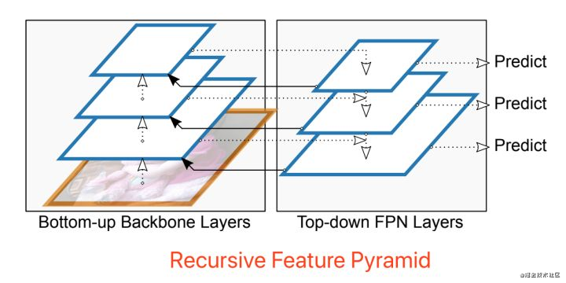

## SPP (Spatial Pyramid Pooling)

空间金字塔池化：

## PPM (Pyramid Pooling Module)

金字塔池化模型：

## ASPP (Atrous Spatial Pyramid Pooling)

空洞卷积空间金字塔池化：

## FPN (Feature Pyramid Network)

特征金字塔：

**各种特征金字塔变体：**

## PAN (PANet-Path Aggregation Network)

## DenseNet

## Partial Dense Block

## 特征融合

